# AI Agents vs. Agentic AI: A Conceptual Taxonomy, Applications and Challenges

Ranjan Sapkota∗‡, Konstantinos I. Roumeliotis† , Manoj Karkee∗‡

∗Cornell University, Department of Environmental and Biological Engineering, USA †Department of Informatics and Telecommunications, University of the Peloponnese, 22131 Tripoli, Greece

‡Corresponding authors: rs2672@cornell.edu, mk2684@cornell.edu

*Abstract*—This review critically distinguishes between AI Agents and Agentic AI, offering a structured conceptual taxonomy, application mapping, and challenge analysis to clarify their divergent design philosophies and capabilities. We begin by outlining the search strategy and foundational definitions, characterizing AI Agents as modular systems driven by LLMs and LIMs for narrow, task-specific automation. Generative AI is positioned as a precursor, with AI Agents advancing through tool integration, prompt engineering, and reasoning enhancements. In contrast, Agentic AI systems represent a paradigmatic shift marked by multi-agent collaboration, dynamic task decomposition, persistent memory, and orchestrated autonomy. Through a sequential evaluation of architectural evolution, operational mechanisms, interaction styles, and autonomy levels, we present a comparative analysis across both paradigms. Application domains such as customer support, scheduling, and data summarization are contrasted with Agentic AI deployments in research automation, robotic coordination, and medical decision support. We further examine unique challenges in each paradigm including hallucination, brittleness, emergent behavior, and coordination failure and propose targeted solutions such as ReAct loops, RAG, orchestration layers, and causal modeling. This work aims to provide a definitive roadmap for developing robust, scalable, and explainable AI-driven systems.

*Index Terms*—AI Agents, Agentic AI, Autonomy, Reasoning, Context Awareness, Multi-Agent Systems, Conceptual Taxonomy, vision-language model

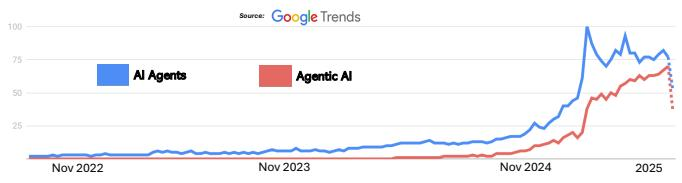

Fig. 1: Global Google search trends showing rising interest in "AI Agents" and "Agentic AI" since November 2022 (ChatGPT Era).

## I. INTRODUCTION

Prior to the widespread adoption of AI agents and agentic AI around 2022 (Before ChatGPT Era), the development of autonomous and intelligent agents was deeply rooted in foundational paradigms of artificial intelligence, particularly multi-agent systems (MAS) and expert systems, which emphasized social action and distributed intelligence [\[1\]](#page-27-0), [\[2\]](#page-27-1). Notably, Castelfranchi [\[3\]](#page-27-2) laid critical groundwork by introducing ontological categories for social action, structure, and mind, arguing that sociality emerges from individual agents' actions and cognitive processes in a shared environment, with concepts like goal delegation and adoption forming the basis for cooperation and organizational behavior. Similarly, Ferber [\[4\]](#page-27-3) provided a comprehensive framework for MAS, defining agents as entities with autonomy, perception, and communication capabilities, and highlighting their applications in distributed problem-solving, collective robotics, and synthetic world simulations. These early works established that individual social actions and cognitive architectures are fundamental to modeling collective phenomena, setting the stage for modern AI agents. This paper builds on these insights to explore how social action modeling, as proposed in [\[3\]](#page-27-2), [\[4\]](#page-27-3), informs the design of AI agents capable of complex, socially intelligent interactions in dynamic environments.

These systems were designed to perform specific tasks with predefined rules, limited autonomy, and minimal adaptability to dynamic environments. Agent-like systems were primarily reactive or deliberative, relying on symbolic reasoning, rulebased logic, or scripted behaviors rather than the learningdriven, context-aware capabilities of modern AI agents [\[5\]](#page-27-4), [\[6\]](#page-27-5). For instance, expert systems used knowledge bases and inference engines to emulate human decision-making in domains like medical diagnosis (e.g., MYCIN [\[7\]](#page-27-6)). Reactive agents, such as those in robotics, followed sense-act cycles based on hardcoded rules, as seen in early autonomous vehicles like the Stanford Cart [\[8\]](#page-27-7). Multi-agent systems facilitated coordination among distributed entities, exemplified by auction-based resource allocation in supply chain management [\[9\]](#page-27-8), [\[10\]](#page-27-9). Scripted AI in video games, like NPC behaviors in early RPGs, used predefined decision trees [\[11\]](#page-27-10). Furthermore, BDI (Belief-Desire-Intention) architectures enabled goal-directed behavior in software agents, such as those in air traffic control simulations [\[12\]](#page-27-11), [\[13\]](#page-27-12). These early systems lacked the generative capacity, self-learning, and environmental adaptability of modern agentic AI, which leverages deep learning, reinforcement learning, and large-scale data [\[14\]](#page-27-13).

Recent public and academic interest in AI Agents and Agentic AI reflects this broader transition in system capabilities. As illustrated in Figure [1,](#page-0-0) Google Trends data demonstrates a significant rise in global search interest for both terms following the emergence of large-scale generative models in late 2022. This shift is closely tied to the evolution of agent design from the pre-2022 era, where AI agents operated in constrained, rule-based environments, to the post-ChatGPT period marked by learning-driven, flexible architectures [\[15\]](#page-27-14)– [\[17\]](#page-27-15). These newer systems enable agents to refine their performance over time and interact autonomously with unstructured, dynamic inputs [\[18\]](#page-27-16)–[\[20\]](#page-27-17). For instance, while pre-modern expert systems required manual updates to static knowledge bases, modern agents leverage emergent neural behaviors to generalize across tasks [\[17\]](#page-27-15). The rise in trend activity reflects increasing recognition of these differences. Moreover, applications are no longer confined to narrow domains like simulations or logistics, but now extend to open-world settings demanding real-time reasoning and adaptive control. This momentum, as visualized in Figure [1,](#page-0-0) underscores the significance of recent architectural advances in scaling autonomous agents for real-world deployment.

The release of ChatGPT in November 2022 marked a pivotal inflection point in the development and public perception of artificial intelligence, catalyzing a global surge in adoption, investment, and research activity [\[21\]](#page-27-18). In the wake of this breakthrough, the AI landscape underwent a rapid transformation, shifting from the use of standalone LLMs toward more autonomous, task-oriented frameworks [\[22\]](#page-27-19). This evolution progressed through two major post-generative phases: AI Agents and Agentic AI. Initially, the widespread success of ChatGPT popularized Generative Agents, which are LLMbased systems designed to produce novel outputs such as text, images, and code from user prompts [\[23\]](#page-27-20), [\[24\]](#page-27-21). These agents were quickly adopted across applications ranging from conversational assistants (e.g., GitHub Copilot [\[25\]](#page-27-22)) and contentgeneration platforms (e.g., Jasper [\[26\]](#page-27-23)) to creative tools (e.g., Midjourney [\[27\]](#page-27-24)), revolutionizing domains like digital design, marketing, and software prototyping throughout 2023.

Building on this generative foundation, a new class of systems known as AI Agents emerged. These agents enhanced LLMs with capabilities for external tool use, function calling, and sequential reasoning, enabling them to retrieve real-time information and execute multi-step workflows autonomously [\[28\]](#page-27-25), [\[29\]](#page-27-26). Frameworks such as AutoGPT [\[30\]](#page-27-27) and BabyAGI (https://github.com/yoheinakajima/babyagi) exemplified this transition, showcasing how LLMs could be embedded within feedback loops to dynamically plan, act, and adapt in goal-driven environments [\[31\]](#page-27-28), [\[32\]](#page-27-29). By late 2023, the field had advanced further into the realm of Agentic AI complex, multi-agent systems in which specialized agents collaboratively decompose goals, communicate, and coordinate toward shared objectives. Architectures such as CrewAI demonstrate how these agentic frameworks can orchestrate decision-making across distributed roles, facilitating intelligent behavior in high-stakes applications including autonomous robotics, logistics management, and adaptive decision-support [\[33\]](#page-27-30)–[\[36\]](#page-27-31).

As the field progresses from Generative Agents toward increasingly autonomous systems, it becomes critically important to delineate the technological and conceptual boundaries between AI Agents and Agentic AI. While both paradigms build upon large LLMs and extend the capabilities of generative systems, they embody fundamentally different architectures, interaction models, and levels of autonomy. AI Agents are typically designed as single-entity systems that perform goal-directed tasks by invoking external tools, applying sequential reasoning, and integrating real-time information to complete well-defined functions [\[17\]](#page-27-15), [\[37\]](#page-27-32). In contrast, Agentic AI systems are composed of multiple, specialized agents that coordinate, communicate, and dynamically allocate subtasks within a broader workflow [\[14\]](#page-27-13), [\[38\]](#page-27-33). This architectural distinction underpins profound differences in scalability, adaptability, and application scope.

Understanding and formalizing the taxonomy between these two paradigms (AI Agents and Agentic AI) is scientifically significant for several reasons. First, it enables more precise system design by aligning computational frameworks with problem complexity ensuring that AI Agents are deployed for modular, tool-assisted tasks, while Agentic AI is reserved for orchestrated multi-agent operations. Moreover, it allows for appropriate benchmarking and evaluation: performance metrics, safety protocols, and resource requirements differ markedly between individual-task agents and distributed agent systems. Additionally, clear taxonomy reduces development inefficiencies by preventing the misapplication of design principles such as assuming inter-agent collaboration in a system architected for single-agent execution. Without this clarity, practitioners risk both under-engineering complex scenarios that require agentic coordination and over-engineering simple applications that could be solved with a single AI Agent.

Since the field of artificial intelligence has seen significant advancements, particularly in the development of AI Agents and Agentic AI. These terms, while related, refer to distinct concepts with different capabilities and applications. This article aims to clarify the differences between AI Agents and Agentic AI, providing researchers with a foundational understanding of these technologies. The objective of this study is to formalize the distinctions, establish a shared vocabulary, and provide a structured taxonomy between AI Agents and Agentic AI that informs the next generation of intelligent agent design across academic and industrial domains, as illustrated in Figure [2.](#page-2-0)

This review provides a comprehensive conceptual and architectural analysis of the progression from traditional AI Agents to emergent Agentic AI systems. Rather than organizing the study around formal research questions, we adopt a sequential, layered structure that mirrors the historical and technical evolution of these paradigms. Beginning with a detailed description of our search strategy and selection criteria, we first establish the foundational understanding of AI Agents by analyzing their defining attributes, such as autonomy, reactivity, and tool-based execution. We then explore the critical role of foundational models specifically LLMs and Large Image Models (LIMs) which serve as the core reasoning and perceptual substrates that drive agentic behavior. Subsequent

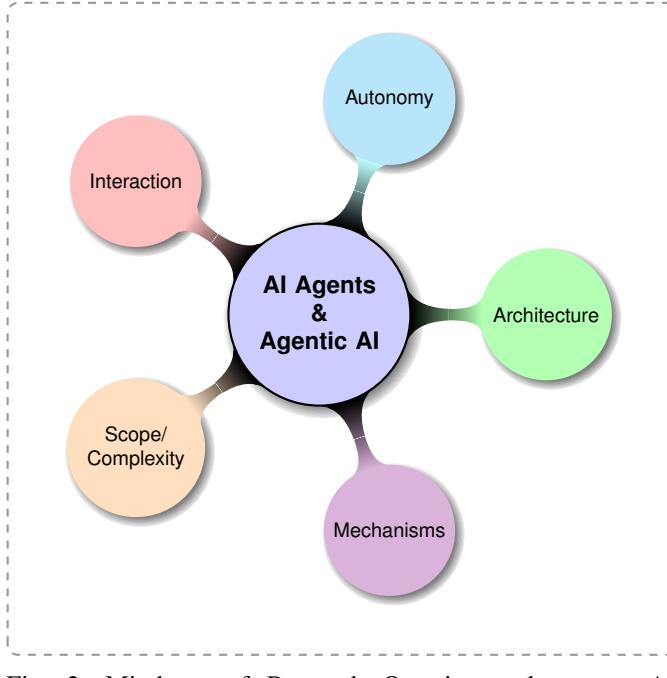

Fig. 2: Mindmap of Research Questions relevant to AI Agents and Agentic AI. Each color-coded branch represents a key dimension of comparison: Architecture, Mechanisms, Scope/Complexity, Interaction, and Autonomy.

sections examine how generative AI systems have served as precursors to more dynamic, interactive agents, setting the stage for the emergence of Agentic AI. Through this lens, we trace the conceptual leap from isolated, single-agent systems to orchestrated multi-agent architectures, highlighting their structural distinctions, coordination strategies, and collaborative mechanisms. We further map the architectural evolution by dissecting the core system components of both AI Agents and Agentic AI, offering comparative insights into their planning, memory, orchestration, and execution layers. Building upon this foundation, we review application domains spanning customer support, healthcare, research automation, and robotics, categorizing real-world deployments by system capabilities and coordination complexity. We then assess key challenges faced by both paradigms including hallucination, limited reasoning depth, causality deficits, scalability issues, and governance risks. To address these limitations, we outline emerging solutions such as retrieval-augmented generation, tool-based reasoning, memory architectures, and simulationbased planning. The review culminates in a forward-looking roadmap that envisions the convergence of modular AI Agents and orchestrated Agentic AI in mission-critical domains. Overall, this paper aims to provide researchers with a structured taxonomy and actionable insights to guide the design, deployment, and evaluation of next-generation agentic systems.

## *A. Methodology Overview*

This review adopts a structured, multi-stage methodology designed to capture the evolution, architecture, application, and limitations of AI Agents and Agentic AI. The process is visually summarized in Figure [3,](#page-3-0) which delineates the sequential flow of topics explored in this study. The analytical framework was organized to trace the progression from basic agentic constructs rooted in LLMs to advanced multi-agent orchestration systems. Each step of the review was grounded in rigorous literature synthesis across academic sources and AIpowered platforms, enabling a comprehensive understanding of the current landscape and its emerging trajectories.

The review begins by establishing a *foundational understanding of AI Agents*, examining their core definitions, design principles, and architectural modules as described in the literature. These include components such as perception, reasoning, and action selection, along with early applications like customer service bots and retrieval assistants. This foundational layer serves as the conceptual entry point into the broader agentic paradigm.

Next, we delve into the role of *LLMs as core reasoning components*, emphasizing how pre-trained language models underpin modern AI Agents. This section details how LLMs, through instruction fine-tuning and reinforcement learning from human feedback (RLHF), enable natural language interaction, planning, and limited decision-making capabilities. We also identify their limitations, such as hallucinations, static knowledge, and a lack of causal reasoning.

Building on these foundations, the review proceeds to the *emergence of Agentic AI*, which represents a significant conceptual leap. Here, we highlight the transformation from toolaugmented single-agent systems to collaborative, distributed ecosystems of interacting agents. This shift is driven by the need for systems capable of decomposing goals, assigning subtasks, coordinating outputs, and adapting dynamically to changing contexts capabilities that surpass what isolated AI Agents can offer.

The next section examines the *architectural evolution from AI Agents to Agentic AI systems*, contrasting simple, modular agent designs with complex orchestration frameworks. We describe enhancements such as persistent memory, meta-agent coordination, multi-agent planning loops (e.g., ReAct and Chain-of-Thought prompting), and semantic communication protocols. Comparative architectural analysis is supported with examples from platforms like AutoGPT, CrewAI, and Lang-Graph.

Following the architectural exploration, the review presents an in-depth analysis of *application domains* where AI Agents and Agentic AI are being deployed. This includes six key application areas for each paradigm, ranging from knowledge retrieval, email automation, and report summarization for AI Agents, to research assistants, robotic swarms, and strategic business planning for Agentic AI. Use cases are discussed in the context of system complexity, real-time decision-making, and collaborative task execution.

Subsequently, we address the *challenges and limitations* inherent to both paradigms. For AI Agents, we focus on issues like hallucination, prompt brittleness, limited planning ability, and lack of causal understanding. For Agentic AI, we identify

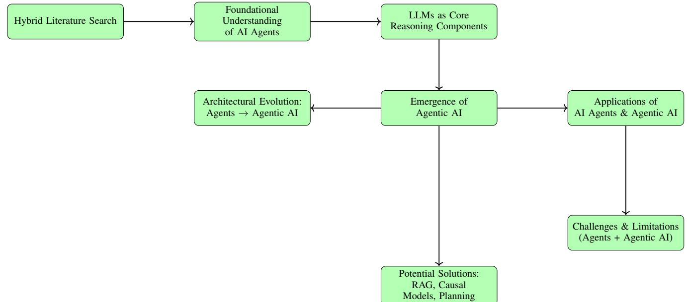

Fig. 3: Methodology pipeline from foundational AI agents to Agentic AI systems, applications, limitations, and solution strategies.

higher-order challenges such as inter-agent misalignment, error propagation, unpredictability of emergent behavior, explainability deficits, and adversarial vulnerabilities. These problems are critically examined with references to recent experimental studies and technical reports.

Finally, the review outlines *potential solutions to overcome these challenges*, drawing on recent advances in causal modeling, retrieval-augmented generation (RAG), multi-agent memory frameworks, and robust evaluation pipelines. These strategies are discussed not only as technical fixes but as foundational requirements for scaling agentic systems into highstakes domains such as healthcare, finance, and autonomous robotics.

Taken together, this methodological structure enables a comprehensive and systematic assessment of the state of AI Agents and Agentic AI. By sequencing the analysis across foundational understanding, model integration, architectural growth, applications, and limitations, the study aims to provide both theoretical clarity and practical guidance to researchers and practitioners navigating this rapidly evolving field.

*1) Search Strategy:* To construct this review, we implemented a hybrid search methodology combining traditional academic repositories and AI-enhanced literature discovery tools. Specifically, twelve platforms were queried: academic databases such as Google Scholar, IEEE Xplore, ACM Digital Library, Scopus, Web of Science, ScienceDirect, and arXiv; and AI-powered interfaces including ChatGPT, Perplexity.ai, DeepSeek, Hugging Face Search, and Grok. Search queries incorporated Boolean combinations of terms such as "AI Agents," "Agentic AI," "LLM Agents," "Tool-augmented LLMs," and "Multi-Agent AI Systems."

Targeted queries such as "Agentic AI + Coordination +

Planning," and "AI Agents + Tool Usage + Reasoning" were employed to retrieve papers addressing both conceptual underpinnings and system-level implementations. Literature inclusion was based on criteria such as novelty, empirical evaluation, architectural contribution, and citation impact. The rising global interest in these technologies illustrated in Figure [1](#page-0-0) using Google Trends data reinforces the urgency of synthesizing this emerging knowledge space.

## II. FOUNDATIONAL UNDERSTANDING OF AI AGENTS

AI Agents are an autonomous software entities engineered for goal-directed task execution within bounded digital environments [\[14\]](#page-27-13), [\[39\]](#page-27-34). These agents are defined by their ability to perceive structured or unstructured inputs [\[40\]](#page-27-35), reason over contextual information [\[41\]](#page-27-36), [\[42\]](#page-27-37), and initiate actions toward achieving specific objectives, often acting as surrogates for human users or subsystems [\[43\]](#page-28-0). Unlike conventional automation scripts, which follow deterministic workflows, AI agents demonstrate reactive intelligence and limited adaptability, allowing them to interpret dynamic inputs and reconfigure outputs accordingly [\[44\]](#page-28-1). Their adoption has been reported across a range of application domains, including customer service automation [\[45\]](#page-28-2), [\[46\]](#page-28-3), personal productivity assistance [\[47\]](#page-28-4), internal information retrieval [\[48\]](#page-28-5), [\[49\]](#page-28-6), and decision support systems [\[50\]](#page-28-7), [\[51\]](#page-28-8).

*1) Overview of Core Characteristics of AI Agents:* AI Agents are widely conceptualized as instantiated operational embodiments of artificial intelligence designed to interface with users, software ecosystems, or digital infrastructures in pursuit of goal-directed behavior [\[52\]](#page-28-9)–[\[54\]](#page-28-10). These agents distinguish themselves from general-purpose LLMs by exhibiting structured initialization, bounded autonomy, and persistent task orientation. While LLMs primarily function as reactive prompt followers [\[55\]](#page-28-11), AI Agents operate within explicitly defined scopes, engaging dynamically with inputs and producing actionable outputs in real-time environments [\[56\]](#page-28-12).

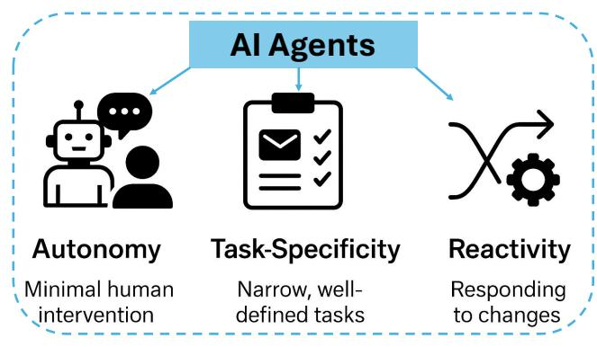

Fig. 4: Core characteristics of AI Agents autonomy, taskspecificity, and reactivity illustrated with symbolic representations for agent design and operational behavior.

Figure [4](#page-4-0) illustrates the three foundational characteristics that recur across architectural taxonomies and empirical deployments of AI Agents. These include *autonomy*, *task-specificity*, and *reactivity with adaptation*. First, autonomy denotes the agent's ability to act independently post-deployment, minimizing human-in-the-loop dependencies and enabling largescale, unattended operation [\[46\]](#page-28-3), [\[57\]](#page-28-13). Second, task-specificity encapsulates the design philosophy of AI agents being specialized for narrowly scoped tasks allowing high-performance optimization within a defined functional domain such as scheduling, querying, or filtering [\[58\]](#page-28-14), [\[59\]](#page-28-15). Third, reactivity refers to an agent's capacity to respond to changes in its environment, including user commands, software states, or API responses; when extended with adaptation, this includes feedback loops and basic learning heuristics [\[17\]](#page-27-15), [\[60\]](#page-28-16).

Together, these three traits provide a foundational profile for understanding and evaluating AI Agents across deployment scenarios. The remainder of this section elaborates on each characteristic, offering theoretical grounding and illustrative examples.

- Autonomy: A central feature of AI Agents is their ability to function with minimal or no human intervention after deployment [\[57\]](#page-28-13). Once initialized, these agents are capable of perceiving environmental inputs, reasoning over contextual data, and executing predefined or adaptive actions in real-time [\[17\]](#page-27-15). Autonomy enables scalable deployment in applications where persistent oversight is impractical, such as customer support bots or scheduling assistants [\[46\]](#page-28-3), [\[61\]](#page-28-17).
- Task-Specificity: AI Agents are purpose-built for narrow, well-defined tasks [\[58\]](#page-28-14), [\[59\]](#page-28-15). They are optimized to execute repeatable operations within a fixed domain, such as email filtering [\[62\]](#page-28-18), [\[63\]](#page-28-19), database querying [\[64\]](#page-28-20), or calendar coordination [\[38\]](#page-27-33), [\[65\]](#page-28-21). This task specialization allows for efficiency, interpretability, and high precision

in automation tasks where general-purpose reasoning is unnecessary or inefficient.

• Reactivity and Adaptation: AI Agents often include basic mechanisms for interacting with dynamic inputs, allowing them to respond to real-time stimuli such as user requests, external API calls, or state changes in software environments [\[17\]](#page-27-15), [\[60\]](#page-28-16). Some systems integrate rudimentary learning [\[66\]](#page-28-22) through feedback loops [\[67\]](#page-28-23), [\[68\]](#page-28-24), heuristics [\[69\]](#page-28-25), or updated context buffers to refine behavior over time, particularly in settings like personalized recommendations or conversation flow management [\[70\]](#page-28-26)–[\[72\]](#page-28-27).

These core characteristics collectively enable AI Agents to serve as modular, lightweight interfaces between pretrained AI models and domain-specific utility pipelines. Their architectural simplicity and operational efficiency position them as key enablers of scalable automation across enterprise, consumer, and industrial settings. While limited in reasoning depth compared to more general AI systems, their high usability and performance within constrained task boundaries have made them foundational components in contemporary intelligent system design.

*2) Foundational Models: The Role of LLMs and LIMs:* The foundational progress in AI agents has been significantly accelerated by the development and deployment of LLMs and LIMs, which serve as the core reasoning and perception engines in contemporary agent systems. These models enable AI agents to interact intelligently with their environments, understand multimodal inputs, and perform complex reasoning tasks that go beyond hard-coded automation.

LLMs such as GPT-4 [\[73\]](#page-28-28) and PaLM [\[74\]](#page-28-29) are trained on massive datasets of text from books, web content, and dialogue corpora. These models exhibit emergent capabilities in natural language understanding, question answering, summarization, dialogue coherence, and even symbolic reasoning [\[75\]](#page-28-30), [\[76\]](#page-28-31). Within AI agent architectures, LLMs serve as the primary decision-making engine, allowing the agent to parse user queries, plan multi-step solutions, and generate naturalistic responses. For instance, an AI customer support agent powered by GPT-4 can interpret customer complaints, query backend systems via tool integration, and respond in a contextually appropriate and emotionally aware manner [\[77\]](#page-28-32).

Large Image Models (LIMs) such as CLIP [\[78\]](#page-28-33) and BLIP-2 [\[79\]](#page-28-34) extend the agent's capabilities into the visual domain. Trained on image-text pairs, LIMs enable perception-based tasks including image classification, object detection, and vision-language grounding. These capabilities are increasingly vital for agents operating in domains such as robotics [\[80\]](#page-28-35), autonomous vehicles [\[81\]](#page-28-36), [\[82\]](#page-28-37), and visual content moderation [\[83\]](#page-28-38), [\[84\]](#page-28-39).

For example, as illustrated in Figure [5](#page-5-0) in an autonomous drone agent tasked with inspecting orchards, a LIM can identify diseased fruits or damaged branches by interpreting live aerial imagery and triggering predefined intervention protocols. Upon detection, the system autonomously triggers predefined intervention protocols, such as notifying horti-

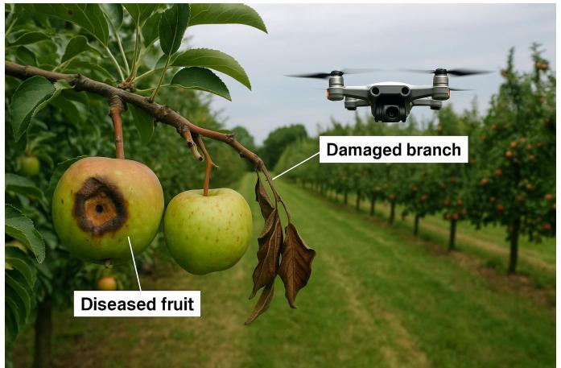

Fig. 5: An AI agent–enabled drone autonomously inspects an orchard, identifying diseased fruits and damaged branches using vision models, and triggers real-time alerts for targeted horticultural interventions

cultural staff or marking the location for targeted treatment without requiring human intervention [\[17\]](#page-27-15), [\[57\]](#page-28-13). This workflow exemplifies the autonomy and reactivity of AI agents in agricultural environment and recent literature underscores the growing sophistication of such drone-based AI agents. Chitra et al. [\[85\]](#page-29-0) provide a comprehensive overview of AI algorithms foundational to embodied agents, highlighting the integration of computer vision, SLAM, reinforcement learning, and sensor fusion. These components collectively support realtime perception and adaptive navigation in dynamic environments. Kourav et al. [\[86\]](#page-29-1) further emphasize the role of natural language processing and large language models in generating drone action plans from human-issued queries, demonstrating how LLMs support naturalistic interaction and mission planning. Similarly, Natarajan et al. [\[87\]](#page-29-2) explore deep learning and reinforcement learning for scene understanding, spatial mapping, and multi-agent coordination in aerial robotics. These studies converge on the critical importance of AI-driven autonomy, perception, and decision-making in advancing drone-based agents.

Importantly, LLMs and LIMs are often accessed via inference APIs provided by cloud-based platforms such as OpenAI [https://openai.com/,](#page-0-1) HuggingFace [https://huggingface.co/,](#page-0-1) and Google Gemini [https://gemini.google.com/app.](#page-0-1) These services abstract away the complexity of model training and finetuning, enabling developers to rapidly build and deploy agents equipped with state-of-the-art reasoning and perceptual abilities. This composability accelerates prototyping and allows agent frameworks like LangChain [\[88\]](#page-29-3) and AutoGen [\[89\]](#page-29-4) to orchestrate LLM and LIM outputs across task workflows. In short, foundational models give modern AI agents their basic understanding of language and visuals. Language models help them reason with words, and image models help them understand pictures-working together, they allow AI to make smart decisions in complex situations.

*3) Generative AI as a Precursor:* A consistent theme in the literature is the positioning of generative AI as the foundational precursor to agentic intelligence. These systems primarily operate on pretrained LLMs and LIMs, which are optimized to synthesize novel content text, images, audio, or code based on input prompts. While highly expressive, generative models fundamentally exhibit reactive behavior: they produce output only when explicitly prompted and do not pursue goals autonomously or engage in self-initiated reasoning [\[90\]](#page-29-5), [\[91\]](#page-29-6).

Key Characteristics of Generative AI:

- Reactivity: As non-autonomous systems, generative models are exclusively input-driven [\[92\]](#page-29-7), [\[93\]](#page-29-8). Their operations are triggered by user-specified prompts and they lack internal states, persistent memory, or goalfollowing mechanisms [\[94\]](#page-29-9)–[\[96\]](#page-29-10).
- Multimodal Capability: Modern generative systems can produce a diverse array of outputs, including coherent narratives, executable code, realistic images, and even speech transcripts. For instance, models like GPT-4 [\[73\]](#page-28-28), PaLM-E [\[97\]](#page-29-11), and BLIP-2 [\[79\]](#page-28-34) exemplify this capacity, enabling language-to-image, image-to-text, and crossmodal synthesis tasks.
- Prompt Dependency and Statelessness: Generative systems are stateless in that they do not retain context across interactions unless explicitly provided [\[98\]](#page-29-12), [\[99\]](#page-29-13). Their design lacks intrinsic feedback loops [\[100\]](#page-29-14), state management [\[101\]](#page-29-15), [\[102\]](#page-29-16), or multi-step planning a requirement for autonomous decision-making and iterative goal refinement [\[103\]](#page-29-17), [\[104\]](#page-29-18).

Despite their remarkable generative fidelity, these systems are constrained by their inability to act upon the environment or manipulate digital tools independently. For instance, they cannot search the internet, parse real-time data, or interact with APIs without human-engineered wrappers or scaffolding layers. As such, they fall short of being classified as true AI Agents, whose architectures integrate perception, decisionmaking, and external tool-use within closed feedback loops.

The limitations of generative AI in handling dynamic tasks, maintaining state continuity, or executing multi-step plans led to the development of tool-augmented systems, commonly referred to as AI Agents [\[105\]](#page-29-19). These systems build upon the language processing backbone of LLMs but introduce additional infrastructure such as memory buffers, tool-calling APIs, reasoning chains, and planning routines to bridge the gap between passive response generation and active task completion. This architectural evolution marks a critical shift in AI system design: from content creation to autonomous utility [\[106\]](#page-29-20), [\[107\]](#page-29-21). The trajectory from generative systems to AI agents underscores a progressive layering of functionality that ultimately supports the emergence of agentic behaviors.

# *A. Language Models as the Engine for AI Agent Progression*

The emergence of Ai agent as a transformative paradigm in artificial intelligence is closely tied to the evolution and repurposing of large-scale language models such as GPT-3 [\[108\]](#page-29-22), Llama [\[109\]](#page-29-23), T5 [\[110\]](#page-29-24), Baichuan 2 [\[111\]](#page-29-25) and GPT3mix [\[112\]](#page-29-26). A substantial and growing body of research confirms that the leap from reactive generative models to autonomous, goal-directed agents is driven by the integration of LLMs as core reasoning engines within dynamic agentic systems. These models, originally trained for natural language processing tasks, are increasingly embedded in frameworks that require adaptive planning [\[113\]](#page-29-27), [\[114\]](#page-29-28), real-time decisionmaking [\[115\]](#page-29-29), [\[116\]](#page-29-30), and environment-aware behavior [\[117\]](#page-29-31).

*1) LLMs as Core Reasoning Components:* LLMs such as GPT-4 [\[73\]](#page-28-28), PaLM [\[74\]](#page-28-29), Claude [https://www.anthropic.com/news/claude-3-5-sonnet,](Claude 3.5 Sonnet) and LLaMA [\[109\]](#page-29-23) are pre-trained on massive text corpora using self-supervised objectives and fine-tuned using techniques such as Supervised Fine-Tuning (SFT) and Reinforcement Learning from Human Feedback (RLHF) [\[118\]](#page-29-32), [\[119\]](#page-29-33). These models encode rich statistical and semantic knowledge, allowing them to perform tasks like inference, summarization, code generation, and dialogue management. In agentic contexts, however, their capabilities are repurposed not merely to generate responses, but to serve as cognitive substrates interpreting user goals, generating action plans, selecting tools, and managing multi-turn workflows.

Recent work identifies these models as central to the architecture of contemporary agentic systems. For instance, AutoGPT [\[30\]](#page-27-27) and BabyAGI [https://github.com/yoheinakajima/babyagi](#page-0-1) use GPT-4 as both a planner and executor: the model analyzes high-level objectives, decomposes them into actionable subtasks, invokes external APIs as needed, and monitors progress to determine subsequent actions. In such systems, the LLM operates in a loop of prompt processing, state updating, and feedback-based correction, closely emulating autonomous decision-making.

*2) Tool-Augmented AI Agents: Enhancing Functionality:* To overcome limitations inherent to generative-only systems such as hallucination, static knowledge cutoffs, and restricted interaction scopes, researchers have proposed the concept of tool-augmented LLM agents [\[120\]](#page-29-34) such as Easytool [\[121\]](#page-29-35), Gentopia [\[122\]](#page-29-36), and ToolFive [\[123\]](#page-29-37). These systems integrate external tools, APIs, and computation platforms into the agent's reasoning pipeline, allowing for real-time information access, code execution, and interaction with dynamic data environments.

Tool Invocation. When an agent identifies a need that cannot be addressed through its internal knowledge such as querying a current stock price, retrieving up-to-date weather information, or executing a script, it generates a structured function call or API request [\[124\]](#page-29-38), [\[125\]](#page-29-39). These calls are typically formatted in JSON, SQL, or Python, depending on the target service, and routed through an orchestration layer that executes the task.

Result Integration. Once a response is received from the tool, the output is parsed and reincorporated into the LLM's context window. This enables the agent to synthesize new reasoning paths, update its task status, and decide on the next step. The ReAct framework [\[126\]](#page-29-40) exemplifies this architecture by combining reasoning (Chain-of-Thought prompting) and action (tool use), with LLMs alternating between internal cognition and external environment interaction.

*3) Illustrative Examples and Emerging Capabilities:* Toolaugmented LLM agents have demonstrated capabilities across a range of applications. In AutoGPT [\[30\]](#page-27-27), the agent may plan a product market analysis by sequentially querying the web, compiling competitor data, summarizing insights, and generating a report. In a coding context, tools like GPT-Engineer combine LLM-driven design with local code execution environments to iteratively develop software artifacts [\[127\]](#page-30-0), [\[128\]](#page-30-1). In research domains, systems like Paper-QA [\[129\]](#page-30-2) utilize LLMs to query vectorized academic databases, grounding answers in retrieved scientific literature to ensure factual integrity.

These capabilities have opened pathways for more robust behavior of AI agents such as long-horizon planning, crosstool coordination, and adaptive learning loops. Nevertheless, the inclusion of tools also introduces new challenges in orchestration complexity, error propagation, and context window limitations all active areas of research.The progression toward AI Agents is inseparable from the strategic integration of LLMs as reasoning engines and their augmentation through structured tool use. This synergy transforms static language models into dynamic cognitive entities capable of perceiving, planning, acting, and adapting setting the stage for multi-agent collaboration, persistent memory, and scalable autonomy.

Figure [6](#page-6-0) illustrates a representative case: a news query agent that performs real-time web search, summarizes retrieved documents, and generates an articulate, context-aware answer. Such workflows have been demonstrated in implementations using LangChain, AutoGPT, and OpenAI function-calling paradigms.

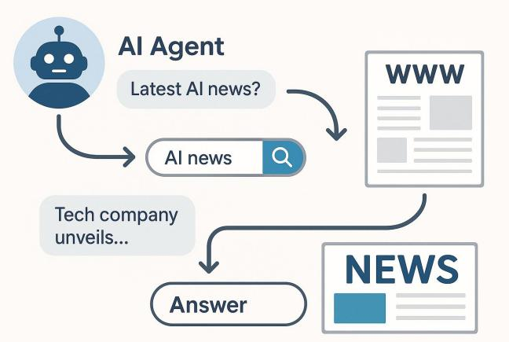

Fig. 6: Workflow of an AI Agent performing real-time news search, summarization, and answer generation, as commonly described in the literature (e.g., Author, Year).

# III. THE EMERGENCE OF AGENTIC AI FROM AI AGENT FOUNDATIONS

While AI Agents represent a significant leap in artificial intelligence capabilities, particularly in automating narrow tasks through tool-augmented reasoning, recent literature identifies notable limitations that constrain their scalability in complex, multi-step, or cooperative scenarios [\[130\]](#page-30-3)–[\[132\]](#page-30-4). These constraints have catalyzed the development of a more advanced paradigm: *Agentic AI*. This emerging class of systems extends the capabilities of traditional agents by enabling multiple intelligent entities to collaboratively pursue goals through structured communication [\[133\]](#page-30-5)–[\[135\]](#page-30-6), shared memory [\[136\]](#page-30-7), [\[137\]](#page-30-8), and dynamic role assignment [\[14\]](#page-27-13).

*1) Conceptual Leap: From Isolated Tasks to Coordinated Systems:* AI Agents, as explored in prior sections, integrate LLMs with external tools and APIs to execute narrowly scoped operations such as responding to customer queries, performing document retrieval, or managing schedules. However, as use cases increasingly demand context retention, task interdependence, and adaptability across dynamic environments, the single-agent model proves insufficient [\[138\]](#page-30-9), [\[139\]](#page-30-10).

Agentic AI systems represent an emergent class of intelligent architectures in which multiple specialized agents collaborate to achieve complex, high-level objectives. As defined in recent frameworks, these systems are composed of modular agents each tasked with a distinct subcomponent of a broader goal and coordinated through either a centralized orchestrator or a decentralized protocol [\[16\]](#page-27-38), [\[134\]](#page-30-11). This structure signifies a conceptual departure from the atomic, reactive behaviors typically observed in single-agent architectures, toward a form of system-level intelligence characterized by dynamic interagent collaboration.

A key enabler of this paradigm is goal decomposition, wherein a user-specified objective is automatically parsed and divided into smaller, manageable tasks by planning agents [\[38\]](#page-27-33). These subtasks are then distributed across the agent network. Multi-step reasoning and planning mechanisms facilitate the dynamic sequencing of these subtasks, allowing the system to adapt in real time to environmental shifts or partial task failures. This ensures robust task execution even under uncertainty [\[14\]](#page-27-13).

Inter-agent communication is mediated through distributed communication channels, such as asynchronous messaging queues, shared memory buffers, or intermediate output exchanges, enabling coordination without necessitating continuous central oversight [\[14\]](#page-27-13), [\[140\]](#page-30-12). Furthermore, reflective reasoning and memory systems allow agents to store context across multiple interactions, evaluate past decisions, and iteratively refine their strategies [\[141\]](#page-30-13). Collectively, these capabilities enable Agentic AI systems to exhibit flexible, adaptive, and collaborative intelligence that exceeds the operational limits of individual agents.

A widely accepted conceptual illustration in the literature delineates the distinction between AI Agents and Agentic AI through the analogy of smart home systems. As depicted in Figure [7,](#page-8-0) the left side represents a traditional AI Agent in the form of a smart thermostat. This standalone agent receives a user-defined temperature setting and autonomously controls the heating or cooling system to maintain the target temperature. While it demonstrates limited autonomy such as learning user schedules or reducing energy usage during absence, it operates in isolation, executing a singular, well-defined task without engaging in broader environmental coordination or goal inference [\[17\]](#page-27-15), [\[57\]](#page-28-13).

In contrast, the right side of Figure [7](#page-8-0) illustrates an Agentic AI system embedded in a comprehensive smart home ecosystem. Here, multiple specialized agents interact synergistically to manage diverse aspects such as weather forecasting, daily scheduling, energy pricing optimization, security monitoring, and backup power activation. These agents are not just reactive modules; they communicate dynamically, share memory states, and collaboratively align actions toward a high-level system goal (e.g., optimizing comfort, safety, and energy efficiency in real time). For instance, a weather forecast agent might signal upcoming heatwaves, prompting early pre-cooling via solar energy before peak pricing hours, as coordinated by an energy management agent. Simultaneously, the system might delay high-energy tasks or activate surveillance systems during occupant absence, integrating decisions across domains. This figure embodies the architectural and functional leap from task-specific automation to adaptive, orchestrated intelligence. The AI Agent acts as a deterministic component with limited scope, while Agentic AI reflects distributed intelligence, characterized by goal decomposition, inter-agent communication, and contextual adaptation, hallmarks of modern agentic AI frameworks.

*2) Key Differentiators between AI Agents and Agentic AI:* To systematically capture the evolution from Generative AI to AI Agents and further to Agentic AI, we structure our comparative analysis around a foundational taxonomy where Generative AI serves as the baseline. While AI Agents and Agentic AI represent increasingly autonomous and interactive systems, both paradigms are fundamentally grounded in generative architectures, especially LLMs and LIMs. Consequently, each comparative table in this subsection includes Generative AI as a reference column to highlight how agentic behavior diverges and builds upon generative foundations.

A set of fundamental distinctions between AI Agents and Agentic AI particularly in terms of scope, autonomy, architectural composition, coordination strategy, and operational complexity are synthesized in Table [I,](#page-9-0) derived from close analysis of prominent frameworks such as AutoGen [\[89\]](#page-29-4) and ChatDev [\[142\]](#page-30-14). These comparisons provide a multi-dimensional view of how single-agent systems transition into coordinated, multiagent ecosystems. Through the lens of generative capabilities, we trace the increasing sophistication in planning, communication, and adaptation that characterizes the shift toward Agentic AI.

While Table [I](#page-9-0) delineates the foundational and operational differences between AI Agents and Agentic AI, a more granular taxonomy is required to understand how these paradigms

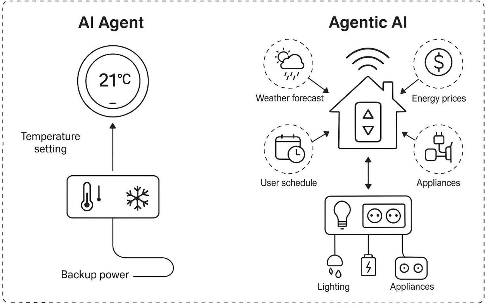

Fig. 7: Comparative illustration of AI Agent vs. Agentic AI, synthesizing conceptual distinctions found in the literature (e.g., Author, Year). Left: A single-task AI Agent. Right: A multi-agent, collaborative Agentic AI system.

emerge from and relate to broader generative frameworks. Specifically, the conceptual and cognitive progression from static Generative AI systems to tool-augmented AI Agents, and further to collaborative Agentic AI ecosystems, necessitates an integrated comparative framework. This transition is not merely structural but also functional encompassing how initiation mechanisms, memory use, learning capacities, and orchestration strategies evolve across the agentic spectrum. Moreover, recent studies suggest the emergence of hybrid paradigms such as "Generative Agents," which blend generative modeling with modular task specialization, further complicating the agentic landscape. In order to capture these nuanced relationships, Table [II](#page-10-0) synthesizes the key conceptual and cognitive dimensions across four archetypes: Generative AI, AI Agents, Agentic AI, and inferred Generative Agents. By positioning Generative AI as a baseline technology, this taxonomy highlights the scientific continuum that spans from passive content generation to interactive task execution and finally to autonomous, multi-agent orchestration. This multitiered lens is critical for understanding both the current capabilities and future trajectories of agentic intelligence across applied and theoretical domains.

To further operationalize the distinctions outlined in Table [I,](#page-9-0) Tables [III](#page-10-1) and [II](#page-10-0) extend the comparative lens to encompass a broader spectrum of agent paradigms including AI Agents, Agentic AI, and emerging Generative Agents. Table [III](#page-10-1) presents key architectural and behavioral attributes that highlight how each paradigm differs in terms of primary capabilities, planning scope, interaction style, learning dynamics, and evaluation criteria. AI Agents are optimized for discrete task execution with limited planning horizons and rely on supervised or rule-based learning mechanisms. In contrast, Agentic AI systems extend this capacity through multistep planning, meta-learning, and inter-agent communication, positioning them for use in complex environments requiring autonomous goal setting and coordination. Generative Agents, as a more recent construct, inherit LLM-centric pretraining capabilities and excel in producing multimodal content creatively, yet they lack the proactive orchestration and statepersistent behaviors seen in Agentic AI systems.

The second table (Table [III\)](#page-10-1) provides a process-driven comparison across three agent categories: Generative AI, AI Agents, and Agentic AI. This framing emphasizes how functional pipelines evolve from prompt-driven single-model inference in Generative AI, to tool-augmented execution in AI Agents, and finally to orchestrated agent networks in Agentic AI. The structure column underscores this progression: from single LLMs to integrated toolchains and ultimately to distributed multi-agent systems. Access to external data, a key operational requirement for real-world utility, also increases

| Feature                                                                                         | AI Agents                                                             | Agentic AI                                                                                 |  |
|-------------------------------------------------------------------------------------------------|-----------------------------------------------------------------------|--------------------------------------------------------------------------------------------|--|
| Definition                                                                                      | Autonomous software programs that perform specific tasks. | Systems of multiple AI agents collaborating to achieve complex goals.                |  |
| High autonomy Autonomy Level within specific tasks.                                    |                                                                       | Higher autonomy with the ability to manage multi-step, complex tasks.                |  |
| Typically handle Task single, specific Complexity tasks.                            |                                                                       | Handle complex, multi-step tasks requiring coordination.                             |  |
| Operate Collaboration independently.                                                      |                                                                       | Involve multi-agent collaboration and information sharing.                           |  |
| Learning and Adaptation                                                                      | Learn and adapt within their specific domain.                   | Learn and adapt across a wider range of tasks and environments.                      |  |
| Customer service chatbots, virtual Applications assistants, automated workflows. |                                                                       | Supply chain management, business process optimization, virtual project managers. |  |

TABLE I: Key Differences Between AI Agents and Agentic AI

in sophistication, from absent or optional in Generative AI to modular and coordinated in Agentic AI. Collectively, these comparative views reinforce that the evolution from generative to agentic paradigms is marked not just by increasing system complexity but also by deeper integration of autonomy, memory, and decision-making across multiple levels of abstraction.

Furthermore, to provide a deeper multi-dimensional understanding of the evolving agentic landscape, Tables [V](#page-11-0) through [IX](#page-11-1) extend the comparative taxonomy to dissect five critical dimensions: core function and goal alignment, architectural composition, operational mechanism, scope and complexity, and interaction-autonomy dynamics. These dimensions serve to not only reinforce the structural differences between Generative AI, AI Agents, and Agentic AI, but also introduce an emergent category Generative Agents representing modular agents designed for embedded subtask-level generation within broader workflows. Table [V](#page-11-0) situates the three paradigms in terms of their overarching goals and functional intent. While Generative AI centers on prompt-driven content generation, AI Agents emphasize tool-based task execution, and Agentic AI systems orchestrate full-fledged workflows. This functional expansion is mirrored architecturally in Table [VI,](#page-11-2) where the system design transitions from single-model reliance (in Generative AI) to multi-agent orchestration and shared memory utilization in Agentic AI. Table [VII](#page-11-3) then outlines how these paradigms differ in their workflow execution pathways, highlighting the rise of inter-agent coordination and hierarchical communication as key drivers of agentic behavior.

Furthermore, Table [VIII](#page-11-4) explores the increasing scope and operational complexity handled by these systems ranging from isolated content generation to adaptive, multi-agent collaboration in dynamic environments. Finally, Table [IX](#page-11-1) synthesizes the varying degrees of autonomy, interaction style, and decision-making granularity across the paradigms. These tables collectively establish a rigorous framework to classify and analyze agent-based AI systems, laying the groundwork for principled evaluation and future design of autonomous, intelligent, and collaborative agents operating at scale.

Each of the comparative tables presented from Table [V](#page-11-0) through Table [IX](#page-11-1) offers a layered analytical lens to isolate the distinguishing attributes of Generative AI, AI Agents, and Agentic AI, thereby grounding the conceptual taxonomy in concrete operational and architectural features. Table [V,](#page-11-0) for instance, addresses the most fundamental layer of differentiation: core function and system goal. While Generative AI is narrowly focused on reactive content production conditioned on user prompts, AI Agents are characterized by their ability to perform targeted tasks using external tools. Agentic AI, by contrast, is defined by its ability to pursue high-level goals through the orchestration of multiple subagents each addressing a component of a broader workflow. This shift from output generation to workflow execution marks a critical inflection point in the evolution of autonomous systems.

In Table [VI,](#page-11-2) the architectural distinctions are made explicit, especially in terms of system composition and control logic. Generative AI relies on a single model with no built-in capability for tool use or delegation, whereas AI Agents combine language models with auxiliary APIs and interface mechanisms to augment functionality. Agentic AI extends this further by introducing multi-agent systems where collaboration, memory persistence, and orchestration protocols are central to the system's operation. This expansion is crucial for enabling intelligent delegation, context preservation, and dynamic role assignment capabilities absent in both generative and singleagent systems. Likewise in Table [VII](#page-11-3) dives deeper into how these systems function operationally, emphasizing differences in execution logic and information flow. Unlike Generative AI's linear pipeline (prompt → output), AI Agents implement procedural mechanisms to incorporate tool responses midprocess. Agentic AI introduces recursive task reallocation and cross-agent messaging, thus facilitating emergent decisionmaking that cannot be captured by static LLM outputs alone. Table [VIII](#page-11-4) further reinforces these distinctions by mapping each system's capacity to handle task diversity, temporal scale, and operational robustness. Here, Agentic AI emerges as uniquely capable of supporting high-complexity goals that demand adaptive, multi-phase reasoning and execution strategies.

Furthermore, Table [IX](#page-11-1) brings into sharp relief the operational and behavioral distinctions across Generative AI, AI Agents, and Agentic AI, with a particular focus on autonomy levels, interaction styles, and inter-agent coordination. Generative AI systems, typified by models such as GPT-3 [\[108\]](#page-29-22) and and DALL·E [https://openai.com/index/dall-e-3/,](DALLE.3) remain reactive generating content solely in response to prompts without maintaining persistent state or engaging in iterative reasoning. In contrast, AI Agents such as those constructed with LangChain [\[88\]](#page-29-3) or MetaGPT [\[143\]](#page-30-15), exhibit a higher degree of autonomy, capable of initiating external tool invocations and adapting behaviors within bounded tasks. However,

| Conceptual Dimension  | Generative AI                        | AI Agent                                                   | Agentic AI                                    | Generative Agent (Inferred)             |
|-----------------------|--------------------------------------|------------------------------------------------------------|-----------------------------------------------|-----------------------------------------------|
| Initiation Type       | Prompt-triggered by user or input | Prompt or goal-triggered with tool use            | Goal-initiated or orchestrated task        | Prompt or system-level trig ger            |
| Goal Flexibility      | (None) fixed per prompt              | (Low) executes specific goal                               | (High) decomposes and adapts goals   | (Low) guided by subtask goal      |
| Temporal Continuity   | Stateless, single-session out put | Short-term continuity within task                       | Persistent across workflow stages    | Context-limited to subtask                    |
| Learning/Adaptation   | Static (pretrained)                  | (Might in future) Tool selec tion strategies may evolve | (Yes) Learns from outcomes                    | Typically static; limited adaptation |
| Memory Use            | No memory or short context window | Optional memory or tool cache                  | Shared episodic/task mem ory               | Subtask-local or contextual memory         |
| Coordination Strategy | None (single-step process)           | Isolated task execution                                    | Hierarchical or decentralized coordination | Receives instructions from system    |
| System Role           | Content generator                    | Tool-using task executor                                   | Collaborative workflow or chestrator       | Subtask-level modular gener ator           |

TABLE II: Taxonomy Summary of AI Agent Paradigms: Conceptual and Cognitive Dimensions

TABLE III: Key Attributes of AI Agents, Agentic AI, and Generative Agents

| Aspect                    | AI Agent                     | Agentic AI                     | Generative Agent            |
|---------------------------|------------------------------|--------------------------------|--------------------------------|
| Primary Capability     | Task execution               | Autonomous goal setting     | Content genera tion      |
| Planning Horizon       | Single-step                  | Multi-step                     | N/A (content only)       |
| Learning Mecha nism | Rule-based or su pervised | Reinforcement/meta learning | Large-scale pre training |
| Interaction Style      | Reactive                     | Proactive                      | Creative                       |
| Evaluation Focus       | Accuracy, latency            | Engagement, adaptability    | Coherence, diver sity       |

TABLE IV: Comparison of Generative AI, AI Agents, and Agentic AI

| Feature                    | Generative AI             | AI Agent                                     | Agentic AI                                      |
|----------------------------|---------------------------|----------------------------------------------|-------------------------------------------------|
| Core Function           | Content genera tion | Task-specific execution using tools | Complex workflow automation               |
| Mechanism                  | Prompt → LLM → Output  | Prompt → Tool Call → LLM → Output      | → Goal Agent Orchestration → Output |
| Structure                  | Single model              | LLM + tool(s)                                | Multi-agent sys tem                       |
| External Data Access | None (unless added) | Via external APIs                            | Coordinated multi-agent access            |
| Key Trait                  | Reactivity                | Tool-use                                     | Collaboration                                   |

their autonomy is typically confined to isolated task execution, lacking long-term state continuity or collaborative interaction.

Agentic AI systems mark a significant departure from these paradigms by introducing internal orchestration mechanisms and multi-agent collaboration frameworks. For example, platforms like AutoGen [\[89\]](#page-29-4) and ChatDev [\[142\]](#page-30-14) exemplify agentic coordination through task decomposition, role assignment, and recursive feedback loops. In AutoGen, one agent might serve as a planner while another retrieves information and a third synthesizes a report each communicating through shared memory buffers and governed by an orchestrator agent that monitors dependencies and overall task progression. This structured coordination allows for more complex goal pursuit and flexible behavior in dynamic environments. Such architectures fundamentally shift the locus of intelligence from single-model outputs to emergent system-level behavior, wherein agents learn, negotiate, and update decisions based on evolving task states. Thus, the comparative taxonomy not only highlights increasing levels of operational independence but also illustrates how Agentic AI introduces novel paradigms of communication, memory integration, and decentralized control, paving the way for the next generation of autonomous systems with scalable, adaptive intelligence.

# *A. Architectural Evolution: From AI Agents to Agentic AI Systems*

While both AI Agents and Agentic AI systems are grounded in modular design principles, Agentic AI significantly extends the foundational architecture to support more complex, distributed, and adaptive behaviors. As illustrated in Figure [8,](#page-12-0) the transition begins with core subsystems Perception, Reasoning, and Action, that define traditional AI Agents. Agentic AI enhances this base by integrating advanced components such as Specialized Agents, Advanced Reasoning & Planning, Persistent Memory, and Orchestration. The figure further emphasizes emergent capabilities including Multi-Agent Collaboration, System Coordination, Shared Context, and Task Decomposition, all encapsulated within a dotted boundary that signifies the shift toward reflective, decentralized, and goal-driven system architectures. This progression marks a fundamental inflection point in intelligent agent design. This section synthesizes findings from empirical frameworks such as LangChain [\[88\]](#page-29-3), AutoGPT [\[89\]](#page-29-4), and TaskMatrix [\[144\]](#page-30-16), highlighting this progression in architectural sophistication.

*1) Core Architectural Components of AI Agents:* Foundational AI Agents are typically composed of four primary subsystems: perception, reasoning, action, and learning. These

| Feature       | Generative AI                                          | AI Agent                                         | Agentic AI                                                         | Generative Agent (Inferred)                |
|---------------|--------------------------------------------------------|--------------------------------------------------|--------------------------------------------------------------------|--------------------------------------------------|
| Primary Goal  | Create novel content based on prompt                | Execute a specific task us ing external tools | Automate complex work flow or achieve high-level goals | Perform a specific genera tive sub-task       |
| Core Function | Content generation (text, image, audio, etc.) | Task execution with exter nal interaction     | Workflow orchestration and goal achievement                     | Sub-task content generation within a workflow |

# TABLE V: Comparison by Core Function and Goal

# TABLE VI: Comparison by Architectural Components

| Component       | Generative AI       | AI Agent            | Agentic AI                               | Generative Agent (Inferred)      |
|-----------------|---------------------|---------------------|------------------------------------------|----------------------------------------|
| Core Engine     | LLM / LIM           | LLM                 | Multiple LLMs (potentially diverse)   | LLM                                    |
| Prompts         | Yes (input trigger) | Yes (task guidance) | Yes (system goal and agent tasks)     | Yes (sub-task guidance)                |
| Tools/APIs      | No (inherently)     | Yes (essential)     | Yes (available to constituent agents) | Potentially (if sub-task re quires) |
| Multiple Agents | No                  | No                  | Yes (essential; collabora tive) | No (is an individual agent)            |
| Orchestration   | No                  | No                  | Yes (implicit or explicit)               | No (is part of orchestration)          |

## TABLE VII: Comparison by Operational Mechanism

| Mechanism         | Generative AI          | AI Agent                            | Agentic AI                                        | Generative Agent (Inferred)         |
|-------------------|------------------------|-------------------------------------|---------------------------------------------------|-------------------------------------------|
| Primary Driver    | Reactivity to prompt   | Tool calling for task execu tion | Inter-agent communication and collaboration | Reactivity to input or sub task prompt |
| Interaction Mode  | User → LLM             | User → Agent → Tool                 | User → System → Agents                            | System/Agent → Agent → Output          |
| Workflow Handling | Single generation step | Single task execution               | Multi-step workflow coordi nation              | Single step within workflow               |
| Information Flow  | Input → Output         | Input → Tool → Output               | Input → Agent1 → Agent2 →  → Output            | Input (from system/agent) → Output     |

## TABLE VIII: Comparison by Scope and Complexity

| Aspect          | Generative AI                        | AI Agent                       | Agentic AI                                    | Generative Agent (Inferred)             |
|-----------------|--------------------------------------|--------------------------------|-----------------------------------------------|-----------------------------------------------|
| Task Scope      | Single piece of generated content | Single, specific, defined task | Complex, multi-faceted goal or workflow | Specific sub-task (often generative) |
| Complexity      | Low (relative)                       | Medium (integrates tools)      | High (multi-agent coordina tion)           | Low to Medium (one task component)         |
| Example (Video) | Chatbot                              | Tavily Search Agent            | YouTube-to-Blog Conversion System          | Title/Description/Conclusion Generator     |

# TABLE IX: Comparison by Interaction and Autonomy

| Feature              | Generative AI         | AI Agent                                      | Agentic AI                            | Generative Agent (Inferred)          |
|----------------------|-----------------------|-----------------------------------------------|---------------------------------------|--------------------------------------------|
| Autonomy Level       | Low (requires prompt) | Medium (uses tools au tonomously) | High (manages entire pro cess)     | Low to Medium (executes sub-task)       |
| External Interaction | None (baseline)       | Via specific tools or APIs                    | Through multiple agents/tools   | Possibly via tools (if needed) |
| Internal Interaction | N/A                   | N/A                                           | High (inter-agent)                    | Receives input from system or agent     |
| Decision Making      | Pattern selection     | Tool usage decisions                          | Goal decomposition and as signment | Best sub-task generation strategy |

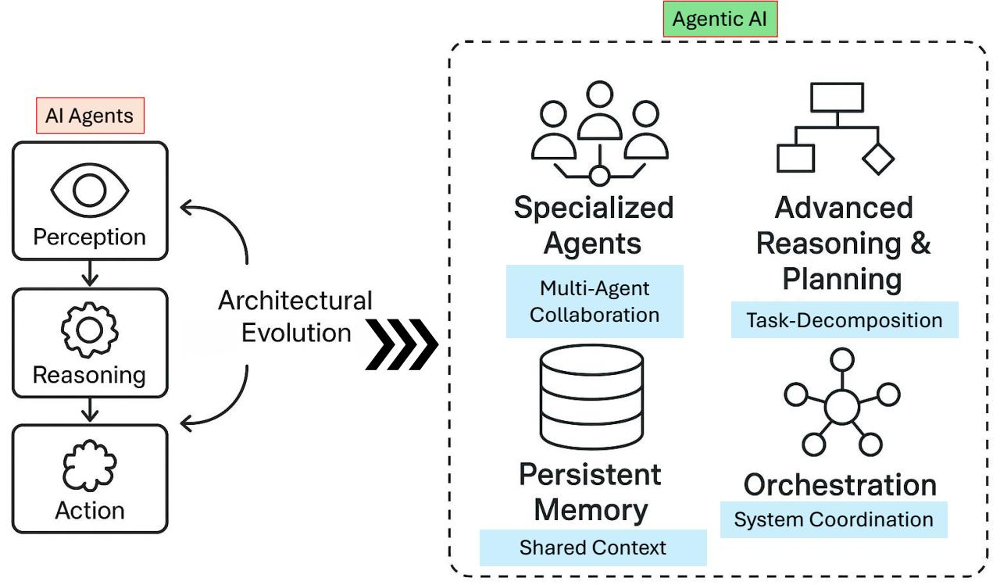

Fig. 8: Illustrating architectural evolution from traditional AI Agents to modern Agentic AI systems. It begins with core modules Perception, Reasoning, and Action and expands into advanced components including Specialized Agents, Advanced Reasoning & Planning, Persistent Memory, and Orchestration. The diagram further captures emergent properties such as Multi-Agent Collaboration, System Coordination, Shared Context, and Task Decomposition, all enclosed within a dotted boundary signifying layered modularity and the transition to distributed, adaptive agentic AI intelligence.

subsystems form a closed-loop operational cycle, commonly referred to as "Understand, Think, Act" from a user interface perspective, or "Input, Processing, Action, Learning" in systems design literature [\[14\]](#page-27-13), [\[145\]](#page-30-17).

- Perception Module: This subsystem ingests input signals from users (e.g., natural language prompts) or external systems (e.g., APIs, file uploads, sensor streams). It is responsible for preprocessing data into a format interpretable by the agent's reasoning module. For example, in LangChain-based agents [\[88\]](#page-29-3), [\[146\]](#page-30-18), the perception layer handles prompt templating, contextual wrapping, and retrieval augmentation via document chunking and embedding search.
- Knowledge Representation and Reasoning (KRR) Module: At the core of the agent's intelligence lies the KRR module, which applies symbolic, statistical, or hybrid logic to input data. Techniques include rule-based logic (e.g., if-then decision trees), deterministic workflow engines, and simple planning graphs. Reasoning in agents like AutoGPT [\[30\]](#page-27-27) is enhanced with function-calling and prompt chaining to simulate thought processes (e.g., "step-by-step" prompts or intermediate tool invocations).
- Action Selection and Execution Module: This module

translates inferred decisions into external actions using an action library. These actions may include sending messages, updating databases, querying APIs, or producing structured outputs. Execution is often managed by middleware like LangChain's "agent executor," which links LLM outputs to tool calls and observes responses for subsequent steps [\[88\]](#page-29-3).

• Basic Learning and Adaptation: Traditional AI Agents feature limited learning mechanisms, such as heuristic parameter adjustment [\[147\]](#page-30-19), [\[148\]](#page-30-20) or history-informed context retention. For instance, agents may use simple memory buffers to recall prior user inputs or apply scoring mechanisms to improve tool selection in future iterations.

Customization of these agents typically involves domainspecific prompt engineering, rule injection, or workflow templates, distinguishing them from hard-coded automation scripts by their ability to make context-aware decisions. Systems like ReAct [\[126\]](#page-29-40) exemplify this architecture, combining reasoning and action in an iterative framework where agents simulate internal dialogue before selecting external actions.

*2) Architectural Enhancements in Agentic AI:* Agentic AI systems inherit the modularity of AI Agents but extend their architecture to support distributed intelligence, interagent communication, and recursive planning. The literature documents a number of critical architectural enhancements that differentiate Agentic AI from its predecessors [\[149\]](#page-30-21), [\[150\]](#page-30-22).

- Ensemble of Specialized Agents: Rather than operating as a monolithic unit, Agentic AI systems consist of multiple agents, each assigned a specialized function e.g., a summarizer, a retriever, a planner. These agents interact via communication channels (e.g., message queues, blackboards, or shared memory). For instance MetaGPT [\[143\]](#page-30-15) exemplify this approach by modeling agents after corporate departments (e.g., CEO, CTO, engineer), where roles are modular, reusable, and role-bound.
- Advanced Reasoning and Planning: Agentic systems embed recursive reasoning capabilities using frameworks such as ReAct [\[126\]](#page-29-40), Chain-of-Thought (CoT) prompting [\[151\]](#page-30-23), and Tree of Thoughts [\[152\]](#page-30-24). These mechanisms allow agents to break down a complex task into multiple reasoning stages, evaluate intermediate results, and replan actions dynamically. This enables the system to respond adaptively to uncertainty or partial failure.
- Persistent Memory Architectures: Unlike traditional agents, Agentic AI incorporates memory subsystems to persist knowledge across task cycles or agent sessions [\[153\]](#page-30-25), [\[154\]](#page-30-26). Memory types include episodic memory (task-specific history) [\[155\]](#page-30-27), [\[156\]](#page-30-28), semantic memory (long-term facts or structured data) [\[157\]](#page-30-29), [\[158\]](#page-30-30), and vector-based memory for retrieval-augmented generation (RAG) [\[159\]](#page-30-31), [\[160\]](#page-30-32). For example, AutoGen [\[89\]](#page-29-4) agents maintain scratchpads for intermediate computations, enabling stepwise task progression.
- Orchestration Layers / Meta-Agents: A key innovation in Agentic AI is the introduction of orchestrators metaagents that coordinate the lifecycle of subordinate agents, manage dependencies, assign roles, and resolve conflicts. Orchestrators often include task managers, evaluators, or moderators. In ChatDev [\[142\]](#page-30-14), for example, a virtual CEO meta-agent distributes subtasks to departmental agents and integrates their outputs into a unified strategic response.

These enhancements collectively enable Agentic AI to support scenarios that require sustained context, distributed labor, multi-modal coordination, and strategic adaptation. Use cases range from research assistants that retrieve, summarize, and draft documents in tandem (e.g., AutoGen pipelines [\[89\]](#page-29-4)) to smart supply chain agents that monitor logistics, vendor performance, and dynamic pricing models in parallel.

The shift from isolated perception–reasoning–action loops to collaborative and reflective multi-agent workflows marks a key inflection point in the architectural design of intelligent systems. This progression positions Agentic AI as the next stage of AI infrastructure capable not only of executing predefined workflows but also of constructing, revising, and managing complex objectives across agents with minimal human supervision.

# IV. APPLICATION OF AI AGENTS AND AGENTIC AI

To illustrate the real-world utility and operational divergence between AI Agents and Agentic AI systems, this study synthesizes a range of applications drawn from recent literature, as visualized in Figure [9.](#page-14-0) We systematically categorize and analyze application domains across two parallel tracks: conventional AI Agent systems and their more advanced Agentic AI counterparts. For AI Agents, four primary use cases are reviewed: (1) Customer Support Automation and Internal Enterprise Search, where single-agent models handle structured queries and response generation; (2) Email Filtering and Prioritization, where agents assist users in managing high-volume communication through classification heuristics; (3) Personalized Content Recommendation and Basic Data Reporting, where user behavior is analyzed for automated insights; and (4) Autonomous Scheduling Assistants, which interpret calendars and book tasks with minimal user input. In contrast, Agentic AI applications encompass broader and more dynamic capabilities, reviewed through four additional categories: (1) Multi-Agent Research Assistants that retrieve, synthesize, and draft scientific content collaboratively; (2) Intelligent Robotics Coordination, including drone and multirobot systems in fields like agriculture and logistics; (3) Collaborative Medical Decision Support, involving diagnostic, treatment, and monitoring subsystems; and (4) Multi-Agent Game AI and Adaptive Workflow Automation, where decentralized agents interact strategically or handle complex task pipelines.

- *1) Application of AI Agents:*
- 1) Customer Support Automation and Internal Enterprise Search: AI Agents are widely adopted in enterprise environments for automating customer support and facilitating internal knowledge retrieval. In customer service, these agents leverage retrieval-augmented LLMs interfaced with APIs and organizational knowledge bases to answer user queries, triage tickets, and perform actions like order tracking or return initiation [\[46\]](#page-28-3). For internal enterprise search, agents built on vector stores (e.g., Pinecone, Elasticsearch) retrieve semantically relevant documents in response to natural language queries. Tools such as Salesforce Einstein [https://www.salesforce.com/artificial-intelligence/,](#page-0-1) Intercom Fin [https://www.intercom.com/fin,](#page-0-1) and Notion AI [https://www.notion.com/product/ai](#page-0-1) demonstrate how structured input processing and summarization capabilities reduce workload and improve enterprise decisionmaking.

A practical example (Figure [10a](#page-15-0)) of this dual functionality can be seen in a multinational e-commerce company deploying an AI Agent-based customer support and internal search assistant. For customer support, the AI Agent integrates with the company's CRM (e.g., Salesforce) and fulfillment APIs to resolve queries such as "Where is my order?" or "How can I return this

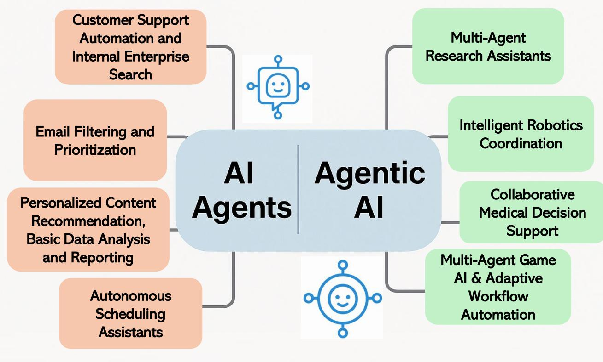

Fig. 9: Categorized applications of AI Agents and Agentic AI across eight core functional domains.

item?" Within milliseconds, the agent retrieves contextual data from shipping databases and policy repositories, then generates a personalized response using retrieval-augmented generation. For internal enterprise search, employees use the same system to query past meeting notes, sales presentations, or legal documents. When an HR manager types "summarize key benefits policy changes from last year," the agent queries a Pinecone vector store embedded with enterprise documentation, ranks results by semantic similarity, and returns a concise summary along with source links. These capabilities not only reduce ticket volume and support overhead but also minimize time spent searching for institutional knowledge. The result is a unified, responsive system that enhances both external service delivery and internal operational efficiency using modular AI Agent architectures.

2) Email Filtering and Prioritization: Within productivity tools, AI Agents automate email triage through content classification and prioritization. Integrated with systems like Microsoft Outlook and Superhuman, these agents analyze metadata and message semantics to detect urgency, extract tasks, and recommend replies. They apply user-tuned filtering rules, behavioral signals, and intent classification to reduce cognitive overload. Autonomous actions, such as auto-tagging or summarizing threads, enhance efficiency, while embedded feedback loops enable personalization through incremental learning [\[61\]](#page-28-17). Figur[e10b](#page-15-0) illustrates a practical implementation of AI Agents in the domain of email filtering and prioritization. In modern workplace environments, users are inundated with high volumes of email, leading to cognitive overload and missed critical communications. AI Agents embedded in platforms like Microsoft Outlook or Superhuman act as intelligent intermediaries that classify, cluster, and triage incoming messages. These agents evaluate metadata (e.g., sender, subject line) and semantic content to detect urgency, extract actionable items, and suggest smart replies. As depicted, the AI agent autonomously categorizes emails into tags such as "Urgent," "Follow-up," and "Low Priority," while also offering context-aware summaries and reply drafts. Through continual feedback loops and usage patterns, the system adapts to user preferences, gradually refining classification thresholds and improving prioritization accuracy. This automation offloads decision fatigue, allowing users to focus on high-value tasks, while maintaining efficient communication management in fast-paced, information-dense environments.

3) Personalized Content Recommendation and Basic Data Reporting: AI Agents support adaptive personalization by analyzing behavioral patterns for news, prod-

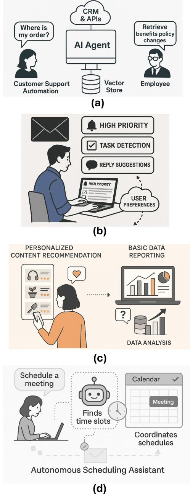

Fig. 10: Applications of AI Agents in enterprise settings: (a) Customer support and internal enterprise search; (b) Email filtering and prioritization; (c) Personalized content recommendation and basic data reporting; and (d) Autonomous scheduling assistants. Each example highlights modular AI Agent integration for automation, intent understanding, and adaptive reasoning across operational workflows and userfacing systems.

uct, or media recommendations. Platforms like Amazon, YouTube, and Spotify deploy these agents to infer user preferences via collaborative filtering, intent detection, and content ranking. Simultaneously, AI Agents in analytics systems (e.g., Tableau Pulse, Power BI Copilot) enable natural-language data queries and automated report generation by converting prompts to structured database queries and visual summaries, democratizing business intelligence access.

A practical illustration (Figure [10c](#page-15-0)) of AI Agents in personalized content recommendation and basic data reporting can be found in e-commerce and enterprise analytics systems. Consider an AI agent deployed on a retail platform like Amazon: as users browse, click, and purchase items, the agent continuously monitors interaction patterns such as dwell time, search queries, and purchase sequences. Using collaborative filtering and content-based ranking, the agent infers user intent and dynamically generates personalized product suggestions that evolve over time. For example, after purchasing gardening tools, a user may be recommended compatible soil sensors or relevant books. This level of personalization enhances customer engagement, increases conversion rates, and supports long-term user retention. Simultaneously, within a corporate setting, an AI agent integrated into Power BI Copilot allows non-technical staff to request insights using natural language, for instance, "Compare Q3 and Q4 sales in the Northeast." The agent translates the prompt into structured SQL queries, extracts patterns from the database, and outputs a concise visual summary or narrative report. This application reduces dependency on data analysts and empowers broader business decision-making through intuitive, language-driven interfaces.

4) Autonomous Scheduling Assistants: AI Agents integrated with calendar systems autonomously manage meeting coordination, rescheduling, and conflict resolution. Tools like x.ai and Reclaim AI interpret vague scheduling commands, access calendar APIs, and identify optimal time slots using learned user preferences. They minimize human input while adapting to dynamic availability constraints. Their ability to interface with enterprise systems and respond to ambiguous instructions highlights the modular autonomy of contemporary scheduling agents.

A practical application of autonomous scheduling agents can be seen in corporate settings as depicted in Figure [10d](#page-15-0) where employees manage multiple overlapping responsibilities across global time zones. Consider an executive assistant AI agent integrated with Google Calendar and Slack that interprets a command like "Find a 45-minute window for a follow-up with the product team next week." The agent parses the request, checks availability for all participants, accounts for time zone differences, and avoids meeting conflicts or workinghour violations. If it identifies a conflict with a previously scheduled task, it may autonomously propose alternative windows and notify affected attendees via Slack integration. Additionally, the agent learns from historical user preferences such as avoiding early Friday meetings and refines its suggestions over time. Tools like Reclaim AI and Clockwise exemplify this capability, offering calendar-aware automation that adapts to evolving workloads. Such assistants reduce coordination overhead, increase scheduling efficiency, and enable smoother team workflows by proactively resolving ambiguity and optimizing calendar utilization.

|  |                                       |  | TABLE X: Representative AI Agents (2023–2025): Applica |  |
|--|---------------------------------------|--|--------------------------------------------------------|--|
|  | tions and Operational Characteristics |  |                                                        |  |

| Model / Reference                                                             | Application Area               | Operation as AI Agent                                                                                                |
|-------------------------------------------------------------------------------|-----------------------------------|----------------------------------------------------------------------------------------------------------------------|
| ChatGPT Deep Re search Mode OpenAI (2025) Deep Research OpenAI | Research Analy sis / Reporting | Synthesizes hundreds of sources into reports; functions as a self-directed research analyst. |
| Operator OpenAI (2025) Opera tor OpenAI                                 | Web Automation                    | Navigates websites, fills forms, and completes online tasks au tonomously.                                     |
| Agentspace: Deep Re search Agent Google (2025) Google Agentspace     | Enterprise Reporting           | Generates business intelligence reports using Gemini models.                                          |
| NotebookLM Plus Agent Google (2025) NotebookLM                 | Knowledge Man agement          | Summarizes, organizes, and retrieves data across Google Workspace apps.                                  |
| Nova Act Amazon (2025) Ama zon Nova                                     | Workflow Automation            | Automates browser-based tasks such as scheduling, HR requests, and email.                                   |
| Manus Agent Monica (2025) Manus Agenthttps://manus.im/                  | Personal Task Automation    | Executes trip planning, site building, and product compar isons via browsing.                         |
| Harvey Harvey AI (2025) Har vey                                         | Legal Automation               | Automates document drafting, legal review, and predictive case analysis.                                       |
| Otter Meeting Agent Otter.ai (2025) Otter                                  | Meeting Management             | Transcribes meetings and pro vides highlights, summaries, and action items.                                    |
| Otter Sales Agent Otter.ai (2025) Otter sales agent               | Sales Enablement               | Analyzes sales calls, extracts insights, and suggests follow ups.                                              |
| ClickUp Brain ClickUp (2025) ClickUp Brain                           | Project Manage ment            | Automates task tracking, up dates, and project workflows.                                                         |
| Agentforce Agentforce (2025) Agentforce                              | Customer Support               | Routes tickets and generates context-aware replies for sup port teams.                                         |
| Microsoft Copilot Microsoft (2024) Mi crosoft Copilot                   | Office Productiv ity           | Automates writing, formula generation, and summarization in Microsoft 365.                               |
| Project Astra Google DeepMind (2025) Project Astra                   | Multimodal As sistance      | Processes text, image, audio, and video for task support and recommendations.                                  |
| Claude 3.5 Agent Anthropic (2025) Claude 3.5 Sonnet                  | Enterprise Assis tance         | Uses multimodal input for rea soning, personalization, and enterprise task completion.                   |

# *2) Appications of Agentic AI:*

1) Multi-Agent Research Assistants: Agentic AI systems are increasingly deployed in academic and industrial research pipelines to automate multi-stage knowledge work. Platforms like AutoGen and CrewAI assign specialized roles to multiple agents retrievers, summarizers, synthesizers, and citation formatters under a central orchestrator. The orchestrator distributes tasks, manages role dependencies, and integrates outputs into coherent drafts or review summaries. Persistent memory allows for cross-agent context sharing and refinement over time. These systems are being used for literature reviews, grant preparation, and patent search pipelines, outperforming single-agent systems such as ChatGPT by enabling concurrent sub-task execution and long-context management [\[89\]](#page-29-4).

For example, a real-world application of agentic AI as depicted in Figure [11a](#page-17-0) is in the automated drafting of grant proposals. Consider a university research group preparing a National Science Foundation (NSF) submission. Using an AutoGen-based architecture, distinct agents are assigned: one retrieves prior funded proposals and extracts structural patterns; another scans recent literature to summarize related work; a third agent aligns proposal objectives with NSF solicitation language; and a formatting agent structures the document per compliance guidelines. The orchestrator coordinates these agents, resolving dependencies (e.g., aligning methodology with objectives) and ensuring stylistic consistency across sections. Persistent memory modules store evolving drafts, feedback from collaborators, and funding agency templates, enabling iterative improvement over multiple sessions. Compared to traditional manual processes, this multi-agent system significantly accelerates drafting time, improves narrative cohesion, and ensures regulatory alignment offering a scalable, adaptive approach to collaborative scientific writing in academia and R&D-intensive industries.

2) Intelligent Robotics Coordination: In robotics and automation, Agentic AI underpins collaborative behavior in multi-robot systems. Each robot operates as a task specialized agent such as pickers, transporters, or mappers while an orchestrator supervises and adapts workflows. These architectures rely on shared spatial memory, real-time sensor fusion, and inter-agent synchronization for coordinated physical actions. Use cases include warehouse automation, drone-based orchard inspection, and robotic harvesting [\[143\]](#page-30-15). For instance, agricultural drone swarms may collectively map tree rows, identify diseased fruits, and initiate mechanical interventions. This dynamic allocation enables real-time reconfiguration and autonomy across agents facing uncertain or evolving environments.

For example, in commercial apple orchards (Figure [11b](#page-17-0)), Agentic AI enables a coordinated multi-robot system to optimize the harvest season. Here, task-specialized robots such as autonomous pickers, fruit classifiers, transport bots, and drone mappers operate as agentic units under a central orchestrator. The mapping drones first survey the orchard and use vision-language models (VLMs) to generate high-resolution yield maps and identify ripe clusters. This spatial data is shared via a

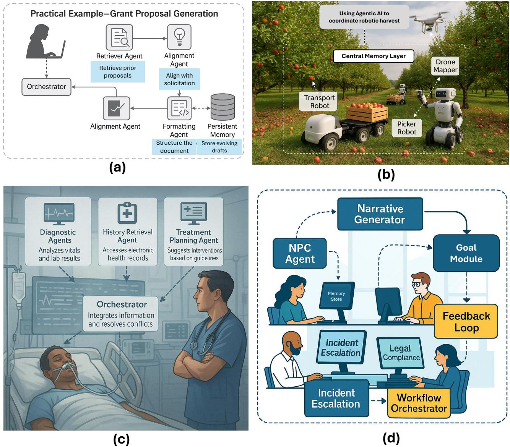

Fig. 11: Illustrative Applications of Agentic AI Across Domains: Figure [11](#page-17-0) presents four real-world applications of agentic AI systems. (a) Automated grant writing using multi-agent orchestration for structured literature analysis, compliance alignment, and document formatting. (b) Coordinated multi-robot harvesting in apple orchards using shared spatial memory and taskspecific agents for mapping, picking, and transport. (c) Clinical decision support in hospital ICUs through synchronized agents for diagnostics, treatment planning, and EHR analysis, enhancing safety and workflow efficiency. (d) Cybersecurity incident response in enterprise environments via agents handling threat classification, compliance analysis, and mitigation planning. In all cases, central orchestrators manage inter-agent communication, shared memory enables context retention, and feedback mechanisms drive continual learning. These use cases highlight agentic AI's capacity for scalable, autonomous task coordination in complex, dynamic environments across science, agriculture, healthcare, and IT security.

centralized memory layer accessible by all agents. Picker robots are assigned to high-density zones, guided by path-planning agents that optimize routes around obstacles and labor zones. Simultaneously, transport agents dynamically shuttle crates between pickers and storage, adjusting tasks in response to picker load levels and terrain changes. All agents communicate asynchronously through a shared protocol, and the orchestrator continuously adjusts task priorities based on weather forecasts or mechanical faults. If one picker fails, nearby units autonomously reallocate workload. This adaptive, memory-driven coordination exemplifies Agentic AI's potential to reduce labor costs, increase harvest efficiency, and respond to uncertainties in complex agricultural environments far surpassing the rigid programming of legacy agricultural robots [\[89\]](#page-29-4), [\[143\]](#page-30-15).

3) Collaborative Medical Decision Support: In highstakes clinical environments, Agentic AI enables distributed medical reasoning by assigning tasks such as diagnostics, vital monitoring, and treatment planning to specialized agents. For example, one agent may retrieve patient history, another validates findings against diagnostic guidelines, and a third proposes treatment options. These agents synchronize through shared memory and reasoning chains, ensuring coherent, safe recommendations. Applications include ICU management, radiology triage, and pandemic response. Real-world pilots show improved efficiency and decision accuracy compared to isolated expert systems [\[87\]](#page-29-2).

For example, in a hospital ICU (Figure [11c](#page-17-0)), an agentic AI system supports clinicians in managing complex patient cases. A diagnostic agent continuously analyzes vitals and lab data for early detection of sepsis risk. Simultaneously, a history retrieval agent accesses electronic health records (EHRs) to summarize comorbidities and recent procedures. A treatment planning agent cross-references current symptoms with clinical guidelines (e.g., Surviving Sepsis Campaign), proposing antibiotic regimens or fluid protocols. The orchestrator integrates these insights, ensures consistency, and surfaces conflicts for human review. Feedback from physicians is stored in a persistent memory module, allowing agents to refine their reasoning based on prior interventions and outcomes. This coordinated system enhances clinical workflow by reducing cognitive load, shortening decision times, and minimizing oversight risks. Early deployments in critical care and oncology units have demonstrated increased diagnostic precision and better adherence to evidence-based protocols, offering a scalable solution for safer, real-time collaborative medical support.

4) Multi-Agent Game AI and Adaptive Workflow Automation: In simulation environments and enterprise systems, Agentic AI facilitates decentralized task execution and emergent coordination. Game platforms like AI Dungeon deploy independent NPC agents with goals, memory, and dynamic interactivity to create emergent narratives and social behavior. In enterprise workflows, systems such as MultiOn and Cognosys use agents to manage processes like legal review or incident escalation, where each step is governed by a specialized module. These architectures exhibit resilience, exception handling, and feedback-driven adaptability far beyond rule-based pipelines.

For example, in a modern enterprise IT environment (as depicted in Figure [11d](#page-17-0)), Agentic AI systems are increasingly deployed to autonomously manage cybersecurity incident response workflows. When a potential threat is detected such as abnormal access patterns or unauthorized data exfiltration specialized agents are activated in parallel. One agent performs real-time threat classification using historical breach data and anomaly detection models. A second agent queries relevant log data from network nodes and correlates patterns across systems. A third agent interprets compliance frameworks (e.g., GDPR or HIPAA) to assess the regulatory severity of the event. A fourth agent simulates mitigation strategies and forecasts operational risks. These agents coordinate under a central orchestrator that evaluates collective outputs, integrates temporal reasoning, and issues recommended actions to human analysts. Through shared memory structures and iterative feedback, the system learns from prior incidents, enabling faster and more accurate responses in future cases. Compared to traditional rule-based security systems, this agentic model enhances decision latency, reduces false positives, and supports proactive threat containment in large-scale organizational infrastructures [\[89\]](#page-29-4).

# V. CHALLENGES AND LIMITATIONS IN AI AGENTS AND AGENTIC AI

To systematically understand the operational and theoretical limitations of current intelligent systems, we present a comparative visual synthesis in Figure [12,](#page-19-0) which categorizes challenges and potential remedies across both AI Agents and Agentic AI paradigms. Figure [12a](#page-19-0) outlines the four most pressing limitations specific to AI Agents namely, lack of causal reasoning, inherited LLM constraints (e.g., hallucinations, shallow reasoning), incomplete agentic properties (e.g., autonomy, proactivity), and failures in long-horizon planning and recovery. These challenges often arise due to their reliance on stateless LLM prompts, limited memory, and heuristic reasoning loops.

In contrast, Figure [12b](#page-19-0) identifies eight critical bottlenecks unique to Agentic AI systems, such as inter-agent error cascades, coordination breakdowns, emergent instability, scalability limits, and explainability issues. These challenges stem from the complexity of orchestrating multiple agents across distributed tasks without standardized architectures, robust communication protocols, or causal alignment frameworks.

Figure [13](#page-24-0) complements this diagnostic framework by synthesizing ten forward-looking design strategies aimed at mitigating these limitations. These include Retrieval-Augmented Generation (RAG), tool-based reasoning [\[120\]](#page-29-34), [\[121\]](#page-29-35), [\[123\]](#page-29-37), agentic feedback loops (ReAct [\[126\]](#page-29-40)), role-based multi-agent orchestration, memory architectures, causal modeling, and governance-aware design. Together, these three panels offer a consolidated roadmap for addressing current pitfalls and accelerating the development of safe, scalable, and contextaware autonomous systems.

*1) Challenges and Limitations of AI Agents:* While AI Agents have garnered considerable attention for their ability to automate structured tasks using LLMs and tool-use interfaces, the literature highlights significant theoretical and practical

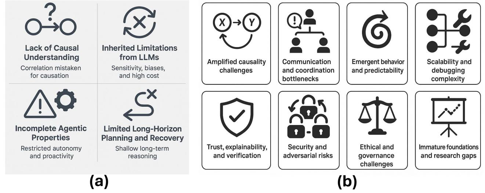

Fig. 12: Challenges and Solutions Across Agentic Paradigms. (a) Key limitations of AI Agents including causality deficits and shallow reasoning. (b) Amplified coordination and stability challenges in Agentic AI systems.

limitations that inhibit their reliability, generalization, and long-term autonomy [\[126\]](#page-29-40), [\[150\]](#page-30-22). These challenges arise from both the architectural dependence on static, pretrained models and the difficulty of instilling agentic qualities such as causal reasoning, planning, and robust adaptation. The key challenges and limitations (Figure [12a](#page-19-0)) of AI Agents are as summarized into following five points:

1) Lack of Causal Understanding: One of the most foundational challenges lies in the agents' inability to reason causally [\[164\]](#page-30-33), [\[165\]](#page-30-34). Current LLMs, which form the cognitive core of most AI Agents, excel at identifying statistical correlations within training data. However, as noted in recent research from DeepMind and conceptual analyses by TrueTheta, they fundamentally lack the capacity for causal modeling distinguishing between mere association and cause-effect relationships [\[166\]](#page-30-35)– [\[168\]](#page-30-36). For instance, while an LLM-powered agent might learn that visiting a hospital often co-occurs with illness, it cannot infer whether the illness causes the visit or vice versa, nor can it simulate interventions or hypothetical changes.

This deficit becomes particularly problematic under distributional shifts, where real-world conditions differ from the training regime [\[169\]](#page-30-37), [\[170\]](#page-31-0). Without such grounding, agents remain brittle, failing in novel or high-stakes scenarios. For example, a navigation agent that excels in urban driving may misbehave in snow or construction zones if it lacks an internal causal model of road traction or spatial occlusion.

2) Inherited Limitations from LLMs: AI Agents, particularly those powered by LLMs, inherit a number of intrinsic limitations that impact their reliability, adaptability, and overall trustworthiness in practical deployments [\[171\]](#page-31-1)–[\[173\]](#page-31-2). One of the most prominent issues is the tendency to produce hallucinations plausible but factually incorrect outputs. In high-stakes domains such as legal consultation or scientific research, these hallucinations can lead to severe misjudgments and erode user trust [\[174\]](#page-31-3), [\[175\]](#page-31-4). Compounding this is the well-documented prompt sensitivity of LLMs, where even minor variations in phrasing can lead to divergent behaviors. This brittleness hampers reproducibility, necessitating meticulous manual prompt engineering and often requiring domain-specific tuning to maintain consistency across interactions [\[176\]](#page-31-5).

Furthermore, while recent agent frameworks adopt reasoning heuristics like Chain-of-Thought (CoT) [\[151\]](#page-30-23), [\[177\]](#page-31-6) and ReAct [\[126\]](#page-29-40) to simulate deliberative processes, these approaches remain shallow in semantic comprehension. Agents may still fail at multi-step inference, misalign task objectives, or make logically inconsistent conclusions despite the appearance of structured reasoning [\[126\]](#page-29-40). Such shortcomings underscore the absence of genuine understanding and generalizable planning capabilities.

Another key limitation lies in computational cost and latency. Each cycle of agentic decision-making particularly in planning or tool-calling may require several LLM invocations. This not only increases runtime latency but also scales resource consumption, creating practical bottlenecks in real-world deployments and cloud-based inference systems. Furthermore, LLMs have a static knowledge cutoff and cannot dynamically integrate new information unless explicitly augmented via retrieval or tool plugins. They also reproduce the biases of their training datasets, which can manifest as culturally insensitive or skewed responses [\[178\]](#page-31-7), [\[179\]](#page-31-8). Without rigorous auditing and mitigation strategies,

| Model / Reference                                                                          | Application Area         | Operation as Agentic AI                                                                                             |
|--------------------------------------------------------------------------------------------|-----------------------------|---------------------------------------------------------------------------------------------------------------------|
| Auto-GPT [30]                                                                           | Task Automation             | Decomposes high-level goals, executes subtasks via tools/APIs, and iteratively self-corrects.     |
| GPT Engineer Open Source (2023) GPT Engineer                                   | Code Generation             | Builds entire codebases: plans, writes, tests, and re fines based on output.                                  |
| MetaGPT [143])                                                                          | Software Collab oration  | Coordinates specialized agents (e.g., coder, tester) for modular multi-role project development.  |
| BabyAGI Nakajima (2024) BabyAGI                                                   | Project Manage ment      | Continuously creates, pri oritizes, and executes sub tasks to adaptively meet user goals.                  |
| Voyager Wang et al. (2023) [161]                                            | Game Exploration         | Learns in Minecraft, in vents new skills, sets sub goals, and adapts strategy in real time.                |
| CAMEL Liu et al. (2023) [162]                                                           | Multi-Agent Simulation   | Simulates agent societies with communication, ne gotiation, and emergent collaborative behavior.     |
| Einstein Copilot Salesforce (2024) Ein stein Copilot                                 | Customer Automation      | Automates full support workflows, escalates is sues, and improves via feedback loops. |
| Copilot Studio (Agentic Mode) Microsoft (2025) Github Agentic Copilot | Productivity Au tomation | Manages documents, meetings, and projects across Microsoft 365 with adaptive orchestration.       |
| Atera AI Copilot Atera (2025) Atera Agentic AI                                 | IT Operations               | Diagnoses/resolves IT is sues, automates ticketing, and learns from evolving infrastructures.              |
| AES Safety Audit Agent AES (2025) AES agentic                         | Industrial Safety           | Automates audits, assesses compliance, and evolves strategies to enhance safety outcomes.            |
| DeepMind Gato (Agentic Mode) Reed et al. (2022) [163]                 | General Robotics            | Performs varied tasks across modalities, dynamically learns, plans, and executes.              |
| GPT-4o + Plugins OpenAI (2024) GPT 4O Agentic                                        | Enterprise Automation    | Manages complex work flows, integrates external tools, and executes adap tive decisions.                   |

TABLE XI: Representative Agentic AI Models (2023–2025): Applications and Operational Characteristics

these issues pose serious ethical and operational risks, particularly when agents are deployed in sensitive or user-facing contexts.

3) Incomplete Agentic Properties: A major limitation of current AI Agents is their inability to fully satisfy the canonical agentic properties defined in foundational literature, such as autonomy, proactivity, reactivity, and social ability [\[135\]](#page-30-6), [\[173\]](#page-31-2). While many systems marketed as "agents" leverage LLMs to perform useful tasks, they often fall short of these fundamental criteria in practice. Autonomy, for instance, is typically partial at best. Although agents can execute tasks with minimal oversight once initialized, they remain heavily reliant on external scaffolding such as human-defined prompts, planning heuristics, or feedback loops to function effectively [\[180\]](#page-31-9). Self-initiated task generation, selfmonitoring, or autonomous error correction are rare or absent, limiting their capacity for true independence.

Proactivity is similarly underdeveloped. Most AI Agents require explicit user instruction to act and lack the capacity to formulate or reprioritize goals dynamically based on contextual shifts or evolving objectives [\[181\]](#page-31-10). As a result, they behave reactively rather than strategically, constrained by the static nature of their initialization. Reactivity itself is constrained by architectural bottlenecks. Agents do respond to environmental or user input, but response latency caused by repeated LLM inference calls [\[182\]](#page-31-11), [\[183\]](#page-31-12), coupled with narrow contextual memory windows [\[153\]](#page-30-25), [\[184\]](#page-31-13), inhibits real-time adaptability. Perhaps the most underexplored capability is social ability. True agentic systems should communicate and coordinate with humans or other agents over extended interactions, resolving ambiguity, negotiating tasks, and adapting to social norms.

However, existing implementations exhibit brittle, template-based dialogue that lacks long-term memory integration or nuanced conversational context. Agentto-agent interaction is often hardcoded or limited to scripted exchanges, hindering collaborative execution and emergent behavior [\[96\]](#page-29-10), [\[185\]](#page-31-14). Collectively, these deficiencies reveal that while AI Agents demonstrate functional intelligence, they remain far from meeting the formal benchmarks of intelligent, interactive, and adaptive agents. Bridging this gap is essential for advancing toward more autonomous, socially capable AI systems.

4) Limited Long-Horizon Planning and Recovery: A persistent limitation of current AI Agents lies in their inability to perform robust long-horizon planning, especially in complex, multi-stage tasks. This constraint stems from their foundational reliance on stateless prompt-response paradigms, where each decision is made without an intrinsic memory of prior reasoning steps unless externally managed. Although augmentations such as the ReAct framework [\[126\]](#page-29-40) or Treeof-Thoughts [\[152\]](#page-30-24) introduce pseudo-recursive reasoning, they remain fundamentally heuristic and lack true internal models of time, causality, or state evolution. Consequently, agents often falter in tasks requiring extended temporal consistency or contingency planning. For example, in domains such as clinical triage or financial portfolio management, where decisions depend on prior context and dynamically unfolding outcomes, agents may exhibit repetitive behaviors such as endlessly querying tools or fail to adapt when sub-tasks fail or return ambiguous results. The absence of systematic recovery mechanisms or error detection leads to brittle workflows and error propagation. This shortfall severely limits agent deployment in mission-critical environments where reliability, fault tolerance, and sequential coherence are essential.

5) Reliability and Safety Concerns: AI Agents are not yet safe or verifiable enough for deployment in critical infrastructure [\[186\]](#page-31-15). The absence of causal reasoning leads to unpredictable behavior under distributional shift [\[165\]](#page-30-34), [\[187\]](#page-31-16). Furthermore, evaluating the correctness of an agent's plan especially when the agent fabricates intermediate steps or rationales remains an unsolved problem in interpretability [\[104\]](#page-29-18), [\[188\]](#page-31-17). Safety guarantees, such as formal verification, are not yet available for open-ended, LLM-powered agents. While AI Agents represent a major step beyond static generative models, their limitations in causal reasoning, adaptability, robustness, and planning restrict their deployment in highstakes or dynamic environments. Most current systems rely on heuristic wrappers and brittle prompt engineering rather than grounded agentic cognition. Bridging this gap will require future systems to integrate causal models, dynamic memory, and verifiable reasoning mechanisms. These limitations also set the stage for the emergence of Agentic AI systems, which attempt to address these bottlenecks through multi-agent collaboration, orchestration layers, and persistent system-level context.

*2) Challenges and Limitations of Agentic AI:* Agentic AI systems represent a paradigm shift from isolated AI agents to collaborative, multi-agent ecosystems capable of decomposing and executing complex goals [\[14\]](#page-27-13). These systems typically consist of orchestrated or communicating agents that interact via tools, APIs, and shared environments [\[18\]](#page-27-16), [\[38\]](#page-27-33). While this architectural evolution enables more ambitious automation, it introduces a range of amplified and novel challenges that compound existing limitations of individual LLM-based agents. The current challenges and limitations of Agentic AI are as follows:

1) Amplified Causality Challenges: One of the most critical limitations in Agentic AI systems is the magnification of causality deficits already observed in singleagent architectures. Unlike traditional AI Agents that operate in relatively isolated environments, Agentic AI systems involve complex inter-agent dynamics, where each agent's action can influence the decision space of others. Without a robust capacity for modeling causeeffect relationships, these systems struggle to coordinate effectively and adapt to unforeseen environmental shifts. A key manifestation of this challenge is *inter-agent distributional shift*, where the behavior of one agent alters the operational context for others. In the absence of causal reasoning, agents are unable to anticipate the downstream impact of their outputs, resulting in coordination breakdowns or redundant computations [\[189\]](#page-31-18). Furthermore, these systems are particularly vulnerable to *error cascades*: a faulty or hallucinated output from one agent can propagate through the system, compounding inaccuracies and corrupting subsequent decisions. For example, if a verification agent erroneously validates false information, downstream agents such as summarizers or decision-makers may unknowingly build upon that misinformation, compromising the integrity of the entire system. This fragility underscores the urgent need for integrating causal inference and intervention modeling into the design of multi-agent workflows, especially in high-stakes or dynamic environments where systemic robustness is essential.

2) Communication and Coordination Bottlenecks: A fundamental challenge in Agentic AI lies in achieving efficient communication and coordination across multiple autonomous agents. Unlike single-agent systems, Agentic AI involves distributed agents that must collectively pursue a shared objective necessitating precise alignment, synchronized execution, and robust communication protocols. However, current implementations fall short in these aspects. One major issue is *goal alignment and shared context*, where agents often lack a unified semantic understanding of overarching objectives. This hampers sub-task decomposition, dependency management, and progress monitoring, especially in dynamic environments requiring causal awareness and temporal coherence.

In addition, *protocol limitations* significantly hinder inter-agent communication. Most systems rely on natural language exchanges over loosely defined interfaces, which are prone to ambiguity, inconsistent formatting, and contextual drift. These communication gaps lead to fragmented strategies, delayed coordination, and degraded system performance. Furthermore, *resource contention* emerges as a systemic bottleneck when agents simultaneously access shared computational, memory, or API resources. Without centralized orchestration or intelligent scheduling mechanisms, these conflicts can result in race conditions, execution delays, or outright system failures. Collectively, these bottlenecks illustrate the immaturity of current coordination frameworks in Agentic AI, and highlight the pressing need for standardized communication protocols, semantic task planners, and global resource managers to ensure scalable, coherent multi-agent collaboration.

3) Emergent Behavior and Predictability: One of the most critical limitations of Agentic AI lies in managing emergent behavior complex system-level phenomena that arise from the interactions of autonomous agents. While such emergence can potentially yield adaptive and innovative solutions, it also introduces significant unpredictability and safety risks [\[145\]](#page-30-17), [\[190\]](#page-31-19). A key concern is the generation of *unintended outcomes*, where agent interactions result in behaviors that were not explicitly programmed or foreseen by system designers. These behaviors may diverge from task objectives, generate misleading outputs, or even enact harmful actions particularly in high-stakes domains like healthcare, finance, or critical infrastructure.

As the number of agents and the complexity of their interactions grow, so too does the likelihood of *system instability*. This includes phenomena such as infinite planning loops, action deadlocks, and contradictory behaviors emerging from asynchronous or misaligned agent decisions. Without centralized arbitration mechanisms, conflict resolution protocols, or fallback strategies, these instabilities compound over time, making the system fragile and unreliable. The stochasticity and opacity of large language model-based agents further exacerbate this issue, as their internal decision logic is not easily interpretable or verifiable. Consequently, ensuring the predictability and controllability of emergent behavior remains a central challenge in designing safe and scalable Agentic AI systems.

4) Scalability and Debugging Complexity: As Agentic AI systems scale in both the number of agents and the diversity of specialized roles, maintaining system reliability and interpretability becomes increasingly complex [\[191\]](#page-31-20), [\[192\]](#page-31-21). A central limitation stems from the *black-box chains of reasoning* characteristic of LLM-based agents. Each agent may process inputs through opaque internal logic, invoke external tools, and communicate with other agents all of which occur through multiple layers of prompt engineering, reasoning heuristics, and dynamic context handling. Tracing the root cause of a failure thus requires unwinding nested sequences of agent interactions, tool invocations, and memory updates, making debugging non-trivial and time-consuming.

Another significant constraint is the system's *noncompositionality*. Unlike traditional modular systems, where adding components can enhance overall functionality, introducing additional agents in an Agentic AI architecture often increases cognitive load, noise, and coordination overhead. Poorly orchestrated agent networks can result in redundant computation, contradictory decisions, or degraded task performance. Without robust frameworks for agent role definition, communication standards, and hierarchical planning, the scalability of Agentic AI does not necessarily translate into greater intelligence or robustness. These limitations highlight the need for systematic architectural controls and traceability tools to support the development of reliable, large-scale agentic ecosystems.

5) Trust, Explainability, and Verification: Agentic AI systems pose heightened challenges in explainability and verifiability due to their distributed, multi-agent architecture. While interpreting the behavior of a single LLMpowered agent is already non-trivial, this complexity is *multiplied* when multiple agents interact asynchronously through loosely defined communication protocols. Each agent may possess its own memory, task objective, and reasoning path, resulting in compounded opacity where tracing the causal chain of a final decision or failure becomes exceedingly difficult. The lack of shared, transparent logs or interpretable reasoning paths across agents makes it nearly impossible to determine *why* a particular sequence of actions occurred or which agent initiated a misstep.

Compounding this opacity is the *absence of formal verification tools* tailored for Agentic AI. Unlike traditional software systems, where model checking and formal proofs offer bounded guarantees, there exists no widely adopted methodology to verify that a multiagent LLM system will perform reliably across all input distributions or operational contexts. This lack of verifiability presents a significant barrier to adoption in safetycritical domains such as autonomous vehicles, finance, and healthcare, where explainability and assurance are non-negotiable. To advance Agentic AI safely, future research must address the foundational gaps in causal traceability, agent accountability, and formal safety guarantees.

6) Security and Adversarial Risks: Agentic AI architectures introduce a significantly expanded attack surface compared to single-agent systems, exposing them to complex adversarial threats. One of the most critical vulnerabilities lies in the presence of a *single point of compromise*. Since Agentic AI systems are composed of interdependent agents communicating over shared memory or messaging protocols, the compromise of even one agent through prompt injection, model poisoning, or adversarial tool manipulation can propagate malicious outputs or corrupted state across the entire system. For example, a fact-checking agent fed with tampered data could unintentionally legitimize false claims, which are then integrated into downstream reasoning by summarization or decision-making agents.

Moreover, *inter-agent dynamics* themselves are susceptible to exploitation. Attackers can induce race conditions, deadlocks, or resource exhaustion by manipulating the coordination logic between agents. Without rigorous authentication, access control, and sandboxing mechanisms, malicious agents or corrupted tool responses can derail multi-agent workflows or cause erroneous escalation in task pipelines. These risks are exacerbated by the absence of standardized security frameworks for LLM-based multi-agent systems, leaving most current implementations defenseless against sophisticated multistage attacks. As Agentic AI moves toward broader adoption, especially in high-stakes environments, embedding secure-by-design principles and adversarial robustness becomes an urgent research imperative.

7) Ethical and Governance Challenges: The distributed and autonomous nature of Agentic AI systems introduces profound ethical and governance concerns, particularly in terms of accountability, fairness, and value alignment. In multi-agent settings, *accountability gaps* emerge when multiple agents interact to produce an outcome, making it difficult to assign responsibility for errors or unintended consequences. This ambiguity complicates legal liability, regulatory compliance, and user trust, especially in domains such as healthcare, finance, or defense. Furthermore, *bias propagation and amplification* present a unique challenge: agents individually trained on biased data may reinforce each other's skewed decisions through interaction, leading to systemic inequities that are more pronounced than in isolated models. These emergent biases can be subtle and difficult to detect without longitudinal monitoring or audit mechanisms.

Additionally, *misalignment and value drift* pose serious risks in long-horizon or dynamic environments. Without a unified framework for shared value encoding, individual agents may interpret overarching objectives differently or optimize for local goals that diverge from human intent. Over time, this misalignment can lead to behavior that is inconsistent with ethical norms or user expectations. Current alignment methods, which are mostly designed for single-agent systems, are inadequate for managing value synchronization across heterogeneous agent collectives. These challenges highlight the urgent need for governance-aware agent architectures, incorporating principles such as role-based isolation, traceable decision logging, and participatory oversight mechanisms to ensure ethical integrity in autonomous multi-agent systems.

8) Immature Foundations and Research Gaps: Despite rapid progress and high-profile demonstrations, Agentic AI remains in a nascent research stage with unresolved foundational issues that limit its scalability, reliability, and theoretical grounding. A central concern is the *lack of standard architectures*. There is currently no widely accepted blueprint for how to design, monitor, or evaluate multi-agent systems built on LLMs . This architectural fragmentation makes it difficult to compare implementations, replicate experiments, or generalize findings across domains. Key aspects such as agent orchestration, memory structures, and communication protocols are often implemented ad hoc, resulting in brittle systems that lack interoperability and formal guarantees.

Equally critical is the *absence of causal foundations* as scalable causal discovery and reasoning remain unsolved challenges [\[193\]](#page-31-22). Without the ability to represent and reason about cause-effect relationships, Agentic AI systems are inherently limited in their capacity to generalize safely beyond narrow training regimes [\[170\]](#page-31-0), [\[194\]](#page-31-23). This shortfall affects their robustness under distributional shifts, their capacity for proactive intervention, and their ability to simulate counterfactuals or hypothetical plans core requirements for intelligent coordination and decision-making.

The gap between functional demos and principled design thus underscores an urgent need for foundational research in multi-agent system theory, causal inference integration, and benchmark development. Only by addressing these deficiencies can the field progress from prototype pipelines to trustworthy, general-purpose agentic frameworks suitable for deployment in highstakes environments.

# VI. POTENTIAL SOLUTIONS AND FUTURE ROADMAP

The potential solutions (as illustrated in Figure [13\)](#page-24-0) to these challenges and limitations of AI agents and Agentic AI are summarized in the following points:

1) Retrieval-Augmented Generation (RAG): For AI Agents, Retrieval-Augmented Generation mitigates hallucinations and expands static LLM knowledge by grounding outputs in real-time data [\[195\]](#page-31-24). By embedding user queries and retrieving semantically relevant documents from vector databases like FAISS [Faiss](https://github.com/facebookresearch/faiss) or Pinecone [Pinecone,](https://www.pinecone.io/) agents can generate contextually valid responses rooted in external facts. This is particularly effective in domains such as enterprise search and customer support, where accuracy and up-to-date knowledge are essential.

In Agentic AI systems, RAG serves as a shared grounding mechanism across agents. For example, a summarizer agent may rely on the retriever agent to access the latest scientific papers before generating a synthesis. Persistent, queryable memory allows distributed agents to operate on a unified semantic layer, mitigating inconsistencies due to divergent contextual views. When implemented across a multi-agent system, RAG helps maintain shared truth, enhances goal alignment, and reduces inter-agent misinformation propagation.

2) Tool-Augmented Reasoning (Function Calling): AI Agents benefit significantly from function calling, which extends their ability to interact with real-world systems [\[159\]](#page-30-31), [\[196\]](#page-31-25). Agents can query APIs, run local scripts, or access structured databases, thus transforming LLMs from static predictors into interactive problem-solvers [\[125\]](#page-29-39), [\[154\]](#page-30-26). This allows them to dynamically retrieve weather forecasts, schedule appointments, or execute Python-based calculations, all beyond the capabilities of pure language modeling.

For Agentic AI, function calling supports agent level autonomy and role differentiation. Agents within a team may use APIs to invoke domain-specific actions such as querying clinical databases or generating visual charts based on assigned roles. Function calls become part of an orchestrated pipeline, enabling fluid delegation across agents [\[197\]](#page-31-26). This structured interaction reduces ambiguity in task handoff and fosters clearer behavioral boundaries, especially when integrated with validation protocols or observation mechanisms [\[14\]](#page-27-13), [\[18\]](#page-27-16).

3) Agentic Loop: Reasoning, Action, Observation: AI Agents often suffer from single-pass inference limitations. The ReAct pattern introduces an iterative loop where agents reason about tasks, act by calling tools or APIs, and then observe results before continuing.

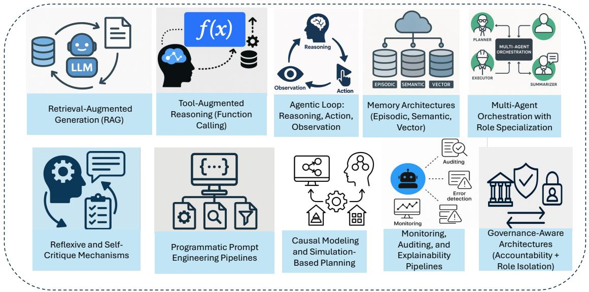

Fig. 13: Ten emerging architectural and algorithmic solutions such as RAG, tool use, memory, orchestration, and reflexive mechanisms addressing reliability, scalability, and explainability across both paradigms

This feedback loop allows for more deliberate, contextsensitive behaviors. For example, an agent may verify retrieved data before drafting a summary, thereby reducing hallucination and logical errors. In Agentic AI, this pattern is critical for collaborative coherence. ReAct enables agents to evaluate dependencies dynamically reasoning over intermediate states, re-invoking tools if needed, and adjusting decisions as the environment evolves. This loop becomes more complex in multiagent settings where each agent's observation must be reconciled against others' outputs. Shared memory and consistent logging are essential here, ensuring that the reflective capacity of the system is not fragmented across agents [\[126\]](#page-29-40).

- 4) Memory Architectures (Episodic, Semantic, Vector): AI Agents face limitations in long-horizon planning and session continuity. Memory architectures address this by persisting information across tasks [\[198\]](#page-31-27). Episodic memory allows agents to recall prior actions and feedback, semantic memory encodes structured domain knowledge, and vector memory enables similarity-based retrieval [\[199\]](#page-31-28). These elements are key for personalization and adaptive decision-making in repeated interactions. Agentic AI systems require even more sophisticated memory models due to distributed state management. Each agent may maintain local memory while accessing shared global memory to facilitate coordination. For example, a planner agent might use vector-based memory to recall prior workflows, while a QA agent references semantic memory for fact verification. Synchronizing memory access and updates across agents enhances consistency, enables context-aware communication, and supports long-horizon system-level planning.
- 5) Multi-Agent Orchestration with Role Specialization: In AI Agents, task complexity is often handled via modular prompt templates or conditional logic. However, as task diversity increases, a single agent may become overloaded [\[200\]](#page-31-29), [\[201\]](#page-31-30). Role specialization splitting tasks into subcomponents (e.g., planner, summarizer) allows lightweight orchestration even within single-agent systems by simulating compartmentalized reasoning. In Agentic AI, orchestration is central. A meta-agent or orchestrator distributes tasks among specialized agents, each with distinct capabilities. Systems like MetaGPT and ChatDev exemplify this: agents emulate roles such as CEO, engineer, or reviewer, and interact through structured messaging. This modular approach enhances interpretability, scalability, and fault isolation ensuring that failures in one agent do not cascade without containment mechanisms from the orchestrator.
- 6) Reflexive and Self-Critique Mechanisms: AI Agents often fail silently or propagate errors. Reflexive mechanisms introduce the capacity for self-evaluation [\[202\]](#page-31-31), [\[203\]](#page-31-32). After completing a task, agents can critique their own outputs using a secondary reasoning pass, increasing robustness and reducing error rates. For example, a legal assistant agent might verify that its drafted clause matches prior case laws before submission. For Agentic AI, reflexivity extends beyond self-critique to inter-agent evaluation. Agents can review each other's outputs e.g., a verifier agent auditing a summarizer's work. Reflexion-like mechanisms ensure collaborative quality control and enhance trustworthiness [\[204\]](#page-31-33). Such patterns also support iterative improvement and adaptive replanning, particularly when integrated with memory logs or feedback queues [\[205\]](#page-31-34), [\[206\]](#page-31-35).
- 7) Programmatic Prompt Engineering Pipelines: Manual prompt tuning introduces brittleness and reduces reproducibility in AI Agents. Programmatic pipelines automate this process using task templates, context fillers, and retrieval-augmented variables [\[207\]](#page-31-36), [\[208\]](#page-31-37). These dynamic prompts are structured based on task type, agent role, or user query, improving generalization and reducing failure modes associated with prompt variability. In Agentic AI, prompt pipelines enable scalable, role-consistent communication. Each agent type (e.g., planner, retriever, summarizer) can generate or consume structured prompts tailored to its function. By automating message formatting, dependency tracking, and semantic alignment, programmatic prompting prevents coordination drift and ensures consistent reasoning across diverse agents in real time [\[14\]](#page-27-13), [\[159\]](#page-30-31).
- 8) Causal Modeling and Simulation-Based Planning: AI Agents often operate on statistical correlations rather than causal models, leading to poor generalization under distribution shifts. Embedding causal inference allows agents to distinguish between correlation and causation, simulate interventions, and plan more robustly. For instance, in supply chain scenarios, a causally aware agent can simulate the downstream impact of shipment delays. In Agentic AI, causal reasoning is vital for safe coordination and error recovery. Agents must anticipate how their actions impact others requiring causal graphs, simulation environments, or Bayesian inference layers. For example, a planning agent may simulate different strategies and communicate likely outcomes to others, fostering strategic alignment and avoiding unintended emergent behaviors.
- 9) Monitoring, Auditing, and Explainability Pipelines: AI Agents lack transparency, complicating debugging and trust. Logging systems that record prompts, tool calls, memory updates, and outputs enable post-hoc analysis and performance tuning. These records help developers trace faults, refine behavior, and ensure compliance with usage guidelines especially critical in enterprise or legal domains. For Agentic AI, logging and explainability are exponentially more important. With multiple agents interacting asynchronously, audit trails are essential for identifying which agent caused an error and under what conditions. Explainability pipelines that integrate across agents (e.g., timeline visualizations or dialogue replays) are key to ensuring safety, especially in regulatory or multi-stakeholder environments.
- 10) Governance-Aware Architectures (Accountability and Role Isolation): AI Agents currently lack builtin safeguards for ethical compliance or error attribution. Governance-aware designs introduce role-based access control, sandboxing, and identity resolution to ensure agents act within scope and their decisions can be audited or revoked. These structures reduce risks in sensitive applications such as healthcare or finance. In Agentic AI, governance must scale across roles,

agents, and workflows. Role isolation prevents rogue agents from exceeding authority, while accountability mechanisms assign responsibility for decisions and trace causality across agents. Compliance protocols, ethical alignment checks, and agent authentication ensure safety in collaborative settings paving the way for trustworthy AI ecosystems.

AI Agents are projected to evolve significantly through enhanced modular intelligence focused on five key domains as depicted in Figure [14](#page-26-0) as : proactive reasoning, tool integration, causal inference, continual learning, and trust-centric operations. The first transformative milestone involves transitioning from reactive to *Proactive Intelligence*, where agents initiate tasks based on learned patterns, contextual cues, or latent goals rather than awaiting explicit prompts. This advancement depends heavily on robust *Tool Integration*, enabling agents to dynamically interact with external systems, such as databases, APIs, or simulation environments, to fulfill complex user tasks. Equally critical is the development of *Causal Reasoning*, which will allow agents to move beyond statistical correlation, supporting inference of cause-effect relationships essential for tasks involving diagnosis, planning, or prediction. To maintain relevance over time, agents must adopt frameworks for *Continuous Learning*, incorporating feedback loops and episodic memory to adapt their behavior across sessions and environments. Lastly, to build user confidence, agents must prioritize *Trust & Safety* mechanisms through verifiable output logging, bias detection, and ethical guardrails especially as their autonomy increases. Together, these pathways will redefine AI Agents from static tools into adaptive cognitive systems capable of autonomous yet controllable operation in dynamic digital environments.

Agentic AI, as a natural extension of these foundations, emphasizes collaborative intelligence through multi-agent coordination, contextual persistence, and domain-specific orchestration. Future systems (Figure [14](#page-26-0) right side) will exhibit *Multi-Agent Scaling*, enabling specialized agents to work in parallel under distributed control for complex problem-solving mirroring team-based human workflows. This necessitates a layer of *Unified Orchestration*, where meta-agents or orchestrators dynamically assign roles, monitor task dependencies, and mediate conflicts among subordinate agents. Sustained performance over time depends on *Persistent Memory* architectures, which preserve semantic, episodic, and shared knowledge for agents to coordinate longitudinal tasks and retain state awareness. *Simulation Planning* is expected to become a core feature, allowing agent collectives to test hypothetical strategies, forecast consequences, and optimize outcomes before real-world execution. Moreover, *Ethical Governance* frameworks will be essential to ensure responsible deployment defining accountability, oversight, and value alignment across autonomous agent networks. Finally, tailored *Domain-Specific Systems* will emerge in fields like law, medicine, and supply chains, leveraging contextual specialization to outperform generic agents. This future positions Agentic AI not merely

Fig. 14: Mindmap visualization of the future roadmap for AI Agents and Agentic AI.

as a coordination layer on the top of AI Agents, but as a new paradigm for collective machine intelligence with adaptive planning, recursive reasoning, and collaborative cognition at its core.

## VII. CONCLUSION

In this study, we presented a comprehensive literature-based evaluation of the evolving landscape of AI Agents and Agentic AI, offering a structured taxonomy that highlights foundational concepts, architectural evolution, application domains, and key limitations. Beginning with a foundational understanding, we characterized AI Agents as modular, task-specific entities with constrained autonomy and reactivity. Their operational scope is grounded in the integration of LLMs and LIMs, which serve as core reasoning modules for perception, language understanding, and decision-making. We identified generative AI as a functional precursor, emphasizing its limitations in autonomy and goal persistence, and examined how LLMs drive the progression from passive generation to interactive task completion through tool augmentation.

This study then explored the conceptual emergence of Agentic AI systems as a transformative evolution from isolated agents to orchestrated, multi-agent ecosystems. We analyzed key differentiators such as distributed cognition, persistent memory, and coordinated planning that distinguish Agentic AI from conventional agent models. This was followed by a detailed breakdown of architectural evolution, highlighting the transition from monolithic, rule-based frameworks to modular, role specialized networks facilitated by orchestration layers and reflective memory architectures. Additionally, this study then surveyed application domains in which these paradigms are deployed. For AI Agents, we illustrated their role in automating customer support, internal enterprise search, email prioritization, and scheduling. For Agentic AI, we demonstrated use cases in collaborative research, robotics, medical decision support, and adaptive workflow automation, supported by practical examples and industry-grade systems. Finally, this study provided a deep analysis of the challenges and limitations affecting both paradigms. For AI Agents, we discussed hallucinations, shallow reasoning, and planning constraints, while for Agentic AI, we addressed amplified causality issues, coordination bottlenecks, emergent behavior, and governance concerns. These insights offer a roadmap for future development and deployment of trustworthy, scalable agentic systems.

## ACKNOWLEDGEMENT

This work was supported by the National Science Foundation and the United States Department of Agriculture, National Institute of Food and Agriculture through the "Artificial Intelligence (AI) Institute for Agriculture" Program under Award AWD003473, and AWD004595, Accession Number 1029004, "Robotic Blossom Thinning with Soft Manipulators".

## DECLARATIONS

The authors declare no conflicts of interest.

## STATEMENT ON AI WRITING ASSISTANCE

ChatGPT and Perplexity were utilized to enhance grammatical accuracy and refine sentence structure; all AI-generated revisions were thoroughly reviewed and edited for relevance. Additionally, ChatGPT-4o was employed to generate realistic visualizations.

## REFERENCES

- [1] E. Oliveira, K. Fischer, and O. Stepankova, "Multi-agent systems: which research for which applications," *Robotics and Autonomous Systems*, vol. 27, no. 1-2, pp. 91–106, 1999.
- [2] Z. Ren and C. J. Anumba, "Multi-agent systems in construction–state of the art and prospects," *Automation in Construction*, vol. 13, no. 3, pp. 421–434, 2004.
- [3] C. Castelfranchi, "Modelling social action for ai agents," *Artificial intelligence*, vol. 103, no. 1-2, pp. 157–182, 1998.
- [4] J. Ferber and G. Weiss, *Multi-agent systems: an introduction to distributed artificial intelligence*, vol. 1. Addison-wesley Reading, 1999.
- [5] R. Calegari, G. Ciatto, V. Mascardi, and A. Omicini, "Logic-based technologies for multi-agent systems: a systematic literature review," *Autonomous Agents and Multi-Agent Systems*, vol. 35, no. 1, p. 1, 2021.
- [6] R. C. Cardoso and A. Ferrando, "A review of agent-based programming for multi-agent systems," *Computers*, vol. 10, no. 2, p. 16, 2021.
- [7] E. Shortliffe, *Computer-based medical consultations: MYCIN*, vol. 2. Elsevier, 2012.
- [8] H. P. Moravec, "The stanford cart and the cmu rover," *Proceedings of the IEEE*, vol. 71, no. 7, pp. 872–884, 1983.
- [9] B. Dai and H. Chen, "A multi-agent and auction-based framework and approach for carrier collaboration," *Logistics Research*, vol. 3, pp. 101– 120, 2011.
- [10] J. Grosset, A.-J. Fougeres, M. Djoko-Kouam, and J.-M. Bonnin, ` "Multi-agent simulation of autonomous industrial vehicle fleets: Towards dynamic task allocation in v2x cooperation mode," *Integrated Computer-Aided Engineering*, vol. 31, no. 3, pp. 249–266, 2024.
- [11] R. A. Agis, S. Gottifredi, and A. J. Garc´ıa, "An event-driven behavior trees extension to facilitate non-player multi-agent coordination in video games," *Expert Systems with Applications*, vol. 155, p. 113457, 2020.
- [12] A. Guerra-Hernandez, A. El Fallah-Seghrouchni, and H. Soldano, ´ "Learning in bdi multi-agent systems," in *International Workshop on Computational Logic in Multi-Agent Systems*, pp. 218–233, Springer, 2004.
- [13] A. Saadi, R. Maamri, and Z. Sahnoun, "Behavioral flexibility in beliefdesire-intention (bdi) architectures," *Multiagent and grid systems*, vol. 16, no. 4, pp. 343–377, 2020.
- [14] D. B. Acharya, K. Kuppan, and B. Divya, "Agentic ai: Autonomous intelligence for complex goals–a comprehensive survey," *IEEE Access*, 2025.
- [15] M. Z. Pan, M. Cemri, L. A. Agrawal, S. Yang, B. Chopra, R. Tiwari, K. Keutzer, A. Parameswaran, K. Ramchandran, D. Klein, *et al.*, "Why do multiagent systems fail?," in *ICLR 2025 Workshop on Building Trust in Language Models and Applications*, 2025.
- [16] L. Hughes, Y. K. Dwivedi, T. Malik, M. Shawosh, M. A. Albashrawi, I. Jeon, V. Dutot, M. Appanderanda, T. Crick, R. De', *et al.*, "Ai agents and agentic systems: A multi-expert analysis," *Journal of Computer Information Systems*, pp. 1–29, 2025.
- [17] Z. Deng, Y. Guo, C. Han, W. Ma, J. Xiong, S. Wen, and Y. Xiang, "Ai agents under threat: A survey of key security challenges and future pathways," *ACM Computing Surveys*, vol. 57, no. 7, pp. 1–36, 2025.
- [18] M. Gridach, J. Nanavati, K. Z. E. Abidine, L. Mendes, and C. Mack, "Agentic ai for scientific discovery: A survey of progress, challenges, and future directions," *arXiv preprint arXiv:2503.08979*, 2025.
- [19] T. Song, M. Luo, X. Zhang, L. Chen, Y. Huang, J. Cao, Q. Zhu, D. Liu, B. Zhang, G. Zou, *et al.*, "A multiagent-driven robotic ai chemist enabling autonomous chemical research on demand," *Journal of the American Chemical Society*, vol. 147, no. 15, pp. 12534–12545, 2025.
- [20] M. M. Karim, D. H. Van, S. Khan, Q. Qu, and Y. Kholodov, "Ai agents meet blockchain: A survey on secure and scalable collaboration for multi-agents," *Future Internet*, vol. 17, no. 2, p. 57, 2025.
- [21] A. Radford, K. Narasimhan, T. Salimans, I. Sutskever, *et al.*, "Improving language understanding by generative pre-training," *arxiv*, 2018.
- [22] J. Sanchez Cuadrado, S. P ´ erez-Soler, E. Guerra, and J. De Lara, ´ "Automating the development of task-oriented llm-based chatbots," in *Proceedings of the 6th ACM Conference on Conversational User Interfaces*, pp. 1–10, 2024.
- [23] Y. Lu, A. Aleta, C. Du, L. Shi, and Y. Moreno, "Llms and generative agent-based models for complex systems research," *Physics of Life Reviews*, 2024.
- [24] A. Zhang, Y. Chen, L. Sheng, X. Wang, and T.-S. Chua, "On generative agents in recommendation," in *Proceedings of the 47th international ACM SIGIR conference on research and development in Information Retrieval*, pp. 1807–1817, 2024.
- [25] S. Peng, E. Kalliamvakou, P. Cihon, and M. Demirer, "The impact of ai on developer productivity: Evidence from github copilot," *arXiv preprint arXiv:2302.06590*, 2023.
- [26] J. Li, V. Lavrukhin, B. Ginsburg, R. Leary, O. Kuchaiev, J. M. Cohen, H. Nguyen, and R. T. Gadde, "Jasper: An end-to-end convolutional neural acoustic model," *arXiv preprint arXiv:1904.03288*, 2019.
- [27] A. Jaruga-Rozdolska, "Artificial intelligence as part of future practices in the architect's work: Midjourney generative tool as part of a process of creating an architectural form," *Architectus*, no. 3 (71, pp. 95–104, 2022.
- [28] K. Basu, "Bridging knowledge gaps in llms via function calls," in *Proceedings of the 33rd ACM International Conference on Information and Knowledge Management*, pp. 5556–5557, 2024.
- [29] Z. Liu, T. Hoang, J. Zhang, M. Zhu, T. Lan, J. Tan, W. Yao, Z. Liu, Y. Feng, R. RN, *et al.*, "Apigen: Automated pipeline for generating verifiable and diverse function-calling datasets," *Advances in Neural Information Processing Systems*, vol. 37, pp. 54463–54482, 2024.
- [30] H. Yang, S. Yue, and Y. He, "Auto-gpt for online decision making: Benchmarks and additional opinions," *arXiv preprint arXiv:2306.02224*, 2023.
- [31] I. Hettiarachchi, "Exploring generative ai agents: Architecture, applications, and challenges," *Journal of Artificial Intelligence General science (JAIGS) ISSN: 3006-4023*, vol. 8, no. 1, pp. 105–127, 2025.
- [32] A. Das, S.-C. Chen, M.-L. Shyu, and S. Sadiq, "Enabling synergistic knowledge sharing and reasoning in large language models with collaborative multi-agents," in *2023 IEEE 9th International Conference on Collaboration and Internet Computing (CIC)*, pp. 92–98, IEEE, 2023.
- [33] Z. Duan and J. Wang, "Exploration of llm multi-agent application implementation based on langgraph+ crewai," *arXiv preprint arXiv:2411.18241*, 2024.
- [34] R. Sapkota, Y. Cao, K. I. Roumeliotis, and M. Karkee, "Visionlanguage-action models: Concepts, progress, applications and challenges," *arXiv preprint arXiv:2505.04769*, 2025.
- [35] R. Sapkota, K. I. Roumeliotis, R. H. Cheppally, M. F. Calero, and M. Karkee, "A review of 3d object detection with vision-language models," *arXiv preprint arXiv:2504.18738*, 2025.
- [36] R. Sapkota and M. Karkee, "Object detection with multimodal large vision-language models: An in-depth review," *Available at SSRN 5233953*, 2025.
- [37] B. Memarian and T. Doleck, "Human-in-the-loop in artificial intelligence in education: A review and entity-relationship (er) analysis," *Computers in Human Behavior: Artificial Humans*, vol. 2, no. 1, p. 100053, 2024.
- [38] P. Bornet, J. Wirtz, T. H. Davenport, D. De Cremer, B. Evergreen, P. Fersht, R. Gohel, S. Khiyara, P. Sund, and N. Mullakara, *Agentic Artificial Intelligence: Harnessing AI Agents to Reinvent Business, Work and Life*. Irreplaceable Publishing, 2025.
- [39] F. Sado, C. K. Loo, W. S. Liew, M. Kerzel, and S. Wermter, "Explainable goal-driven agents and robots-a comprehensive review," *ACM Computing Surveys*, vol. 55, no. 10, pp. 1–41, 2023.
- [40] J. Heer, "Agency plus automation: Designing artificial intelligence into interactive systems," *Proceedings of the National Academy of Sciences*, vol. 116, no. 6, pp. 1844–1850, 2019.
- [41] G. Papagni, J. de Pagter, S. Zafari, M. Filzmoser, and S. T. Koeszegi, "Artificial agents' explainability to support trust: considerations on timing and context," *Ai & Society*, vol. 38, no. 2, pp. 947–960, 2023.
- [42] P. Wang and H. Ding, "The rationality of explanation or human capacity? understanding the impact of explainable artificial intelligence on human-ai trust and decision performance," *Information Processing & Management*, vol. 61, no. 4, p. 103732, 2024.
- [43] E. Popa, "Human goals are constitutive of agency in artificial intelligence (ai)," *Philosophy & Technology*, vol. 34, no. 4, pp. 1731–1750, 2021.
- [44] M. Chacon-Chamorro, L. F. Giraldo, N. Quijano, V. Vargas-Panesso, C. Gonzalez, J. S. Pinz ´ on, R. Manrique, M. R ´ ´ıos, Y. Fonseca, D. Gomez-Barrera, ´ *et al.*, "Cooperative resilience in artificial intelligence multiagent systems," *IEEE Transactions on Artificial Intelligence*, 2025.
- [45] M. Adam, M. Wessel, and A. Benlian, "Ai-based chatbots in customer service and their effects on user compliance," *Electronic Markets*, vol. 31, no. 2, pp. 427–445, 2021.
- [46] D. Leocadio, L. Guedes, J. Oliveira, J. Reis, and N. Mel ´ ao, "Customer ˜ service with ai-powered human-robot collaboration (hrc): A literature review," *Procedia Computer Science*, vol. 232, pp. 1222–1232, 2024.
- [47] T. Cao, Y. Q. Khoo, S. Birajdar, Z. Gong, C.-F. Chung, Y. Moghaddam, A. Xu, H. Mehta, A. Shukla, Z. Wang, *et al.*, "Designing towards productivity: A centralized ai assistant concept for work," *The Human Side of Service Engineering*, p. 118, 2024.
- [48] Y. Huang and J. X. Huang, "Exploring chatgpt for next-generation information retrieval: Opportunities and challenges," in *Web Intelligence*, vol. 22, pp. 31–44, SAGE Publications Sage UK: London, England, 2024.
- [49] N. Holtz, S. Wittfoth, and J. M. Gomez, "The new era of knowledge ´ retrieval: Multi-agent systems meet generative ai," in *2024 Portland International Conference on Management of Engineering and Technology (PICMET)*, pp. 1–10, IEEE, 2024.
- [50] F. Poszler and B. Lange, "The impact of intelligent decision-support systems on humans' ethical decision-making: A systematic literature review and an integrated framework," *Technological Forecasting and Social Change*, vol. 204, p. 123403, 2024.
- [51] F. Khemakhem, H. Ellouzi, H. Ltifi, and M. B. Ayed, "Agent-based intelligent decision support systems: a systematic review," *IEEE Transactions on Cognitive and Developmental Systems*, vol. 14, no. 1, pp. 20–34, 2020.
- [52] R. V. Florian, "Autonomous artificial intelligent agents," *Center for Cognitive and Neural Studies (Coneural), Cluj-Napoca, Romania*, 2003.
- [53] T. Hellstrom, N. Kaiser, and S. Bensch, "A taxonomy of embodiment ¨ in the ai era," *Electronics*, vol. 13, no. 22, p. 4441, 2024.
- [54] M. Wischnewski, "Attributing mental states to non-embodied autonomous systems: A systematic review," in *Proceedings of the Extended Abstracts of the CHI Conference on Human Factors in Computing Systems*, pp. 1–8, 2025.
- [55] K. Greshake, S. Abdelnabi, S. Mishra, C. Endres, T. Holz, and M. Fritz, "Not what you've signed up for: Compromising real-world llmintegrated applications with indirect prompt injection," in *Proceedings of the 16th ACM Workshop on Artificial Intelligence and Security*, pp. 79–90, 2023.
- [56] Y. Talebirad and A. Nadiri, "Multi-agent collaboration: Harnessing the power of intelligent llm agents," *arXiv preprint arXiv:2306.03314*, 2023.
- [57] A. I. Hauptman, B. G. Schelble, N. J. McNeese, and K. C. Madathil, "Adapt and overcome: Perceptions of adaptive autonomous agents for human-ai teaming," *Computers in Human Behavior*, vol. 138, p. 107451, 2023.
- [58] N. Krishnan, "Advancing multi-agent systems through model context protocol: Architecture, implementation, and applications," *arXiv preprint arXiv:2504.21030*, 2025.
- [59] H. Padigela, C. Shah, and D. Juyal, "Ml-dev-bench: Comparative analysis of ai agents on ml development workflows," *arXiv preprint arXiv:2502.00964*, 2025.
- [60] M. Raees, I. Meijerink, I. Lykourentzou, V.-J. Khan, and K. Papangelis, "From explainable to interactive ai: A literature review on current trends in human-ai interaction," *International Journal of Human-Computer Studies*, p. 103301, 2024.
- [61] P. Formosa, "Robot autonomy vs. human autonomy: social robots, artificial intelligence (ai), and the nature of autonomy," *Minds and Machines*, vol. 31, no. 4, pp. 595–616, 2021.
- [62] C. S. Eze and L. Shamir, "Analysis and prevention of ai-based phishing email attacks," *Electronics*, vol. 13, no. 10, p. 1839, 2024.
- [63] D. Singh, V. Patel, D. Bose, and A. Sharma, "Enhancing email marketing efficacy through ai-driven personalization: Leveraging natural language processing and collaborative filtering algorithms," *International Journal of AI Advancements*, vol. 9, no. 4, 2020.
- [64] R. Khan, S. Sarkar, S. K. Mahata, and E. Jose, "Security threats in agentic ai system," *arXiv preprint arXiv:2410.14728*, 2024.
- [65] C. G. Endacott, "Enacting machine agency when ai makes one's day: understanding how users relate to ai communication technologies for scheduling," *Journal of Computer-Mediated Communication*, vol. 29, no. 4, p. zmae011, 2024.
- [66] Z. Pawlak and A. Skowron, "Rudiments of rough sets," *Information sciences*, vol. 177, no. 1, pp. 3–27, 2007.
- [67] P. Ponnusamy, A. Ghias, Y. Yi, B. Yao, C. Guo, and R. Sarikaya, "Feedback-based self-learning in large-scale conversational ai agents," *AI magazine*, vol. 42, no. 4, pp. 43–56, 2022.
- [68] A. Zagalsky, D. Te'eni, I. Yahav, D. G. Schwartz, G. Silverman, D. Cohen, Y. Mann, and D. Lewinsky, "The design of reciprocal learning between human and artificial intelligence," *Proceedings of the ACM on Human-Computer Interaction*, vol. 5, no. CSCW2, pp. 1–36, 2021.
- [69] W. J. Clancey, "Heuristic classification," *Artificial intelligence*, vol. 27, no. 3, pp. 289–350, 1985.
- [70] S. Kapoor, B. Stroebl, Z. S. Siegel, N. Nadgir, and A. Narayanan, "Ai agents that matter," *arXiv preprint arXiv:2407.01502*, 2024.
- [71] X. Huang, J. Lian, Y. Lei, J. Yao, D. Lian, and X. Xie, "Recommender ai agent: Integrating large language models for interactive recommendations," *arXiv preprint arXiv:2308.16505*, 2023.
- [72] A. M. Baabdullah, A. A. Alalwan, R. S. Algharabat, B. Metri, and N. P. Rana, "Virtual agents and flow experience: An empirical examination of ai-powered chatbots," *Technological Forecasting and Social Change*, vol. 181, p. 121772, 2022.
- [73] J. Achiam, S. Adler, S. Agarwal, L. Ahmad, I. Akkaya, F. L. Aleman, D. Almeida, J. Altenschmidt, S. Altman, S. Anadkat, *et al.*, "Gpt-4 technical report," *arXiv preprint arXiv:2303.08774*, 2023.
- [74] A. Chowdhery, S. Narang, J. Devlin, M. Bosma, G. Mishra, A. Roberts, P. Barham, H. W. Chung, C. Sutton, S. Gehrmann, *et al.*, "Palm: Scaling language modeling with pathways," *Journal of Machine Learning Research*, vol. 24, no. 240, pp. 1–113, 2023.
- [75] H. Honda and M. Hagiwara, "Question answering systems with deep learning-based symbolic processing," *IEEE Access*, vol. 7, pp. 152368– 152378, 2019.
- [76] N. Karanikolas, E. Manga, N. Samaridi, E. Tousidou, and M. Vassilakopoulos, "Large language models versus natural language understanding and generation," in *Proceedings of the 27th Pan-Hellenic Conference on Progress in Computing and Informatics*, pp. 278–290, 2023.
- [77] A. S. George, A. H. George, T. Baskar, and A. G. Martin, "Revolutionizing business communication: Exploring the potential of gpt-4 in corporate settings," *Partners Universal International Research Journal*, vol. 2, no. 1, pp. 149–157, 2023.
- [78] A. Radford, J. W. Kim, C. Hallacy, A. Ramesh, G. Goh, S. Agarwal, G. Sastry, A. Askell, P. Mishkin, J. Clark, *et al.*, "Learning transferable visual models from natural language supervision," in *International conference on machine learning*, pp. 8748–8763, PmLR, 2021.
- [79] J. Li, D. Li, S. Savarese, and S. Hoi, "Blip-2: Bootstrapping languageimage pre-training with frozen image encoders and large language models," in *International conference on machine learning*, pp. 19730– 19742, PMLR, 2023.
- [80] S. Sontakke, J. Zhang, S. Arnold, K. Pertsch, E. Bıyık, D. Sadigh, C. Finn, and L. Itti, "Roboclip: One demonstration is enough to learn robot policies," *Advances in Neural Information Processing Systems*, vol. 36, pp. 55681–55693, 2023.
- [81] M. Elhenawy, H. I. Ashqar, A. Rakotonirainy, T. I. Alhadidi, A. Jaber, and M. A. Tami, "Vision-language models for autonomous driving: Clip-based dynamic scene understanding," *Electronics*, vol. 14, no. 7, p. 1282, 2025.
- [82] S. Park, M. Lee, J. Kang, H. Choi, Y. Park, J. Cho, A. Lee, and D. Kim, "Vlaad: Vision and language assistant for autonomous driving," in *Proceedings of the IEEE/CVF Winter Conference on Applications of Computer Vision*, pp. 980–987, 2024.
- [83] S. H. Ahmed, S. Hu, and G. Sukthankar, "The potential of visionlanguage models for content moderation of children's videos," in *2023 International Conference on Machine Learning and Applications (ICMLA)*, pp. 1237–1241, IEEE, 2023.
- [84] S. H. Ahmed, M. J. Khan, and G. Sukthankar, "Enhanced multimodal content moderation of children's videos using audiovisual fusion," *arXiv preprint arXiv:2405.06128*, 2024.
- [85] P. Chitra and A. Saleem Raja, "Artificial intelligence (ai) algorithm and models for embodied agents (robots and drones)," in *Building Embodied AI Systems: The Agents, the Architecture Principles, Challenges, and Application Domains*, pp. 417–441, Springer, 2025.
- [86] S. Kourav, K. Verma, and M. Sundararajan, "Artificial intelligence algorithm models for agents of embodiment for drone applications," in *Building Embodied AI Systems: The Agents, the Architecture Principles, Challenges, and Application Domains*, pp. 79–101, Springer, 2025.
- [87] G. Natarajan, E. Elango, B. Sundaravadivazhagan, and S. Rethinam, "Artificial intelligence algorithms and models for embodied agents: Enhancing autonomy in drones and robots," in *Building Embodied AI Systems: The Agents, the Architecture Principles, Challenges, and Application Domains*, pp. 103–132, Springer, 2025.
- [88] K. Pandya and M. Holia, "Automating customer service using langchain: Building custom open-source gpt chatbot for organizations," *arXiv preprint arXiv:2310.05421*, 2023.
- [89] Q. Wu, G. Bansal, J. Zhang, Y. Wu, B. Li, E. Zhu, L. Jiang, X. Zhang, S. Zhang, J. Liu, *et al.*, "Autogen: Enabling next-gen llm applications via multi-agent conversation," *arXiv preprint arXiv:2308.08155*, 2023.
- [90] L. Gabora and J. Bach, "A path to generative artificial selves," in *EPIA Conference on Artificial Intelligence*, pp. 15–29, Springer, 2023.
- [91] G. Pezzulo, T. Parr, P. Cisek, A. Clark, and K. Friston, "Generating meaning: active inference and the scope and limits of passive ai," *Trends in Cognitive Sciences*, vol. 28, no. 2, pp. 97–112, 2024.
- [92] J. Li, M. Zhang, N. Li, D. Weyns, Z. Jin, and K. Tei, "Generative ai for self-adaptive systems: State of the art and research roadmap," *ACM Transactions on Autonomous and Adaptive Systems*, vol. 19, no. 3, pp. 1–60, 2024.
- [93] W. O'Grady and M. Lee, "Natural syntax, artificial intelligence and language acquisition," *Information*, vol. 14, no. 7, p. 418, 2023.
- [94] X. Liu, J. Wang, J. Sun, X. Yuan, G. Dong, P. Di, W. Wang, and D. Wang, "Prompting frameworks for large language models: A survey," *arXiv preprint arXiv:2311.12785*, 2023.
- [95] E. T. Rolls, "The memory systems of the human brain and generative artificial intelligence," *Heliyon*, vol. 10, no. 11, 2024.
- [96] K. Alizadeh, S. I. Mirzadeh, D. Belenko, S. Khatamifard, M. Cho, C. C. Del Mundo, M. Rastegari, and M. Farajtabar, "Llm in a flash: Efficient large language model inference with limited memory," in *Proceedings of the 62nd Annual Meeting of the Association for Computational Linguistics (Volume 1: Long Papers)*, pp. 12562–12584, 2024.
- [97] D. Driess, F. Xia, M. S. Sajjadi, C. Lynch, A. Chowdhery, A. Wahid, J. Tompson, Q. Vuong, T. Yu, W. Huang, *et al.*, "Palm-e: An embodied multimodal language model," 2023.
- [98] P. Denny, J. Leinonen, J. Prather, A. Luxton-Reilly, T. Amarouche, B. A. Becker, and B. N. Reeves, "Prompt problems: A new programming exercise for the generative ai era," in *Proceedings of the 55th ACM Technical Symposium on Computer Science Education V. 1*, pp. 296–302, 2024.
- [99] C. Chen, S. Lee, E. Jang, and S. S. Sundar, "Is your prompt detailed enough? exploring the effects of prompt coaching on users' perceptions, engagement, and trust in text-to-image generative ai tools," in *Proceedings of the Second International Symposium on Trustworthy Autonomous Systems*, pp. 1–12, 2024.
- [100] A. Pan, E. Jones, M. Jagadeesan, and J. Steinhardt, "Feedback loops with language models drive in-context reward hacking," *arXiv preprint arXiv:2402.06627*, 2024.
- [101] K. Nabben, "Ai as a constituted system: accountability lessons from an llm experiment," *Data & policy*, vol. 6, p. e57, 2024.
- [102] P. J. Pesch, "Potentials and challenges of large language models (llms) in the context of administrative decision-making," *European Journal of Risk Regulation*, pp. 1–20, 2025.
- [103] C. Wang, Y. Deng, Z. Lyu, L. Zeng, J. He, S. Yan, and B. An, "Q\*: Improving multi-step reasoning for llms with deliberative planning," *arXiv preprint arXiv:2406.14283*, 2024.
- [104] H. Wei, Z. Zhang, S. He, T. Xia, S. Pan, and F. Liu, "Plangenllms: A modern survey of llm planning capabilities," *arXiv preprint arXiv:2502.11221*, 2025.
- [105] A. Bandi, P. V. S. R. Adapa, and Y. E. V. P. K. Kuchi, "The power of generative ai: A review of requirements, models, input–output formats, evaluation metrics, and challenges," *Future Internet*, vol. 15, no. 8, p. 260, 2023.
- [106] Y. Liu, H. Du, D. Niyato, J. Kang, Z. Xiong, Y. Wen, and D. I. Kim, "Generative ai in data center networking: Fundamentals, perspectives, and case study," *IEEE Network*, 2025.
- [107] C. Guo, F. Cheng, Z. Du, J. Kiessling, J. Ku, S. Li, Z. Li, M. Ma, T. Molom-Ochir, B. Morris, *et al.*, "A survey: Collaborative hardware and software design in the era of large language models," *IEEE Circuits and Systems Magazine*, vol. 25, no. 1, pp. 35–57, 2025.
- [108] T. Brown, B. Mann, N. Ryder, M. Subbiah, J. D. Kaplan, P. Dhariwal, A. Neelakantan, P. Shyam, G. Sastry, A. Askell, *et al.*, "Language models are few-shot learners," *Advances in neural information processing systems*, vol. 33, pp. 1877–1901, 2020.
- [109] H. Touvron, T. Lavril, G. Izacard, X. Martinet, M.-A. Lachaux, T. Lacroix, B. Roziere, N. Goyal, E. Hambro, F. Azhar, ` *et al.*, "Llama: Open and efficient foundation language models," *arXiv preprint arXiv:2302.13971*, 2023.
- [110] C. Raffel, N. Shazeer, A. Roberts, K. Lee, S. Narang, M. Matena, Y. Zhou, W. Li, and P. J. Liu, "Exploring the limits of transfer learning with a unified text-to-text transformer," *Journal of machine learning research*, vol. 21, no. 140, pp. 1–67, 2020.
- [111] A. Yang, B. Xiao, B. Wang, B. Zhang, C. Bian, C. Yin, C. Lv, D. Pan, D. Wang, D. Yan, *et al.*, "Baichuan 2: Open large-scale language models," *arXiv preprint arXiv:2309.10305*, 2023.
- [112] K. M. Yoo, D. Park, J. Kang, S.-W. Lee, and W. Park, "Gpt3mix: Leveraging large-scale language models for text augmentation," *arXiv preprint arXiv:2104.08826*, 2021.
- [113] D. Zhou, X. Xue, X. Lu, Y. Guo, P. Ji, H. Lv, W. He, Y. Xu, Q. Li, and L. Cui, "A hierarchical model for complex adaptive system: From adaptive agent to ai society," *ACM Transactions on Autonomous and Adaptive Systems*, 2024.
- [114] H. Hao, Y. Wang, and J. Chen, "Empowering scenario planning with artificial intelligence: A perspective on building smart and resilient cities," *Engineering*, 2024.
- [115] Y. Wang, J. Zhu, Z. Cheng, L. Qiu, Z. Tong, and J. Huang, "Intelligent optimization method for real-time decision-making in laminated cooling configurations through reinforcement learning," *Energy*, vol. 291, p. 130434, 2024.
- [116] X. Xiang, J. Xue, L. Zhao, Y. Lei, C. Yue, and K. Lu, "Realtime integration of fine-tuned large language model for improved decision-making in reinforcement learning," in *2024 International Joint Conference on Neural Networks (IJCNN)*, pp. 1–8, IEEE, 2024.
- [117] Z. Li, H. Zhang, C. Peng, and R. Peiris, "Exploring large language model-driven agents for environment-aware spatial interactions and conversations in virtual reality role-play scenarios," in *2025 IEEE Conference Virtual Reality and 3D User Interfaces (VR)*, pp. 1–11, IEEE, 2025.
- [118] T. R. McIntosh, T. Susnjak, T. Liu, P. Watters, and M. N. Halgamuge, "The inadequacy of reinforcement learning from human feedbackradicalizing large language models via semantic vulnerabilities," *IEEE Transactions on Cognitive and Developmental Systems*, 2024.
- [119] S. Lee, G. Lee, W. Kim, J. Kim, J. Park, and K. Cho, "Human strategy learning-based multi-agent deep reinforcement learning for online team sports game," *IEEE Access*, 2025.
- [120] Z. Shi, S. Gao, L. Yan, Y. Feng, X. Chen, Z. Chen, D. Yin, S. Verberne, and Z. Ren, "Tool learning in the wild: Empowering language models as automatic tool agents," in *Proceedings of the ACM on Web Conference 2025*, pp. 2222–2237, 2025.
- [121] S. Yuan, K. Song, J. Chen, X. Tan, Y. Shen, R. Kan, D. Li, and D. Yang, "Easytool: Enhancing llm-based agents with concise tool instruction," *arXiv preprint arXiv:2401.06201*, 2024.
- [122] B. Xu, X. Liu, H. Shen, Z. Han, Y. Li, M. Yue, Z. Peng, Y. Liu, Z. Yao, and D. Xu, "Gentopia: A collaborative platform for tool-augmented llms," *arXiv preprint arXiv:2308.04030*, 2023.
- [123] H. Lu, X. Li, X. Ji, Z. Kan, and Q. Hu, "Toolfive: Enhancing toolaugmented llms via tool filtering and verification," in *ICASSP 2025- 2025 IEEE International Conference on Acoustics, Speech and Signal Processing (ICASSP)*, pp. 1–5, IEEE, 2025.
- [124] Y. Song, F. Xu, S. Zhou, and G. Neubig, "Beyond browsing: Api-based web agents," *arXiv preprint arXiv:2410.16464*, 2024.
- [125] V. Tupe and S. Thube, "Ai agentic workflows and enterprise apis: Adapting api architectures for the age of ai agents," *arXiv preprint arXiv:2502.17443*, 2025.
- [126] S. Yao, J. Zhao, D. Yu, N. Du, I. Shafran, K. Narasimhan, and Y. Cao, "React: Synergizing reasoning and acting in language models," in *International Conference on Learning Representations (ICLR)*, 2023.
- [127] L. Ning, Z. Liang, Z. Jiang, H. Qu, Y. Ding, W. Fan, X.-y. Wei, S. Lin, H. Liu, P. S. Yu, *et al.*, "A survey of webagents: Towards next-generation ai agents for web automation with large foundation models," *arXiv preprint arXiv:2503.23350*, 2025.
- [128] M. W. U. Rahman, R. Nevarez, L. T. Mim, and S. Hariri, "Multiagent actor-critic generative ai for query resolution and analysis," *IEEE Transactions on Artificial Intelligence*, 2025.
- [129] J. Lala, O. O'Donoghue, A. Shtedritski, S. Cox, S. G. Rodriques, ´ and A. D. White, "Paperqa: Retrieval-augmented generative agent for scientific research," *arXiv preprint arXiv:2312.07559*, 2023.
- [130] Z. Wu, C. Yu, C. Chen, J. Hao, and H. H. Zhuo, "Models as agents: Optimizing multi-step predictions of interactive local models in modelbased multi-agent reinforcement learning," in *Proceedings of the AAAI Conference on Artificial Intelligence*, vol. 37, pp. 10435–10443, 2023.
- [131] Z. Feng, R. Xue, L. Yuan, Y. Yu, N. Ding, M. Liu, B. Gao, J. Sun, and G. Wang, "Multi-agent embodied ai: Advances and future directions," *arXiv preprint arXiv:2505.05108*, 2025.
- [132] A. Feriani and E. Hossain, "Single and multi-agent deep reinforcement learning for ai-enabled wireless networks: A tutorial," *IEEE Communications Surveys & Tutorials*, vol. 23, no. 2, pp. 1226–1252, 2021.
- [133] R. Zhang, S. Tang, Y. Liu, D. Niyato, Z. Xiong, S. Sun, S. Mao, and Z. Han, "Toward agentic ai: generative information retrieval inspired intelligent communications and networking," *arXiv preprint arXiv:2502.16866*, 2025.
- [134] U. M. Borghoff, P. Bottoni, and R. Pareschi, "Human-artificial interaction in the age of agentic ai: a system-theoretical approach," *Frontiers in Human Dynamics*, vol. 7, p. 1579166, 2025.
- [135] E. Miehling, K. N. Ramamurthy, K. R. Varshney, M. Riemer, D. Bouneffouf, J. T. Richards, A. Dhurandhar, E. M. Daly, M. Hind, P. Sattigeri, *et al.*, "Agentic ai needs a systems theory," *arXiv preprint arXiv:2503.00237*, 2025.
- [136] W. Xu, Z. Liang, K. Mei, H. Gao, J. Tan, and Y. Zhang, "A-mem: Agentic memory for llm agents," *arXiv preprint arXiv:2502.12110*, 2025.
- [137] C. Riedl and D. De Cremer, "Ai for collective intelligence," *Collective Intelligence*, vol. 4, no. 2, p. 26339137251328909, 2025.
- [138] L. Peng, D. Li, Z. Zhang, T. Zhang, A. Huang, S. Yang, and Y. Hu, "Human-ai collaboration: Unraveling the effects of user proficiency and ai agent capability in intelligent decision support systems," *International Journal of Industrial Ergonomics*, vol. 103, p. 103629, 2024.
- [139] H. Shirado, K. Shimizu, N. A. Christakis, and S. Kasahara, "Realism drives interpersonal reciprocity but yields to ai-assisted egocentrism in a coordination experiment," in *Proceedings of the 2025 CHI Conference on Human Factors in Computing Systems*, pp. 1–21, 2025.
- [140] Y. Xiao, G. Shi, and P. Zhang, "Towards agentic ai networking in 6g: A generative foundation model-as-agent approach," *arXiv preprint arXiv:2503.15764*, 2025.
- [141] P. R. Lewis and S¸. Sarkadi, "Reflective artificial intelligence," *Minds and Machines*, vol. 34, no. 2, p. 14, 2024.
- [142] C. Qian, W. Liu, H. Liu, N. Chen, Y. Dang, J. Li, C. Yang, W. Chen, Y. Su, X. Cong, *et al.*, "Chatdev: Communicative agents for software development," *arXiv preprint arXiv:2307.07924*, 2023.
- [143] S. Hong, X. Zheng, J. Chen, Y. Cheng, J. Wang, C. Zhang, Z. Wang, S. K. S. Yau, Z. Lin, L. Zhou, *et al.*, "Metagpt: Meta programming for multi-agent collaborative framework," *arXiv preprint arXiv:2308.00352*, vol. 3, no. 4, p. 6, 2023.
- [144] Y. Liang, C. Wu, T. Song, W. Wu, Y. Xia, Y. Liu, Y. Ou, S. Lu, L. Ji, S. Mao, *et al.*, "Taskmatrix. ai: Completing tasks by connecting foundation models with millions of apis," *Intelligent Computing*, vol. 3, p. 0063, 2024.
- [145] H. Hexmoor, J. Lammens, G. Caicedo, and S. C. Shapiro, *Behaviour based AI, cognitive processes, and emergent behaviors in autonomous agents*, vol. 1. WIT Press, 2025.
- [146] H. Zhang, Z. Li, F. Liu, Y. He, Z. Cao, and Y. Zheng, "Design and implementation of langchain-based chatbot," in *2024 International Seminar on Artificial Intelligence, Computer Technology and Control Engineering (ACTCE)*, pp. 226–229, IEEE, 2024.
- [147] E. Ephrati and J. S. Rosenschein, "A heuristic technique for multi-agent planning," *Annals of Mathematics and Artificial Intelligence*, vol. 20, pp. 13–67, 1997.
- [148] S. Kupferschmid, J. Hoffmann, H. Dierks, and G. Behrmann, "Adapting an ai planning heuristic for directed model checking," in *International SPIN Workshop on Model Checking of Software*, pp. 35–52, Springer, 2006.
- [149] W. Chen, Y. Su, J. Zuo, C. Yang, C. Yuan, C. Qian, C.-M. Chan, Y. Qin, Y. Lu, R. Xie, *et al.*, "Agentverse: Facilitating multi-agent collaboration and exploring emergent behaviors in agents," *arXiv preprint arXiv:2308.10848*, vol. 2, no. 4, p. 6, 2023.
- [150] T. Schick, J. Dwivedi-Yu, R. Dess`ı, R. Raileanu, M. Lomeli, E. Hambro, L. Zettlemoyer, N. Cancedda, and T. Scialom, "Toolformer: Language models can teach themselves to use tools," *Advances in Neural Information Processing Systems*, vol. 36, pp. 68539–68551, 2023.
- [151] J. Wei, X. Wang, D. Schuurmans, M. Bosma, F. Xia, E. Chi, Q. V. Le, D. Zhou, *et al.*, "Chain-of-thought prompting elicits reasoning in large language models," *Advances in neural information processing systems*, vol. 35, pp. 24824–24837, 2022.
- [152] S. Yao, D. Yu, J. Zhao, I. Shafran, T. Griffiths, Y. Cao, and K. Narasimhan, "Tree of thoughts: Deliberate problem solving with large language models," *Advances in neural information processing systems*, vol. 36, pp. 11809–11822, 2023.
- [153] J. Guo, N. Li, J. Qi, H. Yang, R. Li, Y. Feng, S. Zhang, and M. Xu, "Empowering working memory for large language model agents," *arXiv preprint arXiv:2312.17259*, 2023.
- [154] S. Agashe, J. Han, S. Gan, J. Yang, A. Li, and X. E. Wang, "Agent s: An open agentic framework that uses computers like a human," *arXiv preprint arXiv:2410.08164*, 2024.
- [155] C. DeChant, "Episodic memory in ai agents poses risks that should be studied and mitigated," *arXiv preprint arXiv:2501.11739*, 2025.
- [156] A. M. Nuxoll and J. E. Laird, "Enhancing intelligent agents with episodic memory," *Cognitive Systems Research*, vol. 17, pp. 34–48, 2012.
- [157] G. Sarthou, A. Clodic, and R. Alami, "Ontologenius: A long-term semantic memory for robotic agents," in *2019 28th IEEE International Conference on Robot and Human Interactive Communication (RO-MAN)*, pp. 1–8, IEEE, 2019.
- [158] A.-e.-h. Munir and W. M. Qazi, "Artificial subjectivity: Personal semantic memory model for cognitive agents," *Applied Sciences*, vol. 12, no. 4, p. 1903, 2022.
- [159] A. Singh, A. Ehtesham, S. Kumar, and T. T. Khoei, "Agentic retrievalaugmented generation: A survey on agentic rag," *arXiv preprint arXiv:2501.09136*, 2025.
- [160] R. Akkiraju, A. Xu, D. Bora, T. Yu, L. An, V. Seth, A. Shukla, P. Gundecha, H. Mehta, A. Jha, *et al.*, "Facts about building retrieval augmented generation-based chatbots," *arXiv preprint arXiv:2407.07858*, 2024.
- [161] G. Wang, Y. Xie, Y. Jiang, A. Mandlekar, C. Xiao, Y. Zhu, L. Fan, and A. Anandkumar, "Voyager: An open-ended embodied agent with large language models," *arXiv preprint arXiv:2305.16291*, 2023.
- [162] G. Li, H. Hammoud, H. Itani, D. Khizbullin, and B. Ghanem, "Camel: Communicative agents for" mind" exploration of large language model society," *Advances in Neural Information Processing Systems*, vol. 36, pp. 51991–52008, 2023.
- [163] S. Reed, K. Zolna, E. Parisotto, S. G. Colmenarejo, A. Novikov, G. Barth-Maron, M. Gimenez, Y. Sulsky, J. Kay, J. T. Springenberg, *et al.*, "A generalist agent," *arXiv preprint arXiv:2205.06175*, 2022.
- [164] C. K. Thomas, C. Chaccour, W. Saad, M. Debbah, and C. S. Hong, "Causal reasoning: Charting a revolutionary course for next-generation ai-native wireless networks," *IEEE Vehicular Technology Magazine*, 2024.
- [165] Z. Tang, R. Wang, W. Chen, K. Wang, Y. Liu, T. Chen, and L. Lin, "Towards causalgpt: A multi-agent approach for faithful knowledge reasoning via promoting causal consistency in llms," *arXiv preprint arXiv:2308.11914*, 2023.
- [166] Z. Gekhman, J. Herzig, R. Aharoni, C. Elkind, and I. Szpektor, "Trueteacher: Learning factual consistency evaluation with large language models," *arXiv preprint arXiv:2305.11171*, 2023.
- [167] A. Wu, K. Kuang, M. Zhu, Y. Wang, Y. Zheng, K. Han, B. Li, G. Chen, F. Wu, and K. Zhang, "Causality for large language models," *arXiv preprint arXiv:2410.15319*, 2024.
- [168] S. Ashwani, K. Hegde, N. R. Mannuru, D. S. Sengar, M. Jindal, K. C. R. Kathala, D. Banga, V. Jain, and A. Chadha, "Cause and effect: can large language models truly understand causality?," in *Proceedings of the AAAI Symposium Series*, vol. 4, pp. 2–9, 2024.
- [169] J. Richens and T. Everitt, "Robust agents learn causal world models," in *The Twelfth International Conference on Learning Representations*, 2024.
- [170] A. Chan, R. Salganik, A. Markelius, C. Pang, N. Rajkumar, D. Krasheninnikov, L. Langosco, Z. He, Y. Duan, M. Carroll, *et al.*, "Harms from increasingly agentic algorithmic systems," in *Proceedings of the 2023 ACM Conference on Fairness, Accountability, and Transparency*, pp. 651–666, 2023.
- [171] A. Plaat, M. van Duijn, N. van Stein, M. Preuss, P. van der Putten, and K. J. Batenburg, "Agentic large language models, a survey," *arXiv preprint arXiv:2503.23037*, 2025.
- [172] J. Qiu, K. Lam, G. Li, A. Acharya, T. Y. Wong, A. Darzi, W. Yuan, and E. J. Topol, "Llm-based agentic systems in medicine and healthcare," *Nature Machine Intelligence*, vol. 6, no. 12, pp. 1418–1420, 2024.
- [173] G. A. Gabison and R. P. Xian, "Inherent and emergent liability issues in llm-based agentic systems: a principal-agent perspective," *arXiv preprint arXiv:2504.03255*, 2025.
- [174] M. Dahl, V. Magesh, M. Suzgun, and D. E. Ho, "Large legal fictions: Profiling legal hallucinations in large language models," *Journal of Legal Analysis*, vol. 16, no. 1, pp. 64–93, 2024.
- [175] Y. A. Latif, "Hallucinations in large language models and their influence on legal reasoning: Examining the risks of ai-generated factual inaccuracies in judicial processes," *Journal of Computational Intelligence, Machine Reasoning, and Decision-Making*, vol. 10, no. 2, pp. 10–20, 2025.
- [176] S. Tonmoy, S. Zaman, V. Jain, A. Rani, V. Rawte, A. Chadha, and A. Das, "A comprehensive survey of hallucination mitigation techniques in large language models," *arXiv preprint arXiv:2401.01313*, vol. 6, 2024.
- [177] Z. Zhang, Y. Yao, A. Zhang, X. Tang, X. Ma, Z. He, Y. Wang, M. Gerstein, R. Wang, G. Liu, *et al.*, "Igniting language intelligence: The hitchhiker's guide from chain-of-thought reasoning to language agents," *ACM Computing Surveys*, vol. 57, no. 8, pp. 1–39, 2025.
- [178] Y. Wan and K.-W. Chang, "White men lead, black women help? benchmarking language agency social biases in llms," *arXiv preprint arXiv:2404.10508*, 2024.
- [179] A. Borah and R. Mihalcea, "Towards implicit bias detection and mitigation in multi-agent llm interactions," *arXiv preprint arXiv:2410.02584*, 2024.
- [180] X. Liu, H. Yu, H. Zhang, Y. Xu, X. Lei, H. Lai, Y. Gu, H. Ding, K. Men, K. Yang, *et al.*, "Agentbench: Evaluating llms as agents," *arXiv preprint arXiv:2308.03688*, 2023.
- [181] G. He, G. Demartini, and U. Gadiraju, "Plan-then-execute: An empirical study of user trust and team performance when using llm agents as a daily assistant," in *Proceedings of the 2025 CHI Conference on Human Factors in Computing Systems*, pp. 1–22, 2025.
- [182] Z. Ke, F. Jiao, Y. Ming, X.-P. Nguyen, A. Xu, D. X. Long, M. Li, C. Qin, P. Wang, S. Savarese, *et al.*, "A survey of frontiers in llm reasoning: Inference scaling, learning to reason, and agentic systems," *arXiv preprint arXiv:2504.09037*, 2025.
- [183] M. Luo, X. Shi, C. Cai, T. Zhang, J. Wong, Y. Wang, C. Wang, Y. Huang, Z. Chen, J. E. Gonzalez, *et al.*, "Autellix: An efficient serving engine for llm agents as general programs," *arXiv preprint arXiv:2502.13965*, 2025.
- [184] K. Hatalis, D. Christou, J. Myers, S. Jones, K. Lambert, A. Amos-Binks, Z. Dannenhauer, and D. Dannenhauer, "Memory matters: The need to improve long-term memory in llm-agents," in *Proceedings of the AAAI Symposium Series*, vol. 2, pp. 277–280, 2023.
- [185] H. Jin, X. Han, J. Yang, Z. Jiang, Z. Liu, C.-Y. Chang, H. Chen, and X. Hu, "Llm maybe longlm: Self-extend llm context window without tuning," *arXiv preprint arXiv:2401.01325*, 2024.
- [186] M. Yu, F. Meng, X. Zhou, S. Wang, J. Mao, L. Pang, T. Chen, K. Wang, X. Li, Y. Zhang, *et al.*, "A survey on trustworthy llm agents: Threats and countermeasures," *arXiv preprint arXiv:2503.09648*, 2025.
- [187] H. Chi, H. Li, W. Yang, F. Liu, L. Lan, X. Ren, T. Liu, and B. Han, "Unveiling causal reasoning in large language models: Reality or mirage?," *Advances in Neural Information Processing Systems*, vol. 37, pp. 96640–96670, 2024.
- [188] H. Wang, A. Zhang, N. Duy Tai, J. Sun, T.-S. Chua, *et al.*, "Ali-agent: Assessing llms' alignment with human values via agent-based evaluation," *Advances in Neural Information Processing Systems*, vol. 37, pp. 99040–99088, 2024.
- [189] L. Hammond, A. Chan, J. Clifton, J. Hoelscher-Obermaier, A. Khan, E. McLean, C. Smith, W. Barfuss, J. Foerster, T. Gavenciak, ˇ *et al.*, "Multi-agent risks from advanced ai," *arXiv preprint arXiv:2502.14143*, 2025.
- [190] D. Trusilo, "Autonomous ai systems in conflict: Emergent behavior and its impact on predictability and reliability," *Journal of Military Ethics*, vol. 22, no. 1, pp. 2–17, 2023.
- [191] M. Puvvadi, S. K. Arava, A. Santoria, S. S. P. Chennupati, and H. V. Puvvadi, "Coding agents: A comprehensive survey of automated bug fixing systems and benchmarks," in *2025 IEEE 14th International Conference on Communication Systems and Network Technologies (CSNT)*, pp. 680–686, IEEE, 2025.
- [192] C. Newton, J. Singleton, C. Copland, S. Kitchen, and J. Hudack, "Scalability in modeling and simulation systems for multi-agent, ai, and machine learning applications," in *Artificial Intelligence and Machine Learning for Multi-Domain Operations Applications III*, vol. 11746, pp. 534–552, SPIE, 2021.
- [193] H. D. Le, X. Xia, and Z. Chen, "Multi-agent causal discovery using large language models," *arXiv preprint arXiv:2407.15073*, 2024.
- [194] Y. Shavit, S. Agarwal, M. Brundage, S. Adler, C. O'Keefe, R. Campbell, T. Lee, P. Mishkin, T. Eloundou, A. Hickey, *et al.*, "Practices for governing agentic ai systems," *Research Paper, OpenAI*, 2023.
- [195] P. Lewis, E. Perez, A. Piktus, F. Petroni, V. Karpukhin, N. Goyal, H. Kuttler, M. Lewis, W.-t. Yih, T. Rockt ¨ aschel, ¨ *et al.*, "Retrievalaugmented generation for knowledge-intensive nlp tasks," *Advances in neural information processing systems*, vol. 33, pp. 9459–9474, 2020.
- [196] Y. Ma, Z. Gou, J. Hao, R. Xu, S. Wang, L. Pan, Y. Yang, Y. Cao, A. Sun, H. Awadalla, *et al.*, "Sciagent: Tool-augmented language models for scientific reasoning," *arXiv preprint arXiv:2402.11451*, 2024.
- [197] K. Dev, S. A. Khowaja, K. Singh, E. Zeydan, and M. Debbah, "Advanced architectures integrated with agentic ai for next-generation wireless networks," *arXiv preprint arXiv:2502.01089*, 2025.
- [198] A. Boyle and A. Blomkvist, "Elements of episodic memory: insights from artificial agents," *Philosophical Transactions B*, vol. 379, no. 1913, p. 20230416, 2024.
- [199] Y. Du, W. Huang, D. Zheng, Z. Wang, S. Montella, M. Lapata, K.-F. Wong, and J. Z. Pan, "Rethinking memory in ai: Taxonomy, operations, topics, and future directions," *arXiv preprint arXiv:2505.00675*, 2025.
- [200] K.-T. Tran, D. Dao, M.-D. Nguyen, Q.-V. Pham, B. O'Sullivan, and H. D. Nguyen, "Multi-agent collaboration mechanisms: A survey of llms," *arXiv preprint arXiv:2501.06322*, 2025.
- [201] K. Tallam, "From autonomous agents to integrated systems, a new paradigm: Orchestrated distributed intelligence," *arXiv preprint arXiv:2503.13754*, 2025.
- [202] Y. Lee, "Critique of artificial reason: Ontology of human and artificial intelligence," *Journal of Ecohumanism*, vol. 4, no. 3, pp. 397–415, 2025.
- [203] L. Ale, S. A. King, N. Zhang, and H. Xing, "Enhancing generative ai reliability via agentic ai in 6g-enabled edge computing," *Nature Reviews Electrical Engineering*, pp. 1–3, 2025.
- [204] N. Shinn, F. Cassano, A. Gopinath, K. Narasimhan, and S. Yao, "Reflexion: Language agents with verbal reinforcement learning," *Advances in Neural Information Processing Systems*, vol. 36, pp. 8634– 8652, 2023.
- [205] F. Kamalov, D. S. Calonge, L. Smail, D. Azizov, D. R. Thadani, T. Kwong, and A. Atif, "Evolution of ai in education: Agentic workflows," *arXiv preprint arXiv:2504.20082*, 2025.
- [206] A. Sulc, T. Hellert, R. Kammering, H. Hoschouer, and J. S. John, "Towards agentic ai on particle accelerators," *arXiv preprint arXiv:2409.06336*, 2024.
- [207] J. Yang, C. Jimenez, A. Wettig, K. Lieret, S. Yao, K. Narasimhan, and O. Press, "Swe-agent: Agent-computer interfaces enable automated software engineering," *Advances in Neural Information Processing Systems*, vol. 37, pp. 50528–50652, 2024.
- [208] S. Barua, "Exploring autonomous agents through the lens of large language models: A review," *arXiv preprint arXiv:2404.04442*, 2024.