# Panda: A pretrained forecast model for universal representation of chaotic dynamics

Jeffrey Lai∗ The Oden Institute UT Austin jlai@utexas.edu

Anthony Bao∗ ECE Department UT Austin abao@utexas.edu

William Gilpin† Department of Physics UT Austin gilpin@chaos.utexas.edu

# Abstract

Chaotic systems are intrinsically sensitive to small errors, challenging efforts to construct predictive data-driven models of real-world dynamical systems such as fluid flows or neuronal activity. Prior efforts comprise either specialized models trained separately on individual time series, or foundation models trained on vast time series databases with little underlying dynamical structure. Motivated by dynamical systems theory, we present *Panda*, *P*atched *A*ttention for *N*onlinear *D*yn*A*mics. We train *Panda* on a novel synthetic, extensible dataset of 2 × 104 chaotic dynamical systems that we discover using an evolutionary algorithm. Trained purely on simulated data, *Panda* exhibits emergent properties: zero-shot forecasting of unseen real world chaotic systems, and nonlinear resonance patterns in cross-channel attention heads. Despite having been trained only on low-dimensional ordinary differential equations, *Panda* spontaneously develops the ability to predict partial differential equations without retraining. We demonstrate a neural scaling law for differential equations, underscoring the potential of pretrained models for probing abstract mathematical domains like nonlinear dynamics.

# 1 Introduction

Nonlinear dynamical systems challenge the fundamental capabilities of scientific machine learning (SciML). When an approximate model is constructed of a chaotic nonlinear system, any small error grows exponentially over time, precluding long-term forecasting. This intrinsic limitation underscores the practical difficulty of accurately forecasting systems like weather fronts, neural activity, or economic markets [\[1](#page-9-0)[–3\]](#page-9-1).

Yet recent empirical studies show surprising progress on the classical problem of forecasting chaos, including the ability to predict these systems well-beyond the classical predictability timescale for nonlinear systems [\[4–](#page-9-2)[6\]](#page-9-3). These approaches construct *local* forecast models trained on past observations of a single dynamical system, and then forecast future, unseen states of the same system. For dynamical systems, this represents an in-domain generalization task, because future timepoints are drawn from the same underlying differential equations and invariant distribution. This problem thus reduces to learning the exact numerical propagator for the true underlying governing equations (which may not have closed form for real-world problems). However, a frontier in scientific machine learning is out-of-domain generalization [\[7,](#page-9-4) [8\]](#page-9-5): can a trained model effectively forecast new dynamical regimes, or even unseen dynamical systems? For example, if a digital twin model is trained on a large body of wearable sensor measurements, can this model successfully forecast motion or cardiological datasets for a new user? This task requires a *global* forecast model, which combines training on a large body of background knowledge with local adaptation, in order to

\*Equal contribution. †Corresponding author.

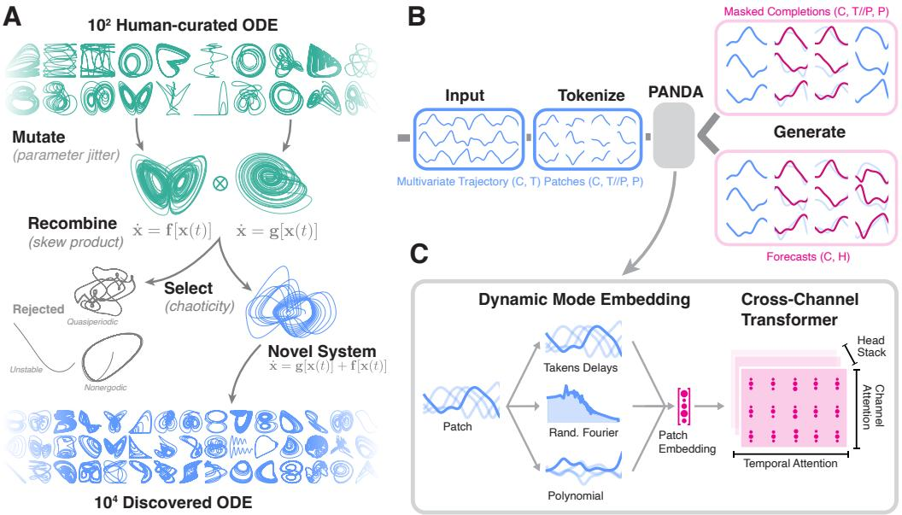

Figure 1: A large-scale chaotic dynamics dataset and dynamics-informed forecast model. (A) Evolutionary creation of a large dataset of chaotic ordinary differential equations through mutation and recombination of known systems. (B) Patch model architecture with forecasting and masked completion output modes. (C) The dynamics-informed time series embedding and attention modules.

generate meaningful forecasts of unseen timepoints and systems [\[9\]](#page-9-6). However, this approach suffers two limitations: (1) It requires sufficient task-specific data to allow for fine-tuning. (2) It fails to leverage the unique properties of dynamical systems relative to conventional time series, such as strong channel coupling, ergodicity and stationarity, and other invariant mathematical properties that could potentially provide generalization signals for unseen data. Moreover, a universal nonlinear model has intrinsic theoretical interest in scientific machine learning, which has long questioned the degree to which complexity can be "transformed out"—whether the predictability of a given system is determined by its intrinsic properties or by the choice of measurement coordinates [\[10,](#page-9-7) [11\]](#page-9-8).

To address these questions, we introduce *Panda*[1](#page-1-0) , a *P*retrained *A*ttention model for *N*onlinear *D*ynamics. We train *Panda* on a novel dataset comprising hundreds of millions of observations from tens of thousands of newly-discovered chaotic dynamical systems. *Panda* generates meaningful zero-shot forecasts of previously-unseen dynamical systems. These strong results, despite training purely on synthetic data, show that *Panda* discovers relevant generalizable information about nonlinear dynamics. Our key contributions are thus as follows,

- 1. We introduce a framework for generating new chaotic dynamical systems, allowing us to create a novel dataset of 2 × 104 ordinary differential equations, algorithmically-discovered based on evolutionary recombination of 102 human-derived chaotic differential equations such as the Lorenz attractor, double pendulum, etc.
- 2. We train a universal forecast model for chaotic systems purely on trajectories integrated from our dataset. Our model produces competitive zero-shot forecasts for real-world nonlinear systems including chemical reactions, electromechanical resonators, electrophysiology time series, and turbulent fluid flows.
- 3. We demonstrate the effectiveness of features motivated by dynamical systems theory: (a) masked pretraining for dynamical continuity, (b) channel attention for dynamical coupling, (c) kernelized patching based on dynamic mode decomposition.
- 4. Despite being trained only on low-dimensional ordinary differential equations, *Panda* spontaneously develops the ability to zero-shot forecast high-dimensional partial differential equations during testing. We identify a new neural scaling law relating performance to the number of distinct dynamical systems encountered during training.

1Code available: <https://github.com/abao1999/panda>

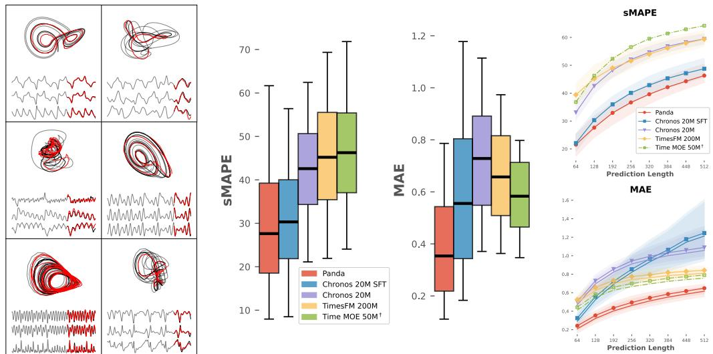

Figure 2: *Panda* effectively zero-shot forecasts unseen dynamical systems. (A) Example zero-shot trajectories on novel chaotic skew-systems. (B) sMAPE and MAE of *Panda* compared to traditional zero-shot time series models, including those fine-tuned on our dataset. (C) Error as a function of the forecast horizon. Error ranges correspond to median and semi-interquartile range across 9.3 × 103 held-out dynamical systems, using 6 forecasts per system. Note: † denotes presence of NaNs for some systems. See Appendix Section [C](#page-17-0) for more example forecasts, and Section [3](#page-3-0) for a description of our dataset. We also trained *Panda* to generate completions of erasures, presented in Section [E.](#page-19-0)

# 2 Related Work

Machine learning for dynamical systems. Machine learning models for dynamical systems (MLDS) leverage as inductive biases the unique properties of dynamical systems, relative to traditional time series. These include: (1) *Strong channel coupling:* The evolution of system variables is governed by deterministic differential or difference equations, implying fixed functional dependencies among variables rather than independent statistical relationships. Several MLDS approaches perform largescale multivariate dynamical modeling, or infer interactions networks among measurement channels [\[2,](#page-9-9) [10,](#page-9-7) [12,](#page-9-10) [13\]](#page-9-11). (2) *Invariant statistical measures:* Ergodic dynamical systems possess invariant probability measures supported on nonwandering sets, such as limit cycles or strange attractors, resulting in well-defined long-term statistical distributions for all observables. MLDS models leverage this property by adapting methods from probabilistic machine learning and generative modeling [\[14](#page-10-0)[–16\]](#page-10-1). (3) *Conserved quantities & Integrals of motion:* Dynamical systems often admit invariant quantities distinct from directly measured observables. MLDS models impose these constraints as inductive biases, or use their existence to motivate latent variable models [\[17–](#page-10-2)[20\]](#page-10-3).

Discovering new dynamical systems. Small datasets of dynamical systems have previously been curated from the published literature [\[5,](#page-9-12) [6,](#page-9-3) [21\]](#page-10-4). Several pretrained models, particularly for partial differential equations (PDE), generate new equations for training by randomly-perturbing parameters or initial conditions from known systems [\[22](#page-10-5)[–25\]](#page-10-6). Others construct *de novo* systems by combining terms from a fixed function library [\[26\]](#page-10-7), or leveraging language models to create candidate symbolic expressions [\[27,](#page-10-8) [28\]](#page-10-9). However, these approaches do not address the harder task of sampling based on *dynamical diversity*, or whether a system exhibits a sustained and unique dynamical attractor. This property is particularly important due to structural stability of dynamics—small parameter changes either smoothly deform the measure (and thus will not produce topologically distinct attractors), while large parameter changes trigger bifurcations leading to trivial dynamics [\[29\]](#page-10-10). Richer sampling requires *post–hoc* analysis of candidate models' dynamics, akin to intrinsically-motivated discovery previously used in domains such as cellular automata and coupled oscillators [\[30–](#page-11-0)[33\]](#page-11-1). Some foundation models generate synthetic time series using stochastic dynamics like Gaussian processes [\[34,](#page-11-2) [35\]](#page-11-3), or simulated physics environments [\[36,](#page-11-4) [37\]](#page-11-5).

Pretrained models for SciML. Pretrained foundation models for dynamics enable transfer learning and zero-shot inference. One study trains transformers across diverse PDEs to create a shared embedding space for multiphysics problems [\[38\]](#page-11-6). Another study proposes supervised pretraining to enable out-of-domain generalization for scientific foundation models, and derives scaling laws for transfer learning on PDEs [\[39\]](#page-11-7). Several recent studies evaluate the zero-shot performance of time series and language models in MLDS, and observe performance only comparable to standard time series tasks [\[40,](#page-11-8) [41\]](#page-11-9). Several studies apply pretrained transformers to control or symbolic equation discovery tasks [\[28,](#page-10-9) [42](#page-11-10)[–44\]](#page-11-11). One work generates pretraining data by randomizing the parameters of four named ODE [\[45\]](#page-12-0), similar to the first step of our evolutionary algorithm described below, with a small founder pool. Another work samples systems from a fixed function space, selecting based on total variation over time [\[26\]](#page-10-7), while another study uses latent ODE as a prior for zero-shot imputation [\[46\]](#page-12-1). Our work is distinguished by (1) its rich data generation process, which discovers novel chaotic systems with diverse properties, and (2) our novel multichannel patch architecture inspired by the theory of dynamic mode decomposition, which leverages the mathematical properties of nonlinear systems. We are thus able to perform extensive benchmarks against existing time series foundation models, and demonstrate emergent capabilities in tasks like PDE inference.

# 3 Dataset

We discover 2 × 104 novel chaotic differential equations by implementing a genetic algorithm with a conserved founder pool. Our procedure is summarized in Fig. [1A](#page-1-1). Samples of 3D projections of discovered systems from our dataset are shown in Appendix [A.](#page-15-0)

Founding population. We start from a human-curated dataset of 135 previously-published lowdimensional chaotic systems [\[5\]](#page-9-12), consisting of named ODE (e.g. the Lorenz equations or blinking vortex flow) of the form x˙(t) = fθ(x(t)). Each system's parameters θ and initial conditions x(0) are hand-tuned to the chaotic regime, and the integration timescales are standardized based on calculations of invariant mathematical properties of the underlying equations, such as the fractal dimension and largest Lyapunov exponent.

Mutation via parameter sampling. We randomly sample pairs of systems fa, fb. For each ODE's default system parameters, we add random Gaussian noise, θ ′ a ∼ N (θa, σ), θ ′ b ∼ N (θb, σ).

Recombination via random skew products. We recombine the mutated parents using a skew product construction x˙(t) = κafa(x) + κb x˙ b. We choose this particular recombination scheme because, for sufficiently weak or strong scale factors, skew product systems preserve chaoticity because the child system either synchronizes to the chaotic driver, or continues exhibiting chaotic dynamics [\[47,](#page-12-2) [48\]](#page-12-3). We compute 1/RMS of the flow fields from fa, fb to use as the scale factors.

Selection for chaoticity. We next perform selection, by culling candidate systems that fail to exhibit chaotic behavior. We first eliminate transient systems that either converge to a fixed point or diverge to infinity. We then apply the 0-1 test, which distinguishes periodic or quasiperiodic dynamics from true chaos [\[49\]](#page-12-4). From here, we apply a sequence of additional attractor tests: a test based on near recurrences to reject limit cycles; a power spectrum test to reject trajectories with only a few distinct sharp peaks; and a data-driven Lyapunov exponent estimator [\[50\]](#page-12-5).

Augmentations. After discovering a set of ODE and accompany trajectories, we apply additional data augmentations to increase the number of time series. We choose augmentations that preserve the property that observed time series arise from a close nonlinear dynamical system. Our augmentations are: *Random time-delay embedding* xi(t) → xi(t − τi), τi ∼ U (1, dembed). This augmentation preserves dynamics due to Takens' embedding theorem [\[51,](#page-12-6) [52\]](#page-12-7). Given X ∈ R C×T and d ∼ U (dmin, dmax), *Convex combinations* implements X ← CX ∈ R d×T ; C ∈ R d×C , Ci,∗ ∼ Dir(α1C ). *Affine transforms* implements X ← AX + b, [A b] ∈ R d×(c+1) , [A b]ij ∼ N (0, σ2 )/ √ d. We set dmin = 3, dmax = 10, and dembed = 10 for our experiments.

Held-out systems. For our zero-shot test metrics, we evaluate on a set of 9.3 × 103 held-out systems never seen during training. To generate these systems, we first hold out a random subset of 20 systems from the 135-system founding population. We ensure that none of these systems or their mutations appear in the random skew product systems used for training (as either the driver or response). We then mutate these systems via parameter sampling and include all random skew product systems for which either the driver or response was mutated from this held-out founding population.

# 4 Model architecture

Because dynamical systems differ from traditional time series tasks, we introduce a novel architecture motivated by dynamical systems theory. Our architecture is summarized in Fig. [1B](#page-1-1).

Many large-scale time series models are autoregressive and thus *parrot* motifs from their context, leading to over-confident predictions on out-of-domain tasks [\[40,](#page-11-8) [53\]](#page-12-8). Parroting is a useful emergent inductive bias when modeling invariant properties in long forecasts is prioritized over accuracy otherwise known as forecasting the *climate*. However, we opt for an encoder-only, non-autoregressive, fixed horizon forecaster that maximizes short-term pointwise accuracy, known as predicting the *weather* in SciML.

We base *Panda* on PatchTST, a univariate time series Transformer model with state-of-the-art forecasting performance [\[54\]](#page-12-9). However, we show strong evidence in section [5.2](#page-5-0) that univariate-only architectures are suboptimal for forecasting dynamical systems and thus include channel attention. Additionally, patching admits an inductive bias for dynamical systems due to Takens' theorem, a fundamental result in nonlinear dynamics that states that time-delayed copies of a low-dimensional measurement of a dynamical system result in a multivariate time series that preserves key topological features of the true attractor [\[51,](#page-12-6) [52\]](#page-12-7).

Patching. Given a length T trajectory T ∈ R C×T . We first tokenize the trajectory by patching it into a token sequence of size P patches with stride S so that in general, TP,S ∈ R C×(⌊ T−P S ⌋+1)×P . We choose stride S = P so that the token sequences are TP ∈ R C×(T /P )×P .

Dynamics Embedding. The patched multivariate timeseries is lifted to a high dimensional embedding space of size dmodel. To do so, we concatenate a combination of the patches themselves, random polynomial features and random Fourier features. Let P ∈ R C×P be a single *patch token* with C channels and a patchsize of P. For the random polynomial features and for a degree d, we sample a fixed index set I ⊂ {1, . . . , P} d of |I| = Npoly (number of features) d-tuples such that for I ∈ I:

$$
\Phi_{c,i}(\mathcal{P}) \coloneqq \Pi_{j=1}^d \mathcal{P}_{c,I_j} = \mathcal{P}_{c,I_1} \cdot \ldots \cdot \mathcal{P}_{c,I_d}
$$

The random Fourier features follow the standard recipe [\[55\]](#page-12-10) of sampling parameters W ∈ R P ×(Nrff/2) , b ∈ R Nrff/2 such that Wij , bi ∼ N (0, σ2 ) and,

$$
\mathcal{F}(\mathcal{P}) \coloneqq [\sin(PW + b) \quad \cos(PW + b)] \in \mathbb{R}^{C \times N_{\text{eff}}}
$$

Where the addition of b is broadcast over the channels. All together, the patch embedding is:

E(P) := [P Φ(P) F(P)] ∈ R C×(P +Npoly+Nrff)

We use degrees d ∈ {2, 3} and choose Npoly and Nrff such that dmodel = P + Npoly + Nrff = 512. The use of polynomial and Fourier features as a lifted dynamics embedding is grounded in Koopman operator theory and follows prior works such as extended dynamic mode decomposition (eDMD) [\[56,](#page-12-11) [57\]](#page-12-12) and next-generation reservoir computers, which specifically use polynomial features to forecast chaotic systems [\[58\]](#page-12-13).

Temporal Attention. Information is mixed over the temporal dimension by taking the channel dimension as a batch dimension and performing self-attention with NoPE [\[59\]](#page-12-14) (a modification of the popular rotary positional encoding RoPE [\[60\]](#page-12-15)) over the T /P univariate patches of dimension dmodel.

Channel Attention. Several existing time series foundation models accommodate an arbitrary number of channels by fixating on univariate architectures which soley rely on temporal attention as described above [\[54\]](#page-12-9). However, this approach is insufficient for chaotic dynamical systems which exhibit strong channel coupling. We demonstrate this empirically for the electronic circuits dataset in Fig. [4D](#page-6-0), where we show the benefit of our approach as the coupling strength increases. To address this, we interleave channel attention layers without positional encoding after each temporal attention layer. A channel attention layer simply transposes the token sequence, treating the token dimension as a batch dimension and the channels as a set, before the self-attention operation:

$$
\mathrm{ChannelAttention}(\mathcal{T}_P) \coloneqq \mathrm{SelfAttention}(\mathcal{T}_P^\top) \qquad \mathcal{T}_P^\top \in \mathbb{R}^{T/P \times C \times d_{\mathrm{model}}}
$$

The temporal-channel attention layers are followed by a FFN with residual connections, GeLU activations [\[61\]](#page-12-16), and RMSNorm [\[62\]](#page-13-0). For the prediction head, the processed tokens are aggregated via mean or max along the sequence dimension T /P and mapped to a length H forecast for each channel via a linear layer. More detailed architecture details can be found in Appendix [B.](#page-16-0)

# 5 Results

### 5.1 *Panda* Zero-Shot Forecasts Unseen Nonlinear Dynamics

To evaluate the quality of the generated forecasts, we compute several metrics against the ground truth trajectories. In particular, we consider the mean squared error (MSE), mean absolute error (MAE), symmetric mean absolute percentage error (sMAPE), and Spearman correlation. We compute these metrics for forecasts generated from zeroshot (held-out) systems never seen during training. Specifically, these are Ntest = 9.3 × 103 unique skew-product dynamical systems found using the methodology described in section [3.](#page-3-0) For brevity, we report only the sMAPE in the main text; the other metrics show similar results and are included in the Appendix Section [D,](#page-18-0) and sample forecasts are included in Appendix Section [C](#page-17-0)

Comparison to baseline models. We train *Panda* with ≈ 20M parameters and compare our results to several current zero-shot time series forecasting models of comparable scale: *Chronos 20M*, a recent foundation model trained on diverse real-world time series [\[34\]](#page-11-2), which was recently shown to produce competitive forecasts of chaos systems [\[40\]](#page-11-8). *Chronos 20M SFT*: the Chronos model with supervised finetuning on our entire chaotic systems dataset [3](#page-3-0) *Time MOE 50M*: A 50M parameter channelindependent model based on sparse mixture of experts [\[63\]](#page-13-1). *TimesFM 200M*: A 200M parameter multivariate model, with pretrained patched decoder. Across 9.3 × 103 held-out systems, we find *Panda* outperforms the second-best model, Chronos-SFT, across a variety of prediction horizons and error metrics (Fig. [2\)](#page-2-0). While we train our model exclusely on d = 3-dimensional dynamical systems, the evaluation set includes arbitrary dimension systems, indicating that channel attention enables multivariate generalization. Moreover, we use autoregression to extend our evaluation forecast horizon beyond the forecast horizon used during training. Our model maintains its performance advantage, indicating that it learns an effective dynamical propagator independent of a single timescale. In the Appendix Section [D,](#page-18-0) we show that our results are robust to the choice of metric (see Fig. [14\)](#page-19-1).

Ablations. We also ablate several features of *Panda*, in order to verify that our dynamics-based architectural choices contribute to model performance. These include (1) Channel Attention, (2) Dynamics Embedding, and (3) MLM Pretraining.

We observe a significant improvement due to channel attention and MLM pretraining (See Section [E](#page-19-0) for example zero-shot completions). However, the combined effect of the MLM with the dynamics embedding appears to be more complex: with no MLM, the dynamics embedding helps, but with MLM, it reduces performance. Moreover, the dynamics embedding improves the error on autoregressive rollout, whereas MLM reduces performance on rollout. We conclude that using the dynamics embedding with polynomial features (PolyEmbed) gives us the best model for long prediction horizons.

We include additional forecast metrics in Fig. [13](#page-18-1) in Appendix [D.](#page-18-0) We continue the discussion and evaluation of MLM with Fig. [17](#page-20-0) in Appendix [E.](#page-19-0)

Figure 3: Ablations of key architectural features of *Panda*.

### 5.2 *Panda* Zero-Shot Forecasts Experimental Data

We next show that *Panda* generalizes to experimental time series generated by real-world dynamical systems. Unlike simulated data, experimental datasets have nonstationarity, missing values, noise, and other complexities not seen by the model during training. Following prior works, we select systems in which the experimental data is known to have an underlying dynamical process generating it: the positions and momenta of the tips of the two rods in an experimental recording of a double pendulum [\[64\]](#page-13-2), the leading independent components of body posture from a light microscopy video of *C. elegans* worms crawling on agar gel [\[65\]](#page-13-3), and voltage recordings from networks of 28 randomly connected electrical oscillators [\[66\]](#page-13-4). In all cases, the zero-shot performance of *Panda* outperforms

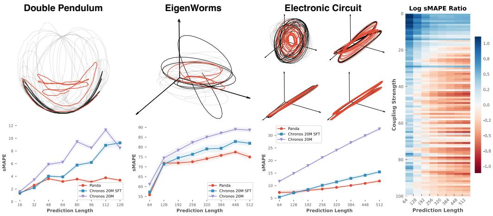

Figure 4: Zero-shot forecasts of experimental data from (a) Double Pendulum [\[64\]](#page-13-2), (b) Eigenworms [\[65\]](#page-13-3), and (c) Electronic Circuit [\[66\]](#page-13-4). (d) Relative change in forecast error for *Panda* compared to Chronos-SFT (as measured in log (sMAPE*Panda*/sMAPE*Chronos-SFT*), showing the advantage of our approach as the coupling strength between variables increases, for various prediction horizons.

.

Chronos-SFT (Fig. [4A](#page-6-0)). For the circuit dataset in particular, we find that as the experimental coupling strength increases, the relative advantage of *Panda* over Chronos-SFT increases (red regions) , particularly at long prediction horizons—leading to a visible Pareto front between the two models (Fig. [4B](#page-6-0)). This finding underscores the importance of channel attention for capturing nonlinear couplings typical in real world dynamical systems.

### 5.3 *Panda* Exhibits a Neural Scaling Law with the Number of Dynamical Systems

We create eight independent pretraining datasets that are subsets of the 2 × 104 unique systems generated using our methodology in Section [3.](#page-3-0) Across these eight datasets, we maintain a constant number of total timepoints while taking, at one extreme, a single trajectory (one initial condition) from each unique system, and at the other extreme, several trajectories (multiple initial conditions) from only a few unique systems. These datasets thus allow us to measure how true dynamical diversity (unique systems versus initial conditions) affects generalization. We repeat our zeroshot evaluations on our set of 9.3 × 103 held-out systems for each model trained on the eight datasets.

In particular, let Nics be the number of

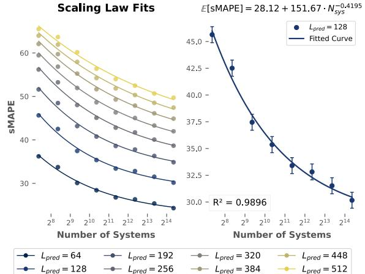

Figure 5: Scaling laws in zero-shot forecast error as the number of unique dynamical systems increases. The total amount of training timepoints is held constant.

sampled initial conditions and Nsys the number of unique systems. Keeping Nics × Nsys fixed, our eight dataset splits are constructed as { Nsys ≈ 2 × 104 , Nics = 1 , Nsys ≈ 104 , Nics = 2 , . . . , (Nsys ≈ 156, Nics = 128)}, where each subsequent split uses a strict subset of the systems of the previous split, but with double the number of sampled initial conditions Nics.

We observe clear scaling of zero-shot performance on unseen systems with the number of new dynamical systems encountered. We emphasize that this scaling law is distinct from traditional neural scaling laws for total training data, because we hold the number of timepoints constant while controlling the diversity of the data [\[67\]](#page-13-5). These results show that increased diversity of dynamical

attractors provides richer training data, indicating the advantages of scaling with diverse synthetic data. This finding accords with classical nonlinear dynamics theory: additional on-attractor trajectories continuously produce new information about that particular attractor's measure (a result of Pesin's theorem), but beyond a certain point they fail to provide new topological information about winding, voids, etc [\[68,](#page-13-6) [69\]](#page-13-7). The distinction between these information types partly explains the gap between in-domain (same system) and out-of-domain (new system or basin) generalization in MLDS [\[7\]](#page-9-4).

### 5.4 *Panda* develops interpretable internal representations of complex dynamics

We analyze the attention maps in *Panda* to probe the mechanisms that allow it to effectively forecast nonlinear dynamics. The attention maps largely concentrate mass away from the diagonals, which indicates that *Panda* effectively uses the context. In contrast, a model implementing a purely local rule (like a numerical integrator) would exhibit predominant diagonal structure, indicating that *Panda* performs more complex operations than few-step integration. Individual attention maps exhibit complex structure, with some layers forming recurrence maps, classical objects in nonlinear dynamics that encode large-scale attractor geometry [\[48,](#page-12-3) [70\]](#page-13-8). Other layers show banding and circulant structure (Fig. [7\)](#page-7-0), consistent with global integral transforms like Fourier series. Recentlyintroduced state-space models exhibit similar structure [\[71\]](#page-13-9)

We dynamically probe the response of the trained model to pairs of pure frequencies, by providing x(t) = [sin(f1t),sin(f2t)] as multichannel input. For each pair of frequencies f1, f2, we plot the mean row-wise entropy of the attention rollout for the temporal attention maps [\[72\]](#page-13-10) (Fig. [6\)](#page-7-1). The attention maps exhibit complex, multiscale structure which indicates nonlinear resonance, a phenomenon in dynamical systems where a physical system (such as a kicked rotor or forced pendulum) exhibits gain with nonlinear dependence on the input frequencies. The lattice structure of these plots

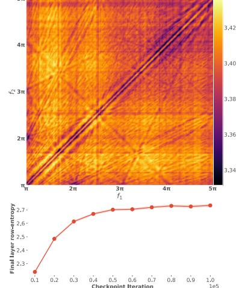

Figure 6: (Top) Nonlinear resonance structure measured by average rowwise entropy of temporal attention rollout matrices. (Bottom) Convergence of mean row-wise entropy of the final layer throughout training.

resembles bispectra used to characterize non-additive interactions (e.g. triads) in turbulent fluid flows; similar phenomena like Arnold resonances occur in resonant quasi-Hamiltonian systems like models of celestial orbits [\[73,](#page-13-11) [74\]](#page-13-12). In contrast, the univariate ablation of *Panda* exhibits no complex off-diagonal response (Appendix [F\)](#page-21-0), underscoring how channel attention allows *Panda* to respond and couple multichannel inputs. In Appendix [F.2](#page-21-1) we investigate the implicit spatio-temporal mixing maps which arise from the coupling of temporal attention with channel attention.

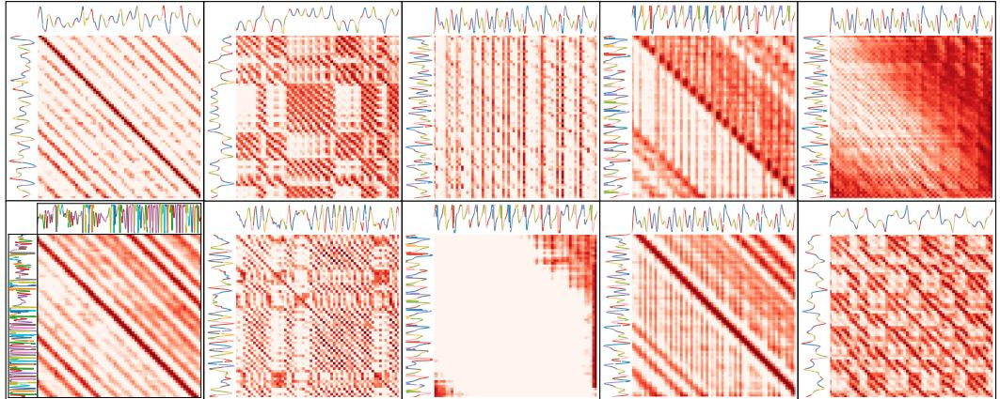

Figure 7: Temporal attention maps from *Panda* on context windows from different chaotic systems. (From left to right column-wise) Presence of Toeplitz, block, selector, and hybrid/combined structures.

### 5.5 *Panda* spontaneously forecasts partial differential equations without retraining

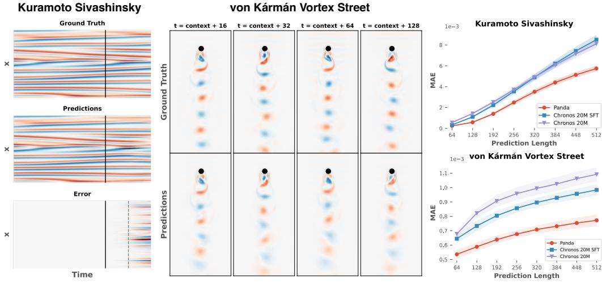

(a) Forecasts

Figure 8: (a) Zero-shot forecasts of the Kuramoto-Sivashinsky equation (left) and the von Kármán vortext street. (b) The horizoned MAE (with standard errors bars) compared to baselines. We show point-wise MAE instead of sMAPE, due to sMAPE's saturation at the upper bound.

Partial differential equations (PDE) represent dynamical systems on continuous domains, and thus have intrinsic interest in areas such as weather prediction or materials science [\[75\]](#page-13-13). Conceptually, these systems may be seen as coupled ordinary differential equations evolving in an infinitedimensional space, which approximate numerical solution schemes discretize with meshing or spectral methods. We apply our trained model to the problem of forecasting two chaotic PDE that represent standard benchmark datasets in SciML: the Von-Karman vortex street (VKVS) describing the unsteady motion of flow past a cylinder, and the Kuramoto-Sivashinksy (KS) model of propagating flame fronts [\[76\]](#page-13-14). We study both systems in the weakly-turbulent regime (Appendix [G\)](#page-22-0).

Surprisingly, *Panda* outperforms baselines in zero-shot forecasting these systems (Fig. [8\)](#page-8-0), *despite having never encountered PDE during training.* Unlike baselines, our model predicts nonlinear phenomena like merging of flame fronts in the KS equation or vortex pinchoff in the VKVS. While prior works require specially-trained models to forecast chaotic PDEs [\[4\]](#page-9-2), our zero-shot approach does not require extensive in-distribution training data, highlighting the advantages of cross-channel attention and multivariate training in generalization.

# 6 Conclusion and Future Directions

Our work demonstrates the feasibility of pretrained models in discovering generalizable properties of dynamical systems, mathematical objects of intrinsic interest to the SciML and forecasting communities. Our model's emergent ability to predict higher-dimensional partial differential equations, and the scaling of its performance with the diversity of dynamical systems, show that its generalization signal stems from unique properties of dynamics relative to time series. We identify nonlinear resonance occurring within the model, underscoring the unique capabilities of our architecture.

A limitation of our work stems from our focus on low-dimensional dynamical systems. We argue that low-dimensional dynamics are the building block for higher-dimensional systems like weather front or spiking neurons, because they capture essential properties like bifurcations that become more complex in extended systems. A future variant of our approach for high-dimensional dynamics could exploit the sparsity of coupling typical in these systems, by making the channel attention sparse. Another limitation is the degredation of rollout performance from MLM pretraining. Future work will investigate other natural pretraining tasks for forecasting chaos.

# Acknowledgments and Disclosure of Funding

JL was supported by the UT CSEM Fellowship. AB was supported by the UT PGEF Fellowship and the Basdall Gardner Memorial Fellowship. WG was supported by NSF DMS 2436233 and NSF CMMI 2440490. This project has been made possible in part by Grant No. DAF2023-329596 from the Chan Zuckerberg Initiative DAF, an advised fund of Silicon Valley Community Foundation. The authors acknowledge the Biomedical Research Computing Facility and Texas Advanced Computing Center (TACC) at The University of Texas at Austin for providing computational resources.

# References

- [1] Ilan Price, Alvaro Sanchez-Gonzalez, Ferran Alet, Tom R Andersson, Andrew El-Kadi, Dominic Masters, Timo Ewalds, Jacklynn Stott, Shakir Mohamed, Peter Battaglia, et al. Probabilistic weather forecasting with machine learning. *Nature*, 637(8044):84–90, 2025.
- [2] Zongyi Li, Miguel Liu-Schiaffini, Nikola Kovachki, Burigede Liu, Kamyar Azizzadenesheli, Kaushik Bhattacharya, Andrew Stuart, and Anima Anandkumar. Learning dissipative dynamics in chaotic systems. In *Proceedings of the 36th International Conference on Neural Information Processing Systems*, pages 16768–16781, 2022.
- [3] Jonas Mikhaeil, Zahra Monfared, and Daniel Durstewitz. On the difficulty of learning chaotic dynamics with rnns. *Advances in neural information processing systems*, 35:11297–11312, 2022.
- [4] Jaideep Pathak, Brian Hunt, Michelle Girvan, Zhixin Lu, and Edward Ott. Model-free prediction of large spatiotemporally chaotic systems from data: A reservoir computing approach. *Physical review letters*, 120(2):024102, 2018.
- [5] William Gilpin. Chaos as an interpretable benchmark for forecasting and data-driven modelling. *NeurIPS*, 34, 2021.
- [6] William Gilpin. Model scale versus domain knowledge in statistical forecasting of chaotic systems. *Phys. Rev. Research*, 5(4):043252, 2023.
- [7] Niclas Alexander Göring, Florian Hess, Manuel Brenner, Zahra Monfared, and Daniel Durstewitz. Out-of-domain generalization in dynamical systems reconstruction. In Ruslan Salakhutdinov, Zico Kolter, Katherine Heller, Adrian Weller, Nuria Oliver, Jonathan Scarlett, and Felix Berkenkamp, editors, *Proceedings of the 41st International Conference on Machine Learning*, volume 235 of *Proceedings of Machine Learning Research*, pages 16071–16114. PMLR, 21–27 Jul 2024. URL <https://proceedings.mlr.press/v235/goring24a.html>.
- [8] Rui Wang, Robin Walters, and Rose Yu. Data augmentation vs. equivariant networks: A theory of generalization on dynamics forecasting. *arXiv preprint arXiv:2206.09450*, 2022.
- [9] Rajat Sen, Hsiang-Fu Yu, and Inderjit S Dhillon. Think globally, act locally: A deep neural network approach to high-dimensional time series forecasting. *Advances in neural information processing systems*, 32, 2019.
- [10] Steven L Brunton, Marko Budisic, Eurika Kaiser, and J Nathan Kutz. Modern koopman theory ´ for dynamical systems. *SIAM Review*, 64(2):229–340, 2022.
- [11] Igor Mezic. Analysis of fluid flows via spectral properties of the koopman operator. ´ *Annual review of fluid mechanics*, 45(1):357–378, 2013.
- [12] Ricky TQ Chen, Yulia Rubanova, Jesse Bettencourt, and David K Duvenaud. Neural ordinary differential equations. *Advances in neural information processing systems*, 31, 2018.
- [13] Dhananjay Bhaskar, Daniel Sumner Magruder, Matheo Morales, Edward De Brouwer, Aarthi Venkat, Frederik Wenkel, Guy Wolf, and Smita Krishnaswamy. Inferring dynamic regulatory interaction graphs from time series data with perturbations. In *Learning on Graphs Conference*, pages 22–1. PMLR, 2024.
- [14] Chris Pedersen, Laure Zanna, and Joan Bruna. Thermalizer: Stable autoregressive neural emulation of spatiotemporal chaos. *arXiv preprint arXiv:2503.18731*, 2025.
- [15] Georgia Koppe, Hazem Toutounji, Peter Kirsch, Stefanie Lis, and Daniel Durstewitz. Identifying nonlinear dynamical systems via generative recurrent neural networks with applications to fmri. *PLoS computational biology*, 15(8):e1007263, 2019.
- [16] Xiaoyuan Cheng, Yi He, Yiming Yang, Xiao Xue, Sibo Chen, Daniel Giles, Xiaohang Tang, and Yukun Hu. Learning chaos in a linear way. In *The Thirteenth International Conference on Learning Representations*, 2025.
- [17] Renyi Chen and Molei Tao. Data-driven prediction of general hamiltonian dynamics via learning exactly-symplectic maps. In *International conference on machine learning*, pages 1717–1727. PMLR, 2021.
- [18] Yuan Yin, Matthieu Kirchmeyer, Jean-Yves Franceschi, Alain Rakotomamonjy, et al. Continuous pde dynamics forecasting with implicit neural representations. In *The Eleventh International Conference on Learning Representations*, 2023.
- [19] Yenho Chen, Noga Mudrik, Kyle A Johnsen, Sankaraleengam Alagapan, Adam S Charles, and Christopher Rozell. Probabilistic decomposed linear dynamical systems for robust discovery of latent neural dynamics. *Advances in Neural Information Processing Systems*, 37:104443– 104470, 2024.
- [20] Jonah Botvinick-Greenhouse, Yunan Yang, and Romit Maulik. Generative modeling of timedependent densities via optimal transport and projection pursuit. *Chaos: An Interdisciplinary Journal of Nonlinear Science*, 33(10), 2023.
- [21] William La Cava, Bogdan Burlacu, Marco Virgolin, Michael Kommenda, Patryk Orzechowski, Fabrício Olivetti de França, Ying Jin, and Jason H Moore. Contemporary symbolic regression methods and their relative performance. *Advances in neural information processing systems*, 2021(DB1):1, 2021.
- [22] Wuyang Chen, Jialin Song, Pu Ren, Shashank Subramanian, Dmitriy Morozov, and Michael W Mahoney. Data-efficient operator learning via unsupervised pretraining and in-context learning. *Advances in Neural Information Processing Systems*, 37:6213–6245, 2024.
- [23] Tapas Tripura and Souvik Chakraborty. A foundational neural operator that continuously learns without forgetting. *arXiv preprint arXiv:2310.18885*, 2023.
- [24] Maximilian Herde, Bogdan Raonic, Tobias Rohner, Roger Käppeli, Roberto Molinaro, Emmanuel de Bézenac, and Siddhartha Mishra. Poseidon: Efficient foundation models for pdes. *Advances in Neural Information Processing Systems*, 37:72525–72624, 2024.
- [25] Jingmin Sun, Yuxuan Liu, Zecheng Zhang, and Hayden Schaeffer. Towards a foundation model for partial differential equations: Multioperator learning and extrapolation. *Physical Review E*, 111(3):035304, 2025.
- [26] Martin Ziegler, Andres Felipe Posada-Moreno, Friedrich Solowjow, and Sebastian Trimpe. On foundation models for dynamical systems from purely synthetic data. *arXiv preprint arXiv:2412.00395*, 2024.
- [27] Mengge Du, Yuntian Chen, Zhongzheng Wang, Longfeng Nie, and Dongxiao Zhang. Large language models for automatic equation discovery of nonlinear dynamics. *Physics of Fluids*, 36 (9), 2024.
- [28] Stéphane d'Ascoli, Sören Becker, Alexander Mathis, Philippe Schwaller, and Niki Kilbertus. Odeformer: Symbolic regression of dynamical systems with transformers. *arXiv preprint arXiv:2310.05573*, 2023.
- [29] John Guckenheimer and Philip Holmes. *Nonlinear oscillations, dynamical systems, and bifurcations of vector fields*, volume 42. Springer Science & Business Media, 2013.
- [30] James P Crutchfield and Melanie Mitchell. The evolution of emergent computation. *Proceedings of the National Academy of Sciences*, 92(23):10742–10746, 1995.
- [31] Chris Reinke, Mayalen Etcheverry, and Pierre-Yves Oudeyer. Intrinsically motivated discovery of diverse patterns in self-organizing systems. In *International Conference on Learning Representations*, 2020.
- [32] Martin J Falk, Finnegan D Roach, William Gilpin, and Arvind Murugan. Curiosity-driven search for novel nonequilibrium behaviors. *Physical Review Research*, 6(3):033052, 2024.
- [33] Akarsh Kumar, Chris Lu, Louis Kirsch, Yujin Tang, Kenneth O Stanley, Phillip Isola, and David Ha. Automating the search for artificial life with foundation models. *arXiv preprint arXiv:2412.17799*, 2024.
- [34] Abdul Fatir Ansari, Lorenzo Stella, Ali Caner Turkmen, Xiyuan Zhang, Pedro Mercado, Huibin Shen, Oleksandr Shchur, Syama Sundar Rangapuram, Sebastian Pineda Arango, Shubham Kapoor, et al. Chronos: Learning the language of time series. *Transactions on Machine Learning Research*, 2024.
- [35] Abhimanyu Das, Weihao Kong, Rajat Sen, and Yichen Zhou. A decoder-only foundation model for time-series forecasting. In *Forty-first International Conference on Machine Learning*, 2024.
- [36] Yufei Wang, Zhou Xian, Feng Chen, Tsun-Hsuan Wang, Yian Wang, Katerina Fragkiadaki, Zackory Erickson, David Held, and Chuang Gan. Robogen: Towards unleashing infinite data for automated robot learning via generative simulation. In *International Conference on Machine Learning*, pages 51936–51983. PMLR, 2024.
- [37] Yixin Lin, Jan Humplik, Sandy H Huang, Leonard Hasenclever, Francesco Romano, Stefano Saliceti, Daniel Zheng, Jose Enrique Chen, Catarina Barros, Adrian Collister, et al. Proc4gem: Foundation models for physical agency through procedural generation. *arXiv preprint arXiv:2503.08593*, 2025.
- [38] Michael McCabe, Régaldo-Saint Blancard, Liam Parker, Ruben Ohana, Miles Cranmer, Alberto Bietti, Michael Eickenberg, Siavash Golkar, Geraud Krawezik, Francois Lanusse, et al. Multiple physics pretraining for spatiotemporal surrogate models. *Advances in Neural Information Processing Systems*, 37:119301–119335, 2024.
- [39] Shashank Subramanian, Peter Harrington, Kurt Keutzer, Wahid Bhimji, Dmitriy Morozov, Michael W Mahoney, and Amir Gholami. Towards foundation models for scientific machine learning: Characterizing scaling and transfer behavior. *Advances in Neural Information Processing Systems*, 36:71242–71262, 2023.
- [40] Yuanzhao Zhang and William Gilpin. Zero-shot forecasting of chaotic systems. In *The Thirteenth International Conference on Learning Representations*, 2025. URL [https://](https://arxiv.org/abs/2409.15771) [arxiv.org/abs/2409.15771](https://arxiv.org/abs/2409.15771).
- [41] Toni JB Liu, Nicolas Boullé, Raphaël Sarfati, and Christopher J Earls. Llms learn governing principles of dynamical systems, revealing an in-context neural scaling law. *arXiv preprint arXiv:2402.00795*, 2024.
- [42] Jonathan Lee, Annie Xie, Aldo Pacchiano, Yash Chandak, Chelsea Finn, Ofir Nachum, and Emma Brunskill. In-context decision-making from supervised pretraining. In *ICML Workshop on New Frontiers in Learning, Control, and Dynamical Systems*, 2023.
- [43] Xiangyuan Zhang, Weichao Mao, Haoran Qiu, and Tamer Ba¸sar. Decision transformer as a foundation model for partially observable continuous control. *arXiv preprint arXiv:2404.02407*, 2024.
- [44] Sören Becker, Michal Klein, Alexander Neitz, Giambattista Parascandolo, and Niki Kilbertus. Predicting ordinary differential equations with transformers. In *International conference on machine learning*, pages 1978–2002. PMLR, 2023.
- [45] Zezheng Song, Jiaxin Yuan, and Haizhao Yang. Fmint: Bridging human designed and data pretrained models for differential equation foundation model. *arXiv preprint arXiv:2404.14688*, 2024.
- [46] Patrick Seifner, Kostadin Cvejoski, Antonia Körner, and Ramses J Sanchez. Zero-shot imputation with foundation inference models for dynamical systems. In *The Thirteenth International Conference on Learning Representations*, 2025.
- [47] Louis M Pecora and Thomas L Carroll. Synchronization in chaotic systems. *Physical review letters*, 64(8):821, 1990.
- [48] William Gilpin. Recurrences reveal shared causal drivers of complex time series. *Physical Review X*, 15(1):011005, 2025.
- [49] Ian Falconer, Georg A Gottwald, Ian Melbourne, and Kjetil Wormnes. Application of the 0-1 test for chaos to experimental data. *SIAM Journal on Applied Dynamical Systems*, 6(2):395–402, 2007.
- [50] Michael T. Rosenstein, James J. Collins, and Carlo J. De Luca. A practical method for calculating largest lyapunov exponents from small data sets. *Phys. D*, 65(1–2):117–134, May 1993. ISSN 0167-2789. doi: 10.1016/0167-2789(93)90009-P. URL [https://doi.org/10.](https://doi.org/10.1016/0167-2789(93)90009-P) [1016/0167-2789\(93\)90009-P](https://doi.org/10.1016/0167-2789(93)90009-P).
- [51] Floris Takens. Dynamical systems and turbulence. *Warwick, 1980*, pages 366–381, 1981.
- [52] Norman H Packard, James P Crutchfield, J Doyne Farmer, and Robert S Shaw. Geometry from a time series. *Physical review letters*, 45(9):712, 1980.
- [53] Catherine Olsson, Nelson Elhage, Neel Nanda, Nicholas Joseph, Nova DasSarma, Tom Henighan, Ben Mann, Amanda Askell, Yuntao Bai, Anna Chen, et al. In-context learning and induction heads. *arXiv preprint arXiv:2209.11895*, 2022.
- [54] Yuqi Nie, Nam H Nguyen, Phanwadee Sinthong, and Jayant Kalagnanam. A time series is worth 64 words: Long-term forecasting with transformers. In *The Eleventh International Conference on Learning Representations*, 2022.
- [55] Ali Rahimi and Benjamin Recht. Random features for large-scale kernel machines. In J. Platt, D. Koller, Y. Singer, and S. Roweis, editors, *Advances in Neural Information Processing Systems*, volume 20. Curran Associates, Inc., 2007. URL [https://proceedings.neurips.cc/](https://proceedings.neurips.cc/paper_files/paper/2007/file/013a006f03dbc5392effeb8f18fda755-Paper.pdf) [paper\\_files/paper/2007/file/013a006f03dbc5392effeb8f18fda755-Paper.pdf](https://proceedings.neurips.cc/paper_files/paper/2007/file/013a006f03dbc5392effeb8f18fda755-Paper.pdf).
- [56] Matthew O Williams, Ioannis G Kevrekidis, and Clarence W Rowley. A data–driven approximation of the koopman operator: Extending dynamic mode decomposition. *Journal of Nonlinear Science*, 25:1307–1346, 2015.
- [57] Jose Nathan Kutz, Steven L. Brunton, Bingni W. Brunton, and Joshua L. Proctor. *Dynamic Mode Decomposition : Data-Driven Modeling of Complex Systems*. SIAM, 2016. ISBN 9781611974492 1611974496. URL <http://www.dmdbook.com/>.
- [58] Daniel J Gauthier, Erik Bollt, Aaron Griffith, and Wendson AS Barbosa. Next generation reservoir computing. *Nature communications*, 12(1):1–8, 2021.
- [59] Federico Barbero, Alex Vitvitskyi, Christos Perivolaropoulos, Razvan Pascanu, and Petar Velickovic. Round and round we go! what makes rotary positional encodings useful? In ´ *The Thirteenth International Conference on Learning Representations*, 2025. URL [https:](https://openreview.net/forum?id=GtvuNrk58a) [//openreview.net/forum?id=GtvuNrk58a](https://openreview.net/forum?id=GtvuNrk58a).
- [60] Jianlin Su, Yu Lu, Shengfeng Pan, Ahmed Murtadha, Bo Wen, and Yunfeng Liu. Roformer: Enhanced transformer with rotary position embedding, 2023. URL [https://arxiv.org/](https://arxiv.org/abs/2104.09864) [abs/2104.09864](https://arxiv.org/abs/2104.09864).
- [61] Dan Hendrycks and Kevin Gimpel. Gaussian error linear units (gelus). *arXiv preprint arXiv:1606.08415*, 2016.
- [62] Biao Zhang and Rico Sennrich. Root mean square layer normalization. In H. Wallach, H. Larochelle, A. Beygelzimer, F. d'Alché-Buc, E. Fox, and R. Garnett, editors, *Advances in Neural Information Processing Systems*, volume 32. Curran Associates, Inc., 2019. URL [https://proceedings.neurips.cc/paper\\_files/paper/2019/file/](https://proceedings.neurips.cc/paper_files/paper/2019/file/1e8a19426224ca89e83cef47f1e7f53b-Paper.pdf) [1e8a19426224ca89e83cef47f1e7f53b-Paper.pdf](https://proceedings.neurips.cc/paper_files/paper/2019/file/1e8a19426224ca89e83cef47f1e7f53b-Paper.pdf).
- [63] Xiaoming Shi, Shiyu Wang, Yuqi Nie, Dianqi Li, Zhou Ye, Qingsong Wen, and Ming Jin. Time-moe: Billion-scale time series foundation models with mixture of experts, 2024. URL <https://arxiv.org/abs/2409.16040>.
- [64] Alexis Asseman, Tomasz Kornuta, and Ahmet Ozcan. Learning beyond simulated physics. In *Modeling and Decision-making in the Spatiotemporal Domain Workshop*, 2018. URL <https://openreview.net/pdf?id=HylajWsRF7>.
- [65] Tosif Ahamed, Antonio C Costa, and Greg J Stephens. Capturing the continuous complexity of behaviour in caenorhabditis elegans. *Nature Physics*, 17(2):275–283, 2021.
- [66] VP Vera-Ávila, Ricardo Sevilla-Escoboza, AA Lozano-Sánchez, RR Rivera-Durón, and Javier M Buldú. Experimental datasets of networks of nonlinear oscillators: Structure and dynamics during the path to synchronization. *Data in brief*, 28:105012, 2020.
- [67] Jared Kaplan, Sam McCandlish, Tom Henighan, Tom B Brown, Benjamin Chess, Rewon Child, Scott Gray, Alec Radford, Jeffrey Wu, and Dario Amodei. Scaling laws for neural language models. *arXiv preprint arXiv:2001.08361*, 2020.
- [68] Ya B Pesin. Characteristic lyapunov exponents and smooth ergodic theory. *Russian Mathematical Surveys*, 32(4):55, 1977.
- [69] Robert Gilmore. Topological analysis of chaotic dynamical systems. *Reviews of Modern Physics*, 70(4):1455, 1998.
- [70] Reik V Donner, Yong Zou, Jonathan F Donges, Norbert Marwan, and Jürgen Kurths. Recurrence networks—a novel paradigm for nonlinear time series analysis. *New Journal of Physics*, 12(3): 033025, 2010.
- [71] Albert Gu, Karan Goel, and Christopher Re. Efficiently modeling long sequences with structured state spaces. In *International Conference on Learning Representations*, 2021.
- [72] Samira Abnar and Willem Zuidema. Quantifying attention flow in transformers, 2020. URL <https://arxiv.org/abs/2005.00928>.
- [73] Michael J O'Brien, Blakesley Burkhart, and Michael J Shelley. Studying interstellar turbulence driving scales using the bispectrum. *The Astrophysical Journal*, 930(2):149, 2022.
- [74] Claude Froeschlé, Massimiliano Guzzo, and Elena Lega. Graphical evolution of the arnold web: from order to chaos. *Science*, 289(5487):2108–2110, 2000.
- [75] Dmitrii Kochkov, Janni Yuval, Ian Langmore, Peter Norgaard, Jamie Smith, Griffin Mooers, Milan Klöwer, James Lottes, Stephan Rasp, Peter Düben, et al. Neural general circulation models for weather and climate. *Nature*, 632(8027):1060–1066, 2024.
- [76] Predrag Cvitanovic, Ruslan L Davidchack, and Evangelos Siminos. On the state space geometry ´ of the kuramoto–sivashinsky flow in a periodic domain. *SIAM Journal on Applied Dynamical Systems*, 9(1):1–33, 2010.
- [77] Steven H Strogatz. *Nonlinear dynamics and chaos: with applications to physics, biology, chemistry, and engineering*. CRC press, 2018.
- [78] Peter Grassberger and Itamar Procaccia. Characterization of strange attractors. *Phys. Rev. Lett.*, 50:346–349, Jan 1983. doi: 10.1103/PhysRevLett.50.346. URL [https://link.aps.org/](https://link.aps.org/doi/10.1103/PhysRevLett.50.346) [doi/10.1103/PhysRevLett.50.346](https://link.aps.org/doi/10.1103/PhysRevLett.50.346).
- [79] Peter Grassberger and Itamar Procaccia. Estimation of the kolmogorov entropy from a chaotic signal. *Phys. Rev. A*, 28:2591–2593, Oct 1983. doi: 10.1103/PhysRevA.28.2591. URL <https://link.aps.org/doi/10.1103/PhysRevA.28.2591>.
- [80] Edward Lorenz. Deterministic nonperiodic flow. *Journal of Atmospheric Sciences*, 20(2): 130–148, 1963.
- [81] Edward Ott. Strange attractors and chaotic motions of dynamical systems. *Rev. Mod. Phys.*, 53: 655–671, Oct 1981. doi: 10.1103/RevModPhys.53.655. URL [https://link.aps.org/doi/](https://link.aps.org/doi/10.1103/RevModPhys.53.655) [10.1103/RevModPhys.53.655](https://link.aps.org/doi/10.1103/RevModPhys.53.655).
- [82] David Ruelle and Floris Takens. On the nature of turbulence. *Communications in Mathematical Physics*, 20(3):167 – 192, 1971.
- [83] Aaron Clauset, Cosma Rohilla Shalizi, and M. E. J. Newman. Power-law distributions in empirical data. *SIAM Review*, 51(4):661–703, November 2009. ISSN 1095-7200. doi: 10.1137/ 070710111. URL <http://dx.doi.org/10.1137/070710111>.

# A Generation of a Novel Chaotic Systems Dataset

### A.1 Skew-Product Systems

We algorithmically discover skew-product systems following the methodology described in section [3.](#page-3-0) Here, we present a subset of 30 of these systems, out of a total of 2 × 104 in our training set.

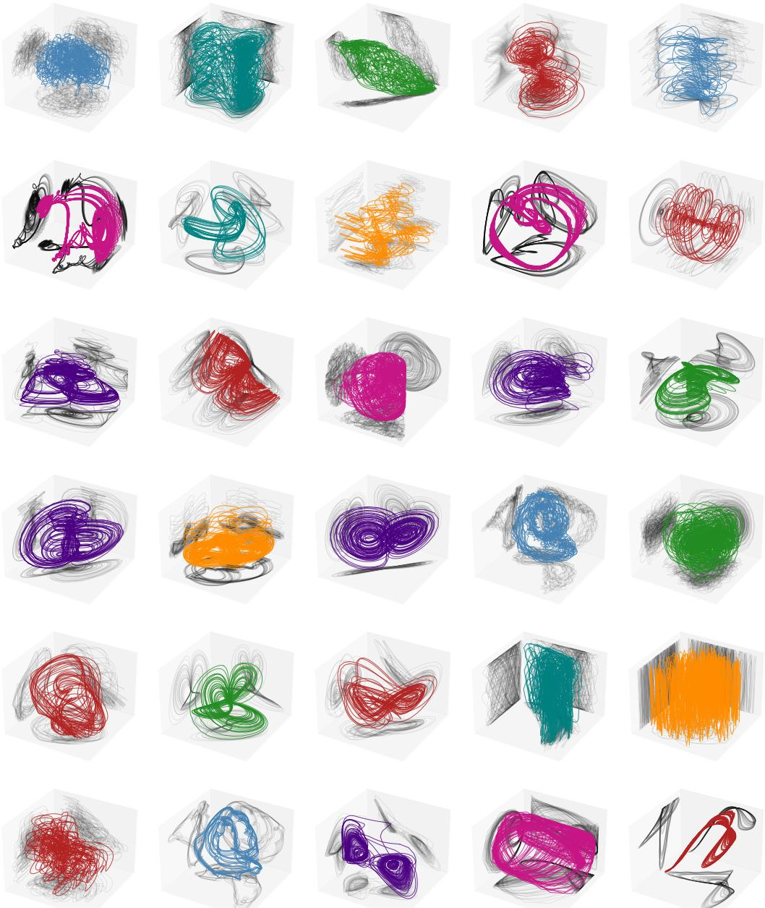

Figure 9: Examples of novel chaotic skew-product systems discovered via evolutionary search. Shaded regions correspond to two-dimensional projections onto the corresponding axes.

Our starting point is a hand-curated, crowdsourced public dataset of 135 chaotic low-dimensional dynamical systems described in previous works [\[5,](#page-9-12) [6,](#page-9-3) [40\]](#page-11-8). Each entry comprises a set of coupled ordinary differential equations with dimensionality between three and ten. The parameters and initial conditions for each system have been hand-tuned into the chaotic regime, based on values used in previously-published studies. The timescales of different chaotic systems are aligned based

on characteristic timescales in either the power spectrum or Lyapunov exponents. The numerical integration step is separately controlled based on estimates of each system's Lipschitz constant. Each system's attractor has been estimated and used to estimate invariant properties associated with that particular set of equations and parameters, such as the Lyapunov exponent spectrum, fractal dimension, and entropy production rate.

### A.2 Mutation of Base Systems

We also generate new instances of the base 135 chaotic systems by perturbing the ODE parameters.

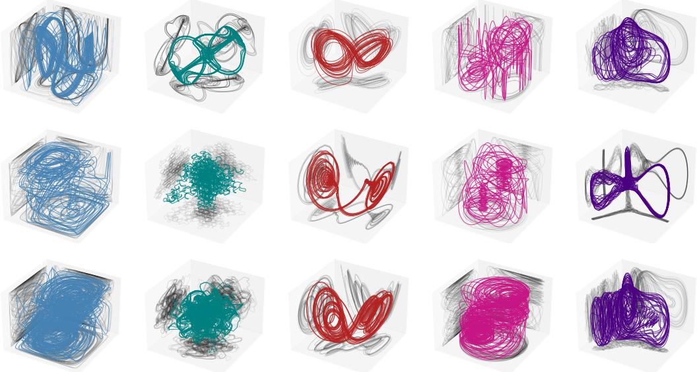

Figure 10: Examples of parameter perturbations of base systems. Top row Unperturbed original systems. Botton rows Parameter perturbations of the top row systems.

### A.3 Attractor Selection

The only general way to identify properties about chaotic dynamical systems is to integrate them. This fundamental fact makes the system discovery process described in Section [3](#page-3-0) very expensive. To effectively reduce the number of incoming candidates for chaoticity selection and validation, we employ callbacks during integration that will immediately kill the process and prune that system candidate. Specifically, we terminate integration whenever the step size falls below 10−10, any bounded (non-driving dimension) coordinate exceeds 104 in value, and whenever the integration time exceeds 5 minutes. The surviving systems will finish integration and move on to the chaoticity selection phase (see the overview of our selection for chaoticity in section [3\)](#page-3-0).

# B Training Details

The training dataset consists of trajectories of 4096 timesteps are obtained by integrating each of our discovered ODEs with a relative tolerance of 1 × 10−9 and an absolute tolerance of 1 × 10−10. The initial conditions are obtained by integrating initially at a lower tolerance (rtol = 1e−6, atol = 1e−7) and sampling a point from the coarse trajectory which approximates starting at a point *on attractor*. A technical difficulty of training a multivariate model is forming batches of trajectories with mixed channel dimensions. We look to dynamical systems theory and note that it is well known that at least 3 coupled dynamical variables are necessary for a system to exhibit deterministic chaos in continuous-time [\[77\]](#page-13-15) - and in fact every system in our dataset has at least 3 dimensions. To this end, we fix the dimensions of each input trajectory to 3 *only during training* by randomly sampling 3 channels from each multivariate trajectory to enable efficient batching. During inference time, we process the full multivariate trajectories. With dynamics embedding, *Panda* has 21.3M parameters.

We use a patch size (and patch stride) of 16. All models are trained with a context length of 512, which corresponds to 32 patches, and use a non-causal transformer encoder with 8 layers, each with dmodel = 512 and 8 heads. For models pretrained with masked language modeling (MLM), a linear head is used to infill masked patches. For the forecasting model, a prediction head aggregates the encoder hidden states via mean or max along the sequence (patch) dimension and a linear layer maps this representation to a fixed-length 128 forecast. All models are trained with MSE loss.

The MLM models are trained for 200K iterations with a batchsize of 1024. The forecasting models are trained for 100K iterations with a batch size of 1024 and are optionally initialized with a pretrained encoder from an MLM model (Section [5.1\)](#page-5-1). The Chronos-SFT models are fine-tuned for 300K iterations with the maximal batch size that fits into GPU memory (128).

# C Forecasts

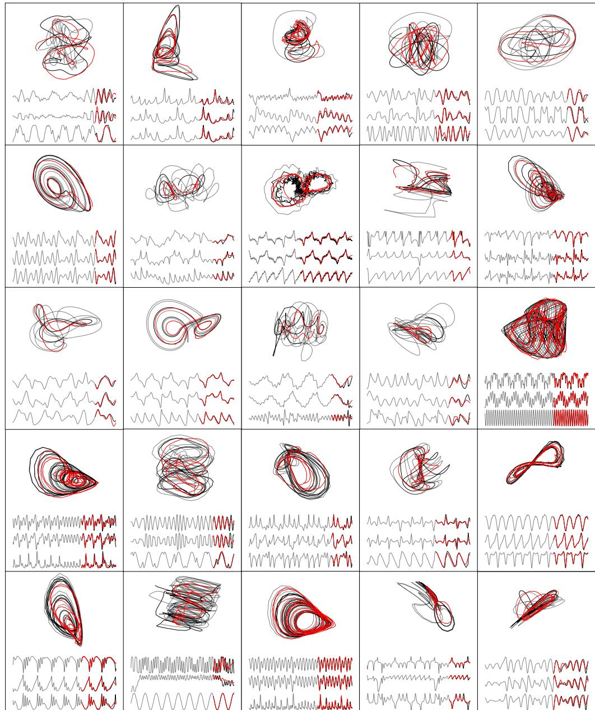

Figure 11: Examples of zero-shot forecasts on held-out chaotic dynamical systems.

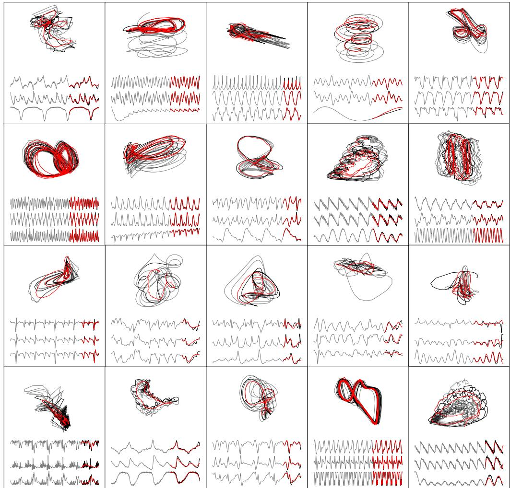

Figure 12: More examples of zero-shot forecasts on held-out chaotic dynamical systems.

# D Additional Forecast Metrics

In Fig. [3](#page-5-2) we presented a sMAPE comparison for several key ablations of our model. Here, we provide additional zero-shot forecast metrics for these ablations, supporting our conclusion that our dynamics embedding with polynomial features (PolyEmbed) is best for long-horizon forecasting via rollouts.

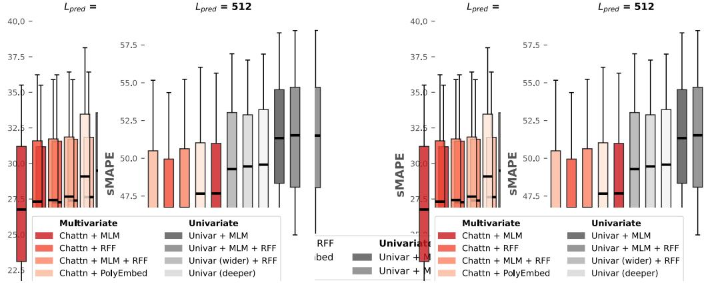

Figure 13: Zero-shot forecast metrics for our ablation experiments.

In Fig. [2](#page-2-0) we presented the sMAPE and MAE comparison for *Panda* versus our baseline models. We now present more zero-shot forecast metrics, but using the probabilistic forecasting mode for Chronos and Chronos-SFT. When finetuning *Chronos 20M* on our dataset (i.e. *Chronos 20M SFT*), we used the default top-k and top-p (nucleus sampling) and temperature settings. We use these same settings, *top-k* = 50, *top-p* = 1.0, *temperature* = 1.0 for the Chronos probabilistic forecasting, aggregating our metrics over 10 sample forecasts per context window per system.

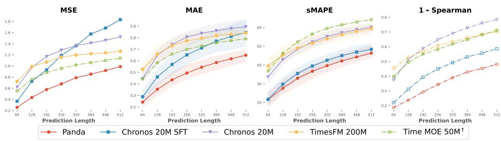

Figure 14: Zero-shot forecast metrics for our baselines, using *probabilistic* forecasts for Chronos. Dash-dotted lines indicate presence of NaNs for some systems (4 - 12% of systems for Spearman).

# E Completions

For the completions task, we randomly mask out half of patches for each coordinate dimension separately i.e. channel-independent masking. We trained with patch length 16 and context length 512, so each context window has 32 patches on the time axis. But we can generate completions with any context length. We refer to the masked-out portions of the trajectory as the erasures. We seek to measure how the model learns the cross-channel coupling relationships and statistical dependencies.

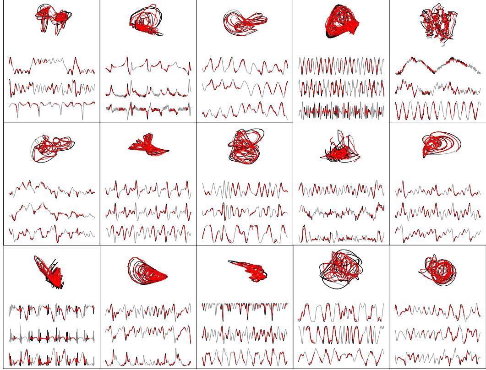

Figure 15: Examples of zero-shot completions on held-out chaotic dynamical systems.

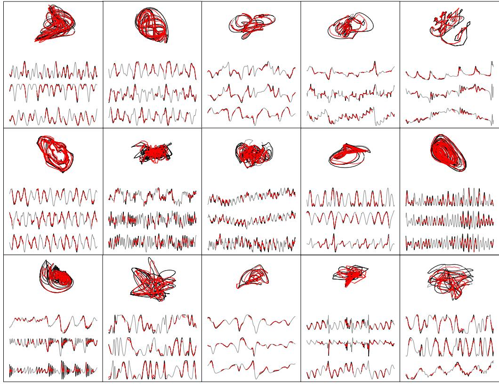

Figure 16: More examples of zero-shot completions on held-out chaotic dynamical systems.

In future work we hope to investigate more sophisticated masking strategies, such as masking out contiguous blocks of patches and investigating channel-dependent masking, which is closer to a forecasting task. Recall from our discussion of Fig. [3](#page-5-2) that MLM pretraining reduces performance on autoregressive rollout (c.f. Fig. [13\)](#page-18-1). Determining the optimal MLM pretraining objective for long horizon forecasts on autoregressive rollout remains an intriguing area to investigate, for which this completions tasks serves as a testbed.

To quantify the performance of our MLM checkpoint on the completion task, we compute the correlation dimension of completions versus ground truth trajectories using the Grassberger-Procaccia algorithm [\[78,](#page-13-16) [79\]](#page-13-17). This algorithm was developed to quantify the strangeness [\[80–](#page-14-0)[82\]](#page-14-1) of chaotic attractors via a computable metric related to the fractal (Hausdorff) dimension and information entropy. Specifically, for each of our held-out systems, we take the entire length 4096 trajectory and cut off the first 512 points to exclude any potential transients. We then randomly mask out half of the trajectory in a channelinconsistent manner.

Let {xi} T i=1 ⊂ R D be a time series of T points in D dimensions. First, we compute pairwise Euclidean distances (excluding i = j):

$$
\mathcal{R} := \{ r_{ij} = ||x_i - x_j||_2 \mid 1 \le i, j \le T, i \ne j \}
$$

Next, we select the scaling region. Let r(5%) and r(50%) denote the empirical 5th and 50th percentiles of R. Then truncate to:

Figure 17: Correlation dimension comparison on held-out systems. Computed for ground truth and completions using the Grassberger-Procaccia method, averaged over 5 independent masks for each trajectory.

$$
\mathcal{R}^* = \{ r \in \mathcal{R} \mid r_{(5\%)} < r < r_{(50\%)} \}
$$

Now denote n := |R∗ | and rmin := minr∈R∗ r.

Following Clauset. Shalizi, and Newman [\[83\]](#page-14-2), we identify a power law fit using maximum likelihood estimation (MLE). Assume for r ≥ rmin that the distances follow p(r) = Z r−α, where Z is the normalizing constant. Then,

$$
\hat{\alpha} = 1 + \frac{n}{\sum_{r \in \mathcal{R}^*} \ln\left(\frac{r}{r_{\min}}\right)}
$$

In the Grassberger–Procaccia method one examines a correlation integral with unbiased estimator:

$$
C(r) = \frac{2}{T(T-1)} \sum_{i < j} H(r - \|x_i - x_j\|_2), \quad C(r) \sim r^{D_2} \quad (r \to 0),
$$

so that D2 = d ln C(r) d ln r . Fitting C(r) ∝ r D2 is equivalent to fitting the distribution of pairwise distances to a power law, yielding D2 ≈ αˆ as the estimated correlation dimension.

# F Analyzing Attention Maps

### F.1 Nonlinear Resonance in the Attention Maps

To probe the effect of channel attention in *Panda*, we feed twotone sinusoids into the model and measure the response (Section [5.4\)](#page-7-1). The frequencies f1, f2 are each swept out over the range [2π, 5π]. Let A˜ denote the attention rollout [\[72\]](#page-13-10) of the temporal attention matrices. Since A˜ is the product of row-stochastic matrices, A˜ remains row-stochastic. Thus, we can measure the response from "shaking" the model at frequencies f1, f2 by measuring the average of the entropies over the rows of A˜ (c.f. Fig. [6\)](#page-7-1).

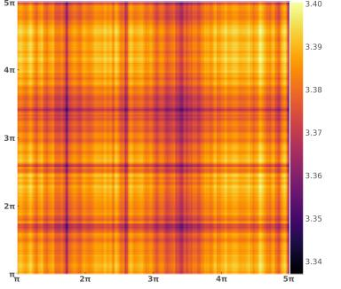

As a control, the frequency response of an equally trained univariate model does not exhibit the same nonlinear multiscale structure (Fig. [18\)](#page-21-2).

Figure 18: Average row-wise entropy of temporal attention rollouts for our univariate ablation.

### F.2 Implicit Spatio-temporal Coupling in *Panda*

Temporal attention and channel attention layers independently mix information along the patch and channel dimensions. For a system like the Lorenz attractor with coupled phase coordinates [x, y, z], we would ideally want information to mix across space *and* time. We will show that by composing temporal and channel attention in sequence, *Panda* implicitly performs spatio-temporal coupling.

Let WQ, WK, WV denote the learned projections for temporal attention and WQ, W K, WV for channel attention. For simplicity, we will focus on the linear attention setting without the row-wise softmax. Let P ∈ R N×C×dmodel be a stack of N, dmodel-dimensional patch embeddings with C channels, and p (c) i ∈ R dmodel an individual patch embedding for patch i and channel c. The linear attention output is (PWQW⊤ K P)PWV . In vector form,

$$
(\mathbf{TA}) : \phi_i^{(\cdot)} = \sum_{j=1}^T \left\langle W_Q^\top \mathbf{p}_i^{(\cdot)}, W_K^\top \mathbf{p}_j^{(\cdot)} \right\rangle W_V^\top \mathbf{p}_j^{(\cdot)} = \sum_{j=1}^T \left\langle \mathbf{p}_i^{(\cdot)}, A_{\mathbf{TA}}, \mathbf{p}_j^{(\cdot)} \right\rangle W_V^\top \mathbf{p}_j^{(\cdot)} \tag{1}
$$

$$
(\mathbf{CA}) : \overline{\phi}_i^{(k)} = \sum_{\ell=1}^c \left\langle \overline{W}_Q^{\top} \phi_i^{(k)}, \overline{W}_K^{\top} \phi_i^{(\ell)} \right\rangle \overline{W}_V^{\top} \phi_i^{(\ell)} = \sum_{\ell=1}^c \underbrace{\left\langle \phi_i^{(k)}, A_{\mathbf{CA}}, \phi_i^{(\ell)} \right\rangle}_{M_i^{k\ell}} \overline{W}_V^{\top} \phi_i^{(\ell)} \tag{2}
$$

Where TA denotes temporal attention and CA channel attention, and ATA := WQW⊤ K and ACA := WQW ⊤ K. Looking at an element of the 3-tensor Mkℓ i we see that:

$$
M_{k\ell} = \left\langle \sum_{j=1}^{T} \left\langle \mathbf{p}_{i}^{(k)}, A_{\mathbf{TA}} \mathbf{p}_{j}^{(k)} \right\rangle W_{V}^{\top} \mathbf{p}_{j}^{(k)}, A_{\mathbf{CA}} \sum_{j'=1}^{T} \left\langle \mathbf{p}_{i}^{(\ell)}, A_{\mathbf{TA}} \mathbf{p}_{j'}^{(\ell)} \right\rangle W_{V}^{\top} \mathbf{p}_{j'}^{(\ell)} \right\rangle
$$
(3)

$$
= \sum_{j,j'=1}^T \left\langle \left\langle \mathbf{p}_i^{(k)}, A_{\mathbf{TA}} \mathbf{p}_j^{(k)} \right\rangle W_V^\top \mathbf{p}_j^{(k)}, \left\langle \mathbf{p}_i^{(\ell)}, A_{\mathbf{TA}} \mathbf{p}_{j'}^{(\ell)} \right\rangle A_{\mathbf{CA}} W_V^\top \mathbf{p}_{j'}^{(\ell)} \right\rangle \tag{4}
$$

$$
= \sum_{j,j'=1}^T \left\langle \mathbf{p}_i^{(k)}, A_{\mathbf{TA}} \mathbf{p}_j^{(k)} \right\rangle \left\langle \mathbf{p}_i^{(\ell)}, A_{\mathbf{TA}} \mathbf{p}_{j'}^{(\ell)} \right\rangle \left\langle \mathbf{p}_j^{(k)}, \underbrace{(W_V A_{\mathbf{CA}} W_V^T)}_{\tilde{\mathcal{A}}_{\mathbf{CA}}} \mathbf{p}_{j'}^{(\ell)} \right\rangle \tag{5}
$$

Where A˜ CA prescribes how patches from different channels attend to each other. In matrix form,

$$
M_i^{k\ell} = (\mathbf{p}_{\mathbf{TA}}^{(k)})^\top \underbrace{\begin{pmatrix} \left\langle \mathbf{p}_1^{(k)}, \tilde{\mathcal{A}}_{\mathbf{C}\mathbf{A}} \mathbf{p}_1^{(\ell)} \right\rangle & \dots & \left\langle \mathbf{p}_1^{(k)}, \tilde{\mathcal{A}}_{\mathbf{C}\mathbf{A}} \mathbf{p}_T^{(\ell)} \right\rangle \\ \vdots & \ddots & \vdots \\ \left\langle \mathbf{p}_T^{(k)}, \tilde{\mathcal{A}}_{\mathbf{C}\mathbf{A}} \mathbf{p}_1^{(\ell)} \right\rangle & \dots & \left\langle \mathbf{p}_T^{(k)}, \tilde{\mathcal{A}}_{\mathbf{C}\mathbf{A}} \mathbf{p}_T^{(\ell)} \right\rangle \end{pmatrix}}_{\text{Cross-Channel Mixing Map}} \mathbf{p}_{\mathbf{TA}}^{(\ell)}, \quad \mathbf{p}_{\mathbf{TA}}^{(k)} := \begin{bmatrix} \left\langle \mathbf{p}_i^{(k)}, A_{\mathbf{TA}} \mathbf{p}_1^{(k)} \right\rangle \\ \vdots \\ \left\langle \mathbf{p}_i^{(k)}, A_{\mathbf{TA}} \mathbf{p}_T^{(k)} \right\rangle \end{bmatrix}
$$

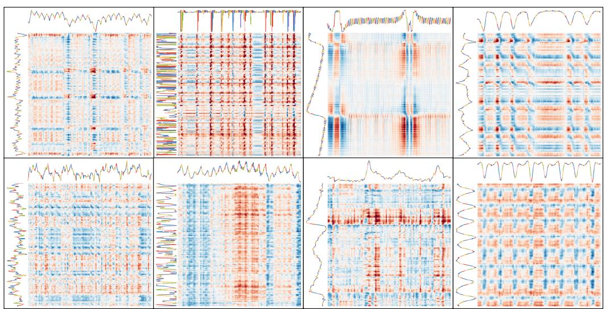

Figure 19: Cross-channel mixing maps across patches for different channels from different held-out systems. Each mixing map is max-scaled to the range [−1, 1].

# G Forecasts on PDEs

For the Kuramoto-Shivashinsky (KS) PDE, we integrate the equations pseudospectrally with 64 Fourier modes and the spatial length parameter L = 100. We use an explicit eighth-order Dormand-Prince scheme (DOP853) to integrate the resulting system of coupled ODEs.

For the Von-Karman vortex street (VKVS) data, we simulate the velocity fields of the fluid flow for 4800 timepoints using the Lattice Boltzmann method at a Reynolds number of 450. Predictions are made on the voriticity field derived from the velocity field data.

# H Computing and Hardware Requirements

All training runs were conducted on a node equipped with 4× AMD MI100X GPUs, each with 32 GB of HBM2 memory. Inference was performed on a single AMD MI100X GPU.